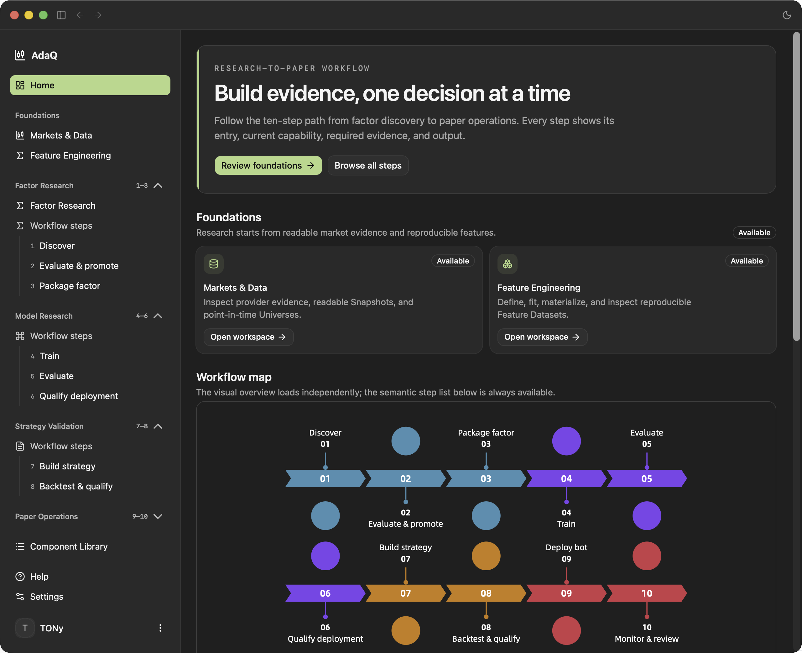

# AdaQ

[English](README.md) | [简体中文](README.zh-CN.md)

[](https://github.com/tonywxx/adaq/actions/workflows/release.yml)

> **AdaQ** (Ada Quant) is an AI-powered quantitative trading platform for equities and digital crypto assets.

## V1 status: engineering acceptance passed

**AdaQ V1 engineering acceptance has succeeded** — code, build, tests, components, the research chain, Desktop, Paper Reconcile, and the Bot safety lifecycle have passed acceptance. The latest automated acceptance run is [green on macOS ARM64 and Windows x86_64](https://github.com/tonywxx/adaq/actions/runs/34547508572), and [release v0.9.8](https://github.com/tonywxx/adaq/releases/tag/v0.9.8) is published.

This statement is explicitly scoped: it does **not** mean strategies are profitable, and it does **not** authorize Live Trading. The current Demo Bot still has zero fills and no realized feedback samples. AdaQ V1 is a local-first research, backtesting, and simulation desktop app; it never executes real account orders, and live trading remains a separate future supervised, host-controlled milestone. Details and evidence: [V1 acceptance summary](V1自动验收文档.md) and the [V1 Demo Bot analysis report](V1模拟盘Bot分析报告.md).

## The V1 workflow

AdaQ V1 is one local-first loop, organized by user workflow:

**数据 Data → Feature / Factor / Model → Strategy / Backtest → Paper / Bot → Operations / Feedback**

| Stage | What you can do today |
| --- | --- |
| **数据 Data** | Inspect OKX Spot, China A-share, and U.S. equity evidence; acquire, validate, and freeze immutable Market Data Snapshots with Source/Canonical/Quality provenance and one User-scoped Watchlist. |
| **Feature** | Publish causal Feature Definitions, fit declared transformations, freeze Feature Plans, and materialize immutable Parquet Feature Datasets in the `/features` workspace. |
| **Factor** | Research Factors over immutable Factor Datasets with causal evaluation, Research Family lineage, multiple-testing controls, and User-owned Promotion Decisions in `/factors`. |
| **Model** | Train Qlib Ridge models in the local Python research lab; produce native or external (`.adaq-signals`) Forecast Signal Datasets and immutable Forecast Evaluation Reports. |
| **Strategy / Backtest** | Run Dataset-first, sandboxed Strategy Backtests over immutable Snapshots with full provenance; validate with chronological holdout, walk-forward, or cross-market Protocols. |
| **Paper / Bot** | Connect non-ordering Paper/Demo accounts (OKX Demo, Alpaca Paper, local A-share simulator), reconcile OKX Demo Paper accounts, and deploy supervised Bots whose decisions fail closed without complete inputs. |
| **Operations / Feedback** | Monitor runtime health and alerts on the Operations Dashboard; close the loop through Paper Feedback and human-reviewed Research Review Decisions. |

Under the hood: sandboxed WebAssembly Factor/Strategy/Model Components under versioned ABIs, verifiable content-addressed `.adaq` packages, the pinned C TA-Lib indicator engine with 160 indicators, exact Decimal financial values, immutable and auditable runs, and a bilingual (English / 简体中文) Tauri 2 + React 19 desktop GUI.

## AdaQ App



## Getting Started

### Prerequisites

- **Desktop build toolchain for Tauri 2** — install the [Tauri 2 prerequisites](https://v2.tauri.app/start/prerequisites/) for your OS (WebKit/WebView2, a C/C++ build toolchain, and on macOS the Xcode Command Line Tools).
- **Rust stable toolchain** — required to build the native Tauri shell:

  ```sh
  rustup toolchain install stable
  ```

- **Node.js 20 LTS or newer** and **pnpm 11**:

  ```sh
  npm install -g pnpm      # or enable corepack
  ```

- *(Component development only)* the `wasm32-unknown-unknown` target plus the component tooling — see [Develop a Component](#develop-a-component).

### Install

```sh
pnpm install --frozen-lockfile
```

### Run (development)

```sh
pnpm tauri dev
```

This starts the Vite dev server (<http://localhost:1420>) and opens the native desktop window.

### Build (production / release)

```sh
pnpm run build      # strict TypeScript check, then build the frontend
pnpm tauri build    # bundle the signed desktop installer for the current platform
```

Release packaging (macOS ARM64 and Windows x86_64) is automated by the GitHub Actions `Release` workflow after you synchronize the version in `package.json`, `src-tauri/Cargo.toml`, and `src-tauri/tauri.conf.json`. Linux validation and packaging are deferred.

### Verify (optional checks)

```sh
pnpm run build            # frontend + strict type check
cd src-tauri && cargo check   # Rust / Tauri
pnpm test                 # Jest
```

## Usage

### Sign in

On first launch the app shows a sign-in screen backed by your Supabase account. Use email + password (primary path); first-time email OTP plus password setup is available as a supplement. No real trading credentials are ever requested.

### Import a Component

1. Open **Components** in the sidebar.
2. Click **Import** and choose a verified `.adaq` package — for example one you built with the Component Developer Kit, or an example from `examples/components`.
3. Review the detail panel (parameters, Feature Slots, dependencies, Warmup, ABI/SDK/Manifest versions, exact hashes) and confirm. Imported components appear in the library with their compatibility and Run-lock status.

### Prepare market data

Backtests run over immutable Market Data Snapshots. In the Backtest **Data** stage, choose an Instrument and Bar Interval, then reuse an existing Snapshot (showing its range, Bar count, source, and ID) or freeze a new one. Snapshots come from imported/example data or external adapters such as the [Kronos example](examples/external-models/kronos/README.md).

### Run a Backtest

The Backtest workspace uses four stages on one page:

1. **Data** — select the Market Data Snapshot.
2. **Strategy** — pick the Strategy Component and bind its Feature Slots / Forecast Signal Dataset; set parameters and the Position Mode (Long Only or Long–Short).
3. **Execution** — choose the Execution Profile (fees, slippage, rebalance thresholds, etc.).
4. **Results** — run the backtest and inspect four tabs:
   - **Overview** — metrics, equity, benchmark, and drawdown charts.
   - **Decisions** — Target Decisions and Run Pauses.
   - **Execution** — paged simulated orders, fills, and fees.
   - **Provenance** — Snapshot, packages, parameters, Indicator Plan, Execution Profile, engine identities, versions, and seed.

Historical Runs are read-only. **Use as new configuration** copies a Run's settings into a fresh immutable Run; any changed execution creates a new Run.

### Run research validation

1. Open **Validation** and choose a method: chronological holdout, walk-forward, or cross-market.
2. Configure the contexts and freeze a Validation Protocol.
3. Run or resume the protocol, then inspect the **Summary**, **Evidence**, and **Provenance** tabs.
4. Export the Report as **JSON** or **Markdown**. Recommended Contexts are historical evidence only and never claim a profitable future configuration.

### Settings & localization

Open **Settings → General** to switch the UI locale between English (US), Simplified Chinese, and System; missing translations fall back to English. **Settings → Account** lets you view your email, change your password, and sign out.

## Develop a Component

Component source code is written in Rust. The Tauri app imports and runs the finished `.adaq` package; it does not provide a GUI code editor or bundle the `adaq-component` CLI.

From this repository:

```sh
rustup toolchain install stable
rustup target add --toolchain stable wasm32-unknown-unknown
cargo install cargo-component --locked
cargo install --path src-tauri/crates/adaq-component-tooling

adaq-component new factor my-factor
cd my-factor
# Edit src/lib.rs and manifest.json.
adaq-component build
adaq-component verify dist/my-factor-0.1.0.adaq
adaq-component verify dist/my-factor-0.1.0.adaq --previous ../my-factor-0.1.0/manifest.json
```

Use `adaq-component new strategy my-strategy` for a Strategy Component. Import the verified file from `dist/` into ADAQ's Component Library. `build` runs the component tests, builds `wasm32-unknown-unknown`, runs host conformance, and creates `dist/*.adaq`. `verify` validates an existing package without modifying it; `--previous` also checks the documented SemVer contract.

Start with the [executable Factor and Strategy examples](examples/components/README.md), then use the [SDK guide](src-tauri/crates/adaq-component-sdk/README.md), [CLI guide](src-tauri/crates/adaq-component-tooling/README.md), and [Component architecture](CONTEXT.md) as references. The crates currently install from this repository; after publication, `cargo install adaq-component-tooling --locked` will install the same CLI independently of the desktop app.

## Documentation

Guides are organized by the user workflow. Root-level status records: [V1 acceptance summary](V1自动验收文档.md) and the [V1 Demo Bot analysis report](V1模拟盘Bot分析报告.md) (0 fills, not a profitability statement).

| English | 简体中文 | Description |
| --------- | ---------- | ------------- |
| [Research Workspaces](docs/research-workspaces.md) | — | Components, Backtest, and Validation workspace contracts and manual verification path |
| [Market Workspaces](docs/market-workspaces.md) | [行情工作区中文](docs/market-workspaces.zh-CN.md) | Three-market observation, Watchlist, provenance, and data-verification journeys |
| [Feature Engineering](docs/feature-engineering.md) | [特征工程中文](docs/feature-engineering.zh-CN.md) | Feature Definitions, Plans, fitting, materialization, and the `/features` workspace |
| [Factor Research](docs/factor-research.md) | [因子研究中文](docs/factor-research.zh-CN.md) | Factor Lab, ABI v2, evaluation, promotion, and the `/factors` workspace |
| [Model Research](docs/model-research.md) | [模型研究中文](docs/model-research.zh-CN.md) | Forecast Signal Datasets, Forecast Evaluation, Python research lab, and Qlib Ridge path |
| [Strategy, Risk & Execution](docs/strategy-risk-execution.md) | [策略风险执行中文](docs/strategy-risk-execution.zh-CN.md) | Strategy intent, Host Risk, OMS, and execution boundaries |
| [Paper Trading Accounts](docs/paper-trading-accounts.md) | [模拟盘账户中文](docs/paper-trading-accounts.zh-CN.md) | Paper accounts, reconciliation, and currency scoping |
| [Bot Runtime](docs/bot-runtime.md) | [Bot 运行时中文](docs/bot-runtime.zh-CN.md) | Supervised Bot workers, attempts, scheduling, and fail-closed safety |
| [Operations Dashboard](docs/operations-dashboard.md) | [运行仪表盘中文](docs/operations-dashboard.zh-CN.md) | Home selection, operational responsibility, and dashboard boundaries |
| [Monitoring & Alerting](docs/monitoring-and-alerting.md) | [监控告警中文](docs/monitoring-and-alerting.zh-CN.md) | Multidimensional health monitoring and append-only alerts |
| [Research Feedback Loop](docs/research-feedback-loop.md) | [研究反馈闭环中文](docs/research-feedback-loop.zh-CN.md) | Closing paper evidence back into human-reviewed research |
| [A-share Data Path](docs/a-share-data-path.md) | [A 股数据路径中文](docs/a-share-data-path.zh-CN.md) | China A-share acquisition and simulator contract |
| [A-share Paper Trading](docs/a-share-paper-trading.md) | [A 股模拟交易中文](docs/a-share-paper-trading.zh-CN.md) | Local A-share simulator Paper execution |
| [Alpaca Data Path](docs/alpaca-data-path.md) | [Alpaca 数据路径中文](docs/alpaca-data-path.zh-CN.md) | U.S. equity data acquisition through Alpaca |
| [Paper Connections](docs/paper-connections.md) | [Paper 连接中文](docs/paper-connections.zh-CN.md) | Provider connections, secret storage, and no-order invariant |
| [External Kronos Adapter](examples/external-models/kronos/README.md) | [外部 Kronos Adapter](examples/external-models/kronos/README.zh-CN.md) | External `Kronos-small` inference, canonical Forecast Signals, evaluation, and Dataset-first Backtest |
| [Component SDK](src-tauri/crates/adaq-component-sdk/README.md) | [Component SDK 中文](src-tauri/crates/adaq-component-sdk/README.zh-CN.md) | Rust SDK for implementing Factor and Strategy Components |
| [CLI Tooling](src-tauri/crates/adaq-component-tooling/README.md) | [CLI 工具中文](src-tauri/crates/adaq-component-tooling/README.zh-CN.md) | Build, verify, and manage `.adaq` packages |
| [Component Template](src-tauri/crates/adaq-component-tooling/templates/README.md) | [组件模板中文](src-tauri/crates/adaq-component-tooling/templates/README.zh-CN.md) | Scaffold README for generated component projects |
| [Executable Examples](examples/components/README.md) | [可执行示例中文](examples/components/README.zh-CN.md) | End-to-end Factor and Strategy SDK/CLI tutorial |
| [Test Fixtures](src-tauri/fixtures/README.md) | [测试固件中文](src-tauri/fixtures/README.zh-CN.md) | WASM component build examples for integration tests |
| [Indicator Catalog](docs/reference/indicator-catalog.md) | [指标目录中文](docs/reference/indicator-catalog.zh-CN.md) | 160 indicators and 179 outputs with inputs, parameters, and Warmup |
| [Research Metrics](docs/reference/research-metrics.md) | [研究指标中文](docs/reference/research-metrics.zh-CN.md) | Backtest and research performance metrics |
| [Developing Components](docs/components/developing-components.md) | [开发组件中文](docs/components/developing-components.zh-CN.md) | Factor/Strategy authoring, Feature Slots, and SemVer rules |

## Disclaimer

**This software is for educational purposes only.**

AdaQ is provided for educational and research purposes only. It does not constitute financial advice, and nothing in it should be interpreted as a recommendation to buy, sell, or hold any security or digital asset. Historical performance and simulated backtest results do not guarantee future results.

You use this software entirely at your own risk. In no event shall the authors, contributors, or maintainers be liable for any direct, indirect, incidental, consequential, or special damages — including but not limited to financial losses — arising from the use of, or inability to use, this software.
