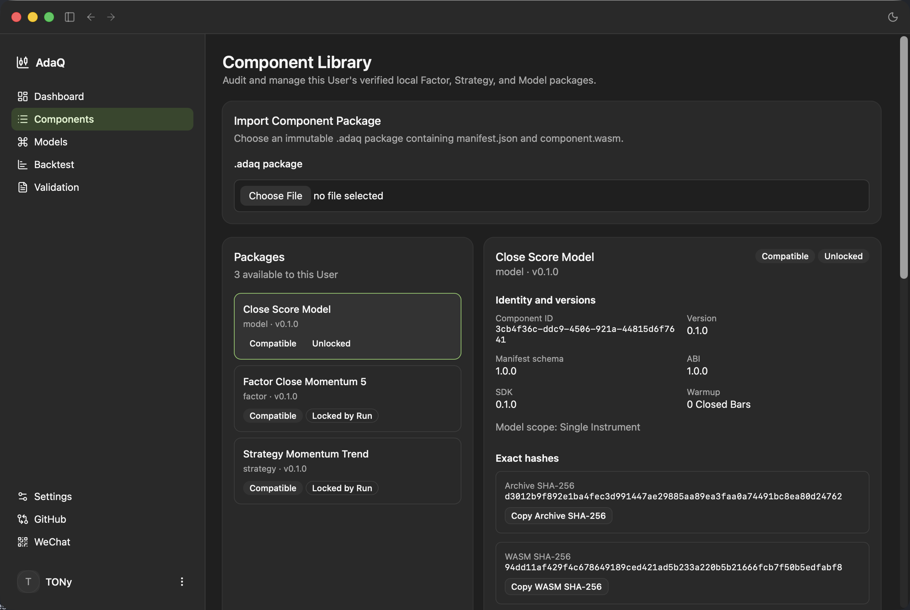
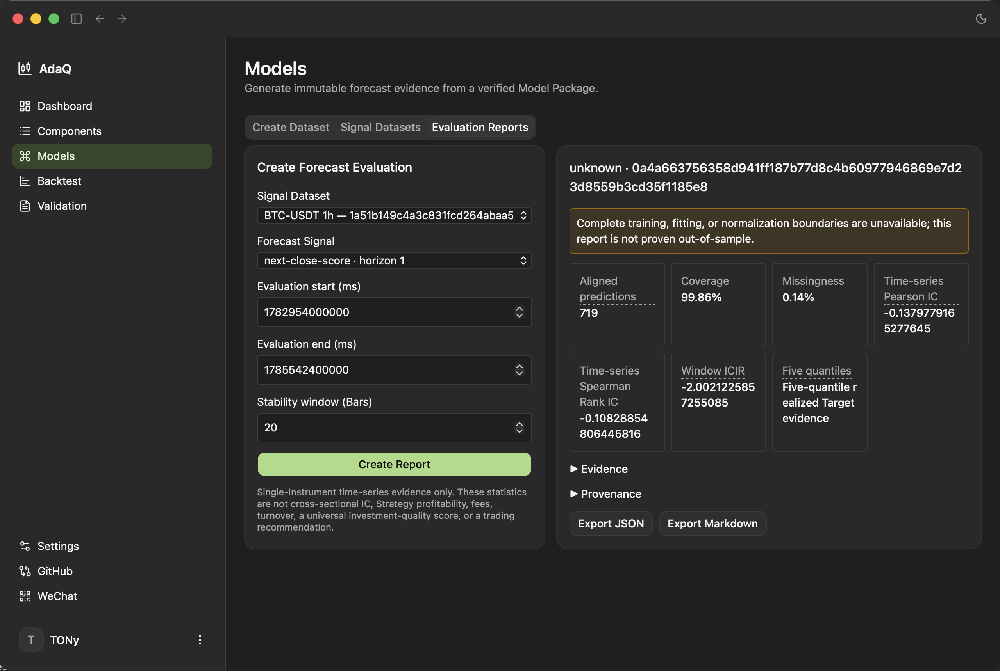
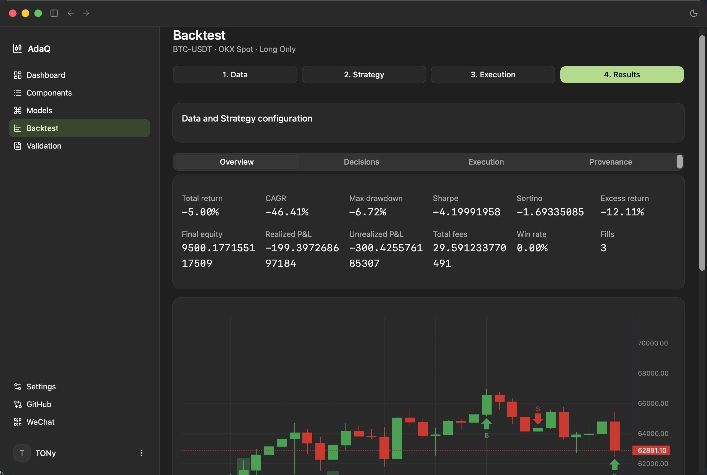
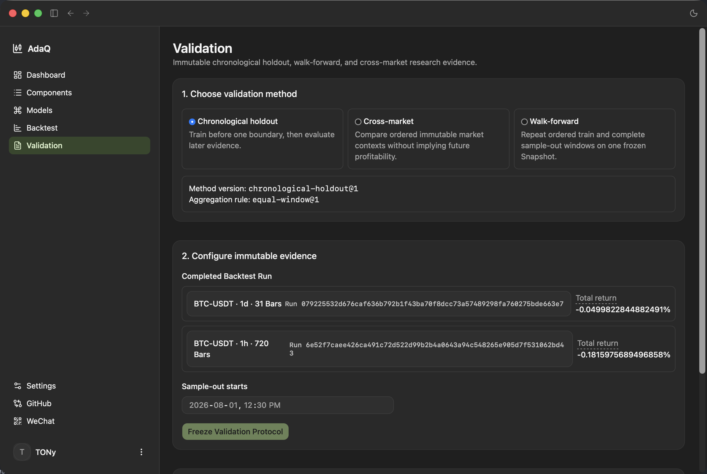

# AdaQ

[English](README.md) | [简体中文](README.zh-CN.md)

[](https://github.com/tonywxx/adaq/actions/workflows/release.yml)

> **AdaQ** (Ada Quant) is an AI-powered quantitative trading platform for equities and digital crypto assets.

AdaQ V1 is a local-first research, backtesting, and simulation desktop app. It does not execute real account orders; live trading is a separate future supervised, host-controlled milestone.

## Features

- **Local-first research, backtesting & simulation** — Reproducible local market-data research and backtesting. AdaQ V1 runs deterministic Spot simulation and never places real orders; live trading is a separate future milestone.
- **Immutable, auditable runs** — Every Backtest Run immutably binds a Market Data Snapshot, Component Lock, parameters, Indicator Plan, Execution Profile, engine version, and seed. Results persist locally with Target Decisions, simulated orders, fills, equity, fees, metrics, history, and charts, plus replay-grade provenance.
- **Sandboxed WebAssembly components** — Deterministic WASM Factor and Strategy Components under versioned Component ABIs (`adaq:factor@2.0.0`, `adaq:strategy@1.0.0`). Factor Components consume scope-specific, host-resolved Feature Batches and return identity-preserving named scalar outputs; Strategy Components consume dense Feature Slots and emit complete Target Exposure decisions.
- **Verifiable `.adaq` packages** — Immutable, content-addressed Component Packages with authoritative Component Meta. Packages, runs, and snapshots are content-addressed so provenance is exact and reproducible.
- **Component Library** — List-and-detail library showing name, kind, version, compatibility, and Run-lock status; the detail view exposes parameters, Feature Slots, Factor dependencies, Warmup, ABI/SDK/Manifest versions, and exact hashes. Import via the native file picker; deletion requires confirmation and shows the references that block removal.
- **TA-Lib Indicator Engine & Feature Slots** — The host pins official C TA-Lib v0.7.1 and exposes `adaq-indicator-catalog@1.0.0` with 160 indicators and 179 outputs. Canonical Indicator Plans are frozen with `planHash`; Market, Built-in, and External Factor Slot sources are supported; indicators evaluate by Continuous Bar Segment, reset analytical state at Bar Gaps, and enforce typed Plan/Run errors plus fixed resource ceilings.
- **Model research & Forecast Signal Datasets (M8)** — Native Model Components and externally generated `.adaq-signals` evidence produce immutable Forecast Signal Datasets and Forecast Evaluation Reports, and drive compatible Signal-driven or Hybrid Strategy Runs.
- **Multi-market data foundation (M9)** — OKX Spot, China A-share, and U.S. equity paths preserve Source, Canonical, Quality, Point-in-Time Universe, calendar, capability, and immutable Snapshot evidence; the Markets GUI exposes all three markets with one user-scoped Watchlist.
- **Research validation** — Immutable Validation Protocols and Reports support chronological holdout, walk-forward, and cross-market studies with traceable evidence and JSON / Markdown exports.
- **Bilingual desktop GUI (Tauri 2 + React 19)** — Operations Dashboard home; Markets, Components, Models, Backtest, and Validation workspaces; Settings for account, locale, and provider Connections. The UI ships in English (US) and Simplified Chinese through `i18next` / `react-i18next` with locale-aware formatting, light/dark themes, and accessible controls.
- **Exact, trustworthy values** — Financial values use exact Decimal representation across domain and IPC boundaries; canonical identities, availability, provider capability, and provenance stay inspectable everywhere.

## Scope of V1

AdaQ V1 is a **local-first research, backtesting, and simulation** desktop app. It executes no real account orders. The closed loop you can use today is: inspect OKX Spot, China A-share, and U.S. equity market evidence; develop or import a Component; prepare exact Market Data Snapshots and Feature Plans; research and evaluate immutable Factor evidence with explicit promotion Decisions; generate or import immutable Forecast Signal evidence; evaluate predictions; run a Dataset-first sandboxed Strategy Backtest; inspect persisted provenance and results; and produce research-validation evidence.

Not included in the current M11 delivery (roadmap M12–M18): Qlib Model training, portfolio Strategies, Paper Trading accounts and execution, supervised Trading Bots, Marketplace publishing, and any real-money trading.

## Screenshots

| Dashboard | Components |
|:---:|:---:|
|  |  |
| **Models** | **Backtest** |
|  |  |
| **Validation** |
|  |

## Implemented Milestones

| Milestone | Delivered capability |
| ----------- | ---------------------- |
| M1 | Versioned WebAssembly Component ABI for `adaq:factor@2.0.0` and `adaq:strategy@1.0.0`. Factor Components transform scope-specific host-resolved Feature Batches into identity-preserving named scalar outputs; Strategy Components consume dense Feature Slots and emit complete Target Exposure decisions. |
| M2 | Deterministic in-memory Run Engine. The host validates Closed Bars, enforces sandbox limits, binds ordered Feature Slots, records warmup or missing-input pauses, and fails closed on invalid data or invalid targets. |
| M3 | Reproducible crypto Spot Backtest. A Backtest Run immutably binds a Market Data Snapshot, Component Lock, parameters, Indicator Plan, Execution Profile, engine version, and seed. Results persist locally with Target Decisions, simulated orders, fills, equity, fees, metrics, history, and charts. |
| M4 | Component Developer Kit. The Rust SDK, `adaq-component` CLI, templates, conformance checks, and `.adaq` packaging flow support `new`, `build`, and `verify` for Factor and Strategy Components. |
| M5 | TA-Lib Indicator Engine, Indicator Catalog, and Feature Slots. The host pins official C TA-Lib v0.7.1, exposes `adaq-indicator-catalog@1.0.0` with 160 Indicators and 179 outputs, freezes canonical Indicator Plans with `planHash`, supports Market, Built-in, and External Factor Slot sources, evaluates by Continuous Bar Segment, resets analytical state at Bar Gaps, and enforces typed Plan/Run errors plus fixed resource ceilings. |
| M6 | Executable Components and Research Validation. Bilingual executable Factor and Strategy examples teach the supported SDK and CLI workflow; replay-grade Backtest Run provenance preserves every authoritative input; immutable Validation Protocols and Reports support chronological holdout, walk-forward, and cross-market research with traceable evidence and JSON/Markdown exports. |
| M7 | Research Workspace Productization. Components, Backtest, and Validation provide guided, auditable desktop workflows over immutable local evidence; the [bilingual manual acceptance guides](docs/m7-manual-acceptance.md) cover the complete from-empty-project path. |
| M8 | Model research and Dataset-first Backtests. Native Model Components and external `.adaq-signals` evidence produce immutable Forecast Signal Datasets, Forecast Evaluation Reports, and compatible Signal-driven or Hybrid Strategy Runs. The [bilingual manual acceptance guides](docs/m8-manual-acceptance.md) cover the complete reviewed path. |
| M9 | Multi-market data and platform foundation. OKX Spot, China A-shares through `akshare-rs`, and U.S. equities through Alpaca Basic provide inspectable Source/Canonical/Quality/Snapshot evidence, secure non-ordering Paper/Demo connections, bilingual Markets routes, and one user-scoped Watchlist. The [M9 bilingual manual acceptance guides](docs/m9-manual-acceptance.md) cover the final cross-platform review path. |
| M10 | Status: Accepted. Feature Engineering. Causal Feature Definitions and Feature Plan 2.0 form immutable revision chains; Fitting Protocols publish fitted Transformation Artifacts; materialization publishes immutable Parquet Feature Datasets with atomic completion and recovery; batch and observation evaluation are equivalent under one evaluator; User-scoped Feature APIs run over one persistent FIFO background runner; and the localized `/features` workspace covers Definitions, Fitting, Materialization, Datasets, and Preview. The [M10 bilingual manual acceptance guides](docs/m10-manual-acceptance.md) ([中文](docs/m10-manual-acceptance.zh-CN.md)) cover the final cross-platform review path. |
| M11 | Status: Accepted. Factor Research and Promotion. Factor ABI v2, Declarative and private Custom Candidates, immutable Factor Datasets, causal Time-Series and Cross-Sectional Evaluation Reports, retained Research Families, User-owned Promotion Decisions, shared native research scheduling, and the localized `/factors` workspace are complete. The [M11 bilingual manual acceptance guides](docs/m11-manual-acceptance.md) ([中文](docs/m11-manual-acceptance.zh-CN.md)) record the final cross-platform evidence matrix. |

Together, M1-M11 provide the current research loop: inspect trustworthy multi-market evidence, develop or import a Component, freeze exact market data and Feature Plans, compute Features and finalize immutable Feature Datasets, research and evaluate Factors with retained evidence, record explicit promotion Decisions, produce or import immutable Forecast Signal evidence, evaluate predictions, run a Dataset-first sandboxed Strategy Backtest, inspect persisted provenance and results, and produce research-validation evidence.

## Getting Started

### Prerequisites

- **Desktop build toolchain for Tauri 2** — install the [Tauri 2 prerequisites](https://v2.tauri.app/start/prerequisites/) for your OS (WebKit/WebView2, a C/C++ build toolchain, and on macOS the Xcode Command Line Tools).
- **Rust stable toolchain** — required to build the native Tauri shell:
  ```sh
  rustup toolchain install stable
  ```
- **Node.js 20 LTS or newer** and **pnpm 11**:
  ```sh
  npm install -g pnpm      # or enable corepack
  ```
- *(Component development only)* the `wasm32-unknown-unknown` target plus the component tooling — see [Develop a Component](#develop-a-component).

### Install

```sh
pnpm install --frozen-lockfile
```

### Run (development)

```sh
pnpm tauri dev
```

This starts the Vite dev server (http://localhost:1420) and opens the native desktop window.

### Build (production / release)

```sh
pnpm run build      # strict TypeScript check, then build the frontend
pnpm tauri build    # bundle the signed desktop installer for the current platform
```

Release packaging (macOS ARM64, Windows x86_64, and Linux x86_64) is automated by the GitHub Actions `Release` workflow after you synchronize the version in `package.json`, `src-tauri/Cargo.toml`, and `src-tauri/tauri.conf.json`.

### Verify (optional checks)

```sh
pnpm run build            # frontend + strict type check
cd src-tauri && cargo check   # Rust / Tauri
pnpm test                 # Jest
```

## Usage

### Sign in

On first launch the app shows a sign-in screen backed by your Supabase account. Use email + password (primary path); first-time email OTP plus password setup is available as a supplement. No real trading credentials are ever requested.

### Import a Component

1. Open **Components** in the sidebar.
2. Click **Import** and choose a verified `.adaq` package — for example one you built with the Component Developer Kit, or an example from `examples/components`.
3. Review the detail panel (parameters, Feature Slots, dependencies, Warmup, ABI/SDK/Manifest versions, exact hashes) and confirm. Imported components appear in the library with their compatibility and Run-lock status.

### Prepare market data

Backtests run over immutable Market Data Snapshots. In the Backtest **Data** stage, choose an Instrument and Bar Interval, then reuse an existing Snapshot (showing its range, Bar count, source, and ID) or freeze a new one. Snapshots come from imported/example data or external adapters such as the [Kronos example](examples/external-models/kronos/README.md).

### Run a Backtest

The Backtest workspace uses four stages on one page:

1. **Data** — select the Market Data Snapshot.
2. **Strategy** — pick the Strategy Component and bind its Feature Slots / Forecast Signal Dataset; set parameters and the Position Mode (Long Only or Long–Short).
3. **Execution** — choose the Execution Profile (fees, slippage, rebalance thresholds, etc.).
4. **Results** — run the backtest and inspect four tabs:
   - **Overview** — metrics, equity, benchmark, and drawdown charts.
   - **Decisions** — Target Decisions and Run Pauses.
   - **Execution** — paged simulated orders, fills, and fees.
   - **Provenance** — Snapshot, packages, parameters, Indicator Plan, Execution Profile, engine identities, versions, and seed.

Historical Runs are read-only. **Use as new configuration** copies a Run's settings into a fresh immutable Run; any changed execution creates a new Run.

### Run research validation

1. Open **Validation** and choose a method: chronological holdout, walk-forward, or cross-market.
2. Configure the contexts and freeze a Validation Protocol.
3. Run or resume the protocol, then inspect the **Summary**, **Evidence**, and **Provenance** tabs.
4. Export the Report as **JSON** or **Markdown**. Recommended Contexts are historical evidence only and never claim a profitable future configuration.

### Settings & localization

Open **Settings → General** to switch the UI locale between English (US), Simplified Chinese, and System; missing translations fall back to English. **Settings → Account** lets you view your email, change your password, and sign out.

## Develop a Component

Component source code is written in Rust. The Tauri app imports and runs the finished `.adaq` package; it does not provide a GUI code editor or bundle the `adaq-component` CLI.

From this repository:

```sh
rustup toolchain install stable
rustup target add --toolchain stable wasm32-unknown-unknown
cargo install cargo-component --locked
cargo install --path src-tauri/crates/adaq-component-tooling

adaq-component new factor my-factor
cd my-factor
# Edit src/lib.rs and manifest.json.
adaq-component build
adaq-component verify dist/my-factor-0.1.0.adaq
adaq-component verify dist/my-factor-0.1.0.adaq --previous ../my-factor-0.1.0/manifest.json
```

Use `adaq-component new strategy my-strategy` for a Strategy Component. Import the verified file from `dist/` into ADAQ's Component Library. `build` runs the component tests, builds `wasm32-unknown-unknown`, runs host conformance, and creates `dist/*.adaq`. `verify` validates an existing package without modifying it; `--previous` also checks the documented SemVer contract.

Start with the [executable Factor and Strategy examples](examples/components/README.md), then use the [SDK guide](src-tauri/crates/adaq-component-sdk/README.md), [CLI guide](src-tauri/crates/adaq-component-tooling/README.md), and [Component architecture](CONTEXT.md) as references. The crates currently install from this repository; after publication, `cargo install adaq-component-tooling --locked` will install the same CLI independently of the desktop app.

## Documentation

| English | 简体中文 | Description |
| --------- | ---------- | ------------- |
| [Component SDK](src-tauri/crates/adaq-component-sdk/README.md) | [Component SDK 中文](src-tauri/crates/adaq-component-sdk/README.zh-CN.md) | Rust SDK for implementing Factor and Strategy Components |
| [CLI Tooling](src-tauri/crates/adaq-component-tooling/README.md) | [CLI 工具中文](src-tauri/crates/adaq-component-tooling/README.zh-CN.md) | Build, verify, and manage `.adaq` packages |
| [Component Template](src-tauri/crates/adaq-component-tooling/templates/README.md) | [组件模板中文](src-tauri/crates/adaq-component-tooling/templates/README.zh-CN.md) | Scaffold README for generated component projects |
| [Executable Examples](examples/components/README.md) | [可执行示例中文](examples/components/README.zh-CN.md) | End-to-end Factor and Strategy SDK/CLI tutorial |
| [Test Fixtures](src-tauri/fixtures/README.md) | [测试固件中文](src-tauri/fixtures/README.zh-CN.md) | WASM component build examples for integration tests |
| [Indicator Catalog](docs/reference/indicator-catalog.md) | [指标目录中文](docs/reference/indicator-catalog.zh-CN.md) | 160 indicators and 179 outputs with inputs, parameters, and Warmup |
| [Research Metrics](docs/reference/research-metrics.md) | [研究指标中文](docs/reference/research-metrics.zh-CN.md) | Backtest and research performance metrics |
| [Developing Components](docs/components/developing-components.md) | [开发组件中文](docs/components/developing-components.zh-CN.md) | Factor/Strategy authoring, Feature Slots, and SemVer rules |
| [M7 Research Workspace](docs/m7-research-workspace.md) | [M7 研究工作区中文](docs/m7-research-workspace.zh-CN.md) | Desktop research-workspace design and acceptance scope |
| [M7 Manual Acceptance](docs/m7-manual-acceptance.md) | [M7 人工验收中文](docs/m7-manual-acceptance.zh-CN.md) | Complete human-reviewed research-workspace acceptance path |
| [M8 Manual Acceptance](docs/m8-manual-acceptance.md) | [M8 人工验收中文](docs/m8-manual-acceptance.zh-CN.md) | Complete Model, Forecast Evaluation, and Dataset-first Backtest acceptance path |
| [M9 Manual Acceptance](docs/m9-manual-acceptance.md) | [M9 人工验收中文](docs/m9-manual-acceptance.zh-CN.md) | Bilingual cross-platform acceptance path for localization, connections, three markets, quality, Snapshots, and GUI boundaries |
| [M10 Manual Acceptance](docs/m10-manual-acceptance.md) | [M10 人工验收中文](docs/m10-manual-acceptance.zh-CN.md) | Bilingual cross-platform acceptance path for Feature Definitions, fitting, materialization, Feature Datasets, and the `/features` workspace |
| [M11 Factor Research Architecture](docs/m11-factor-research.md) | [M11 Factor Research 架构中文](docs/m11-factor-research.zh-CN.md) | Accepted Factor Lab, ABI v2, evaluation, promotion, and delivery baseline; see the [M11 manual acceptance guides](docs/m11-manual-acceptance.md) ([中文](docs/m11-manual-acceptance.zh-CN.md)) |
| [External Kronos Adapter](examples/external-models/kronos/README.md) | [外部 Kronos Adapter](examples/external-models/kronos/README.zh-CN.md) | External `Kronos-small` inference, canonical Forecast Signals, evaluation, and Dataset-first Backtest |
| [V1 Roadmap](docs/v1-roadmap.md) | [V1 路线图中文](docs/v1-roadmap.zh-CN.md) | M11–M18 delivery plan after the M10 Feature Engineering foundation (Factor research, Paper Trading, Bots, and later V1 work) |

Microsoft Qlib training integration is future work (M12) and will use the same External Model Adapter boundary. M8 does not include training, an embedded or controlled Python Runner, Verified external inference, or Marketplace publishing.

## Disclaimer

**This software is for educational purposes only.**

AdaQ is provided for educational and research purposes only. It does not constitute financial advice, and nothing in it should be interpreted as a recommendation to buy, sell, or hold any security or digital asset. Historical performance and simulated backtest results do not guarantee future results.

You use this software entirely at your own risk. In no event shall the authors, contributors, or maintainers be liable for any direct, indirect, incidental, consequential, or special damages — including but not limited to financial losses — arising from the use of, or inability to use, this software.
