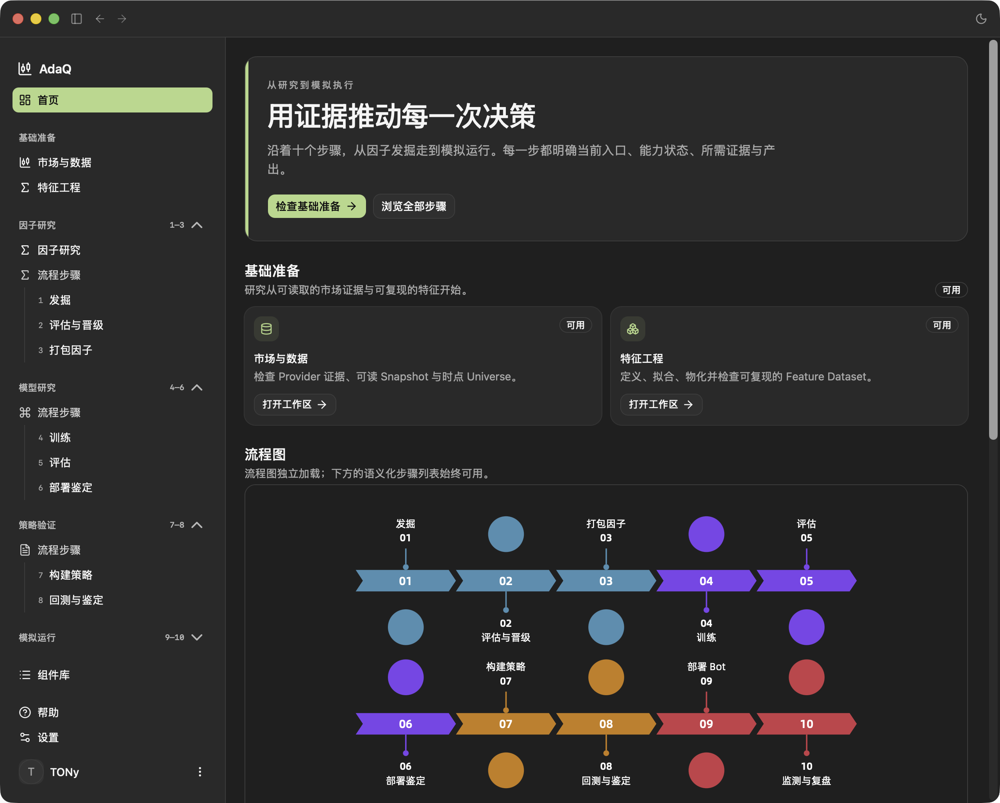

# AdaQ

[English](README.md) | [简体中文](README.zh-CN.md)

[](https://github.com/tonywxx/adaq/actions/workflows/release.yml)

> **AdaQ** (Ada Quant) 是一个 AI 驱动的量化交易平台，支持股票和数字加密资产。

AdaQ V1 是本地优先的研究、回测与模拟桌面应用。它不执行真实账户订单；真实交易属于未来独立的、由主机控制的监督式 Live 里程碑。

## 功能特性

- **本地优先的研究、回测与模拟** —— 可复现的本地市场数据研究与回测。AdaQ V1 执行确定性的 Spot 模拟，绝不发出真实订单；真实交易属于未来的独立里程碑。
- **不可变、可审计的运行记录** —— 每一次 Backtest Run 都不可变地绑定 Market Data Snapshot、Component Lock、参数、Indicator Plan、Execution Profile、引擎版本与 seed。结果在本地持久化，包含 Target Decisions、模拟订单、成交、权益、费用、指标、历史记录和图表，并提供可重放级的 provenance。
- **沙箱化的 WebAssembly 组件** —— 基于版本化 Component ABI（`adaq:factor@2.0.0`、`adaq:strategy@1.0.0`）的确定性 WASM Factor 与 Strategy 组件。Factor Component 消费按范围划分、由主机解析的 Feature Batch，并返回保留身份的具名标量输出；Strategy Component 消费密集的 Feature Slots，并输出完整的 Target Exposure 决策。
- **可验证的 `.adaq` 包** —— 带有权威 Component Meta 的不可变、内容寻址 Component Package。Package、Run 与 Snapshot 均以内容寻址，因而 provenance 精确且可复现。
- **组件库** —— 列表/详情式组件库，展示名称、类型、版本、兼容性与 Run-lock 状态；详情视图公开参数、Feature Slots、Factor 依赖、Warmup、ABI/SDK/Manifest 版本与精确哈希。通过原生文件选择器导入；删除需确认并展示阻止删除的引用。
- **TA-Lib Indicator Engine 与 Feature Slots** —— 主机固定官方 C TA-Lib v0.7.1，并暴露含 160 个 Indicators、179 个输出的 `adaq-indicator-catalog@1.0.0`。用 `planHash` 冻结 canonical Indicator Plan；支持 Market、Built-in、External 三类 Factor Slot source；按 Continuous Bar Segment 执行，在 Bar Gaps 重置分析状态，并执行 typed Plan/Run errors 与固定资源上限。
- **Model 研究与 Forecast Signal Dataset（M8）** —— 原生 Model Component 与外部生成的 `.adaq-signals` 证据共同产出不可变 Forecast Signal Dataset、Forecast Evaluation Report，并驱动兼容的 Signal-driven 或 Hybrid Strategy Run。
- **多市场数据基础（M9）** —— OKX Spot、中国 A 股和美国股票路径保留 Source、Canonical、Quality、Point-in-Time Universe、Calendar、Capability 与不可变 Snapshot 证据；Markets GUI 展示三个市场，并使用一个 User-scoped Watchlist。
- **研究验证** —— 不可变的 Validation Protocol 与 Validation Report 支持时间顺序留出（chronological holdout）、滚动前推（walk-forward）与跨市场研究，提供可追溯证据及 JSON / Markdown 导出。
- **双语桌面 GUI（Tauri 2 + React 19）** —— 以 Operations Dashboard 为首页；包含 Markets、Components、Models、Backtest、Validation 等工作区，以及账户、locale 和 Provider Connections 设置。UI 通过 `i18next` / `react-i18next` 提供英文（美国）与简体中文，支持本地化格式、浅色/深色主题与无障碍控件。
- **精确、可信的数值** —— 金融数值在领域与 IPC 边界间保持精确的 Decimal 表示；canonical 身份、可用性、Provider 能力与 provenance 在各处均可检查。

## V1 适用范围

AdaQ V1 是一个**本地优先的研究、回测与模拟**桌面应用，不执行任何真实账户订单。当前可用的闭环为：检查 OKX Spot、中国 A 股和美国股票的市场证据；开发或导入 Component；准备精确 Market Data Snapshot 与 Feature Plan；研究并评估不可变 Factor Evidence、记录明确 Promotion Decision；生成或导入不可变 Forecast Signal 证据；评估预测；运行 Dataset-first 沙箱化 Strategy Backtest；检查持久化 provenance 与结果；并生成研究验证证据。

当前 M12 交付不包含（路线图 M13–M18）：Portfolio Strategy、Paper Trading 账户与执行、受监督 Trading Bot、Marketplace 发布，以及任何真实资金交易。

## AdaQ App



## 已实现里程碑

| 里程碑 | 已交付能力 |
| -------- | ------------ |
| M1 | 版本化的 WebAssembly Component ABI：`adaq:factor@2.0.0` 与 `adaq:strategy@1.0.0`。Factor Component 将按范围划分、由主机解析的 Feature Batch 转换为保留身份的具名标量输出；Strategy Component 消费密集的 Feature Slots，并输出完整的 Target Exposure 决策。 |
| M2 | 确定性的内存 Run Engine。主机校验 Closed Bars、执行沙箱资源限制、绑定有序 Feature Slots、记录 Warmup 或 Missing Input 暂停，并在无效数据或无效目标仓位时 fail closed。 |
| M3 | 可复现的 crypto Spot Backtest。Backtest Run 不可变地绑定 Market Data Snapshot、Component Lock、参数、Indicator Plan、Execution Profile、引擎版本与 seed。结果本地持久化，包括 Target Decisions、模拟订单、成交、权益、费用、指标、历史记录和图表。 |
| M4 | Component Developer Kit。Rust SDK、`adaq-component` CLI、模板、conformance 检查与 `.adaq` 打包流程支持 Factor 和 Strategy Component 的 `new`、`build`、`verify`。 |
| M5 | TA-Lib Indicator Engine、Indicator Catalog 与 Feature Slots。主机固定官方 C TA-Lib v0.7.1，暴露含 160 个 Indicators、179 个输出的 `adaq-indicator-catalog@1.0.0`，用 `planHash` 冻结 canonical Indicator Plans，支持 Market、Built-in、External 三类 Factor Slot source，按 Continuous Bar Segment 执行，在 Bar Gaps 重置分析状态，并执行 typed Plan/Run errors 与固定资源上限。 |
| M6 | 可执行组件与研究验证。双语可执行 Factor 和 Strategy 示例讲解受支持的 SDK 与 CLI 工作流；可重放级 Backtest Run provenance 保留全部权威输入；不可变 Validation Protocol 与 Validation Report 支持时间顺序留出、滚动前推和跨市场研究，并提供可追溯证据及 JSON/Markdown 导出。 |
| M7 | 研究工作区产品化。Components、Backtest 和 Validation 在不可变本地证据之上提供引导式、可审计的桌面工作流；[双语人工验收指南](docs/m7-manual-acceptance.zh-CN.md)覆盖从空项目开始的完整路径。 |
| M8 | Model 研究与 Dataset-first Backtest。原生 Model Component 和外部 `.adaq-signals` 证据生成不可变 Forecast Signal Dataset、Forecast Evaluation Report，以及兼容的 Signal-driven 或 Hybrid Strategy Run。[双语人工验收指南](docs/m8-manual-acceptance.zh-CN.md)覆盖完整的人工复核路径。 |
| M9 | 多市场数据与平台基础。OKX Spot、通过 `akshare-rs` 的中国 A 股、通过 Alpaca Basic 的美国股票提供可检查的 Source/Canonical/Quality/Snapshot 证据、安全且不下单的 Paper/Demo Connections、双语 Markets Routes 与一个 User-scoped Watchlist。[M9 双语人工验收指南](docs/m9-manual-acceptance.zh-CN.md)覆盖最终跨平台复核路径。 |
| M10 | 状态：已接受。Feature Engineering。因果 Feature Definitions 与 Feature Plan 2.0 构成不可变 revision chain；Fitting Protocols 发布 fitted Transformation Artifacts；materialization 发布不可变 Parquet Feature Datasets，带原子完成与恢复；batch 与 observation 评估在同一 evaluator 下等价；User-scoped Feature APIs 运行于一个持久 FIFO background runner；本地化 `/features` workspace 覆盖 Definitions、Fitting、Materialization、Datasets 与 Preview。[M10 双语人工验收指南](docs/m10-manual-acceptance.zh-CN.md)（[English](docs/m10-manual-acceptance.md)）覆盖最终跨平台复核路径。 |
| M11 | 状态：已接受。Factor Research 与 Promotion。Factor ABI v2、Declarative 与 Private Custom Candidate、不可变 Factor Dataset、因果 Time-Series/Cross-Sectional Evaluation Report、保留 Research Family、User-owned Promotion Decision、共享 Native Research Scheduling 与本地化 `/factors` Workspace 已完成。[M11 双语人工验收指南](docs/m11-manual-acceptance.zh-CN.md)（[English](docs/m11-manual-acceptance.md)）记录最终跨平台 Evidence Matrix。 |
| M12 | 状态：已接受。Python Research SDK 与 Qlib-first Model Lab。Managed Runtime、受信任 Runner 执行、Python Factor Candidate、Host-owned Parameter Grid、Qlib Ridge Experiment、不可变 Linear Model Artifact、Forecast Signal Dataset 以及双语 Tutorial/Acceptance Gate 已完成。参见 [M12 架构](docs/m12-python-research-and-model-lab.zh-CN.md)（[English](docs/m12-python-research-and-model-lab.md)）与[人工验收指南](docs/m12-python-research-manual-acceptance.zh-CN.md)（[English](docs/m12-python-research-manual-acceptance.md)）。 |

M1-M12 合起来形成当前研究闭环：检查可信的多市场证据，开发或导入 Component，冻结精确市场数据与 Feature Plan，计算 Feature 并生成 finalized immutable Feature Dataset，研究并评估 Factor、保留 Evidence、记录明确 Promotion Decision，训练或导入受支持的 Model Evidence，生成或导入不可变 Forecast Signal 证据，评估预测，运行 Dataset-first 沙箱化 Strategy Backtest，检查持久化 provenance 与结果，并生成研究验证证据。

## 快速开始

### 环境要求

- **Tauri 2 桌面构建工具链** —— 安装对应操作系统的 [Tauri 2 前置依赖](https://v2.tauri.app/start/prerequisites/)（WebKit/WebView2、C/C++ 构建工具链；macOS 需 Xcode Command Line Tools）。
- **Rust stable 工具链** —— 构建原生 Tauri 壳层所必需：

  ```sh
  rustup toolchain install stable
  ```

- **Node.js 20 LTS 或更新版本** 与 **pnpm 11**：

  ```sh
  npm install -g pnpm      # 或启用 corepack
  ```

- *（仅组件开发需要）* `wasm32-unknown-unknown` 目标，以及组件工具链 —— 见[开发组件](#开发组件)。

### 安装

```sh
pnpm install --frozen-lockfile
```

### 运行（开发模式）

```sh
pnpm tauri dev
```

该命令会启动 Vite 开发服务器（<http://localhost:1420）并打开原生桌面窗口。>

### 构建（生产 / 发布）

```sh
pnpm run build      # 严格 TypeScript 检查，然后构建前端
pnpm tauri build    # 为当前平台打包带签名的桌面安装包
```

发布打包（macOS ARM64、Windows x86_64）由 GitHub Actions `Release` 工作流自动完成，前提是先在 `package.json`、`src-tauri/Cargo.toml` 与 `src-tauri/tauri.conf.json` 中同步版本号。Linux 验证与打包暂缓。

### 校验（可选检查）

```sh
pnpm run build            # 前端 + 严格类型检查
cd src-tauri && cargo check   # Rust / Tauri
pnpm test                 # Jest
```

## 使用说明

### 登录

首次启动会显示由 Supabase 账户托管的登录界面。使用邮箱 + 密码（主路径）；首次可通过邮箱 OTP + 密码设置作为补充。绝不会要求任何真实交易凭证。

### 导入组件

1. 在侧边栏打开 **Components**。
2. 点击 **Import**，选择已验证的 `.adaq` 包 —— 例如你用 Component Developer Kit 构建的包，或 `examples/components` 中的示例。
3. 查看详情面板（参数、Feature Slots、依赖、Warmup、ABI/SDK/Manifest 版本、精确哈希）并确认。导入的组件会以兼容性与 Run-lock 状态出现在组件库中。

### 准备市场数据

回测运行于不可变的 Market Data Snapshot 之上。在 Backtest 的 **Data** 阶段，选择 Instrument 与 Bar Interval，然后复用已有 Snapshot（显示其区间、Bar 数量、来源与 ID），或冻结一个新的 Snapshot。Snapshot 来自导入/示例数据或外部适配器，例如 [Kronos 示例](examples/external-models/kronos/README.zh-CN.md)。

### 运行回测

Backtest 工作区在同一页面使用四个阶段：

1. **Data** —— 选择 Market Data Snapshot。
2. **Strategy** —— 选择 Strategy Component 并绑定其 Feature Slots / Forecast Signal Dataset；设置参数与 Position Mode（Long Only 或 Long–Short）。
3. **Execution** —— 选择 Execution Profile（费用、滑点、再平衡阈值等）。
4. **Results** —— 运行回测并查看四个标签页：
   - **Overview** —— 指标、权益、基准与回撤图表。
   - **Decisions** —— Target Decisions 与 Run Pauses。
   - **Execution** —— 分页的模拟订单、成交与费用。
   - **Provenance** —— Snapshot、Package、参数、Indicator Plan、Execution Profile、引擎身份、版本与 seed。

历史 Run 为只读。**Use as new configuration** 将某次 Run 的设置复制到一个全新的不可变 Run；任何改变后的执行都会创建新的 Run。

### 运行研究验证

1. 打开 **Validation**，选择一种方法：时间顺序留出（chronological holdout）、滚动前推（walk-forward）或跨市场。
2. 配置上下文并冻结一个 Validation Protocol。
3. 运行或恢复该 Protocol，然后查看 **Summary**、**Evidence** 与 **Provenance** 标签页。
4. 将 Report 导出为 **JSON** 或 **Markdown**。Recommended Contexts 仅是历史证据，绝不声称某种有利可图的未来配置。

### 设置与本地化

打开 **Settings → General** 可在 English (US)、简体中文与 System 之间切换 UI 语言；缺失的翻译会回退到英文。在 **Settings → Account** 可查看邮箱、修改密码并退出登录。

## 开发组件

组件源代码使用 Rust 编写。Tauri 应用导入并运行编译完成的 `.adaq` 包；它不提供 GUI 代码编辑器，也不捆绑 `adaq-component` CLI。

在本仓库中：

```sh
rustup toolchain install stable
rustup target add --toolchain stable wasm32-unknown-unknown
cargo install cargo-component --locked
cargo install --path src-tauri/crates/adaq-component-tooling

adaq-component new factor my-factor
cd my-factor
# 编辑 src/lib.rs 和 manifest.json。
adaq-component build
adaq-component verify dist/my-factor-0.1.0.adaq
adaq-component verify dist/my-factor-0.1.0.adaq --previous ../my-factor-0.1.0/manifest.json
```

使用 `adaq-component new strategy my-strategy` 创建 Strategy 组件。将 `dist/` 中验证通过的文件导入 ADAQ 的组件库。`build` 会运行组件测试、构建 `wasm32-unknown-unknown`、执行主机 conformance 检查，并生成 `dist/*.adaq`。`verify` 在不修改原包的前提下校验已有包；`--previous` 还会检查文档化的 SemVer 契约。

请先阅读[可执行 Factor 与 Strategy 双语示例](examples/components/README.zh-CN.md)，再将 [SDK 指南](src-tauri/crates/adaq-component-sdk/README.zh-CN.md)、[CLI 指南](src-tauri/crates/adaq-component-tooling/README.zh-CN.md)和[组件架构](CONTEXT.md)作为参考。这些 crate 目前从本仓库安装；发布之后，`cargo install adaq-component-tooling --locked` 将独立于桌面应用安装相同的 CLI。

## 文档

| English | 简体中文 | 说明 |
| --- | --- | --- |
| [Component SDK](src-tauri/crates/adaq-component-sdk/README.md) | [Component SDK 中文](src-tauri/crates/adaq-component-sdk/README.zh-CN.md) | 用于实现 Factor 与 Strategy Component 的 Rust SDK |
| [CLI Tooling](src-tauri/crates/adaq-component-tooling/README.md) | [CLI 工具中文](src-tauri/crates/adaq-component-tooling/README.zh-CN.md) | 构建、验证与管理 `.adaq` 包 |
| [Component Template](src-tauri/crates/adaq-component-tooling/templates/README.md) | [组件模板中文](src-tauri/crates/adaq-component-tooling/templates/README.zh-CN.md) | 为生成的组件项目提供脚手架 README |
| [Executable Examples](examples/components/README.md) | [可执行示例中文](examples/components/README.zh-CN.md) | 端到端 Factor 与 Strategy SDK/CLI 教程 |
| [Test Fixtures](src-tauri/fixtures/README.md) | [测试固件中文](src-tauri/fixtures/README.zh-CN.md) | 供集成测试使用的 WASM 组件构建示例 |
| [Indicator Catalog](docs/reference/indicator-catalog.md) | [指标目录中文](docs/reference/indicator-catalog.zh-CN.md) | 160 个指标与 179 个输出，含输入、参数与 Warmup |
| [Research Metrics](docs/reference/research-metrics.md) | [研究指标中文](docs/reference/research-metrics.zh-CN.md) | 回测与研究绩效指标 |
| [Developing Components](docs/components/developing-components.md) | [开发组件中文](docs/components/developing-components.zh-CN.md) | Factor/Strategy 编写、Feature Slots 与 SemVer 规则 |
| [M7 Research Workspace](docs/m7-research-workspace.md) | [M7 研究工作区中文](docs/m7-research-workspace.zh-CN.md) | 桌面研究工作区设计与验收范围 |
| [M7 Manual Acceptance](docs/m7-manual-acceptance.md) | [M7 人工验收中文](docs/m7-manual-acceptance.zh-CN.md) | 完整、需人工复核的研究工作区验收路径 |
| [M8 Manual Acceptance](docs/m8-manual-acceptance.md) | [M8 人工验收中文](docs/m8-manual-acceptance.zh-CN.md) | 完整的 Model、Forecast Evaluation 与 Dataset-first Backtest 验收路径 |
| [M9 Manual Acceptance](docs/m9-manual-acceptance.md) | [M9 人工验收中文](docs/m9-manual-acceptance.zh-CN.md) | 本地化、Connections、三个市场、Quality、Snapshot 与 GUI 边界的双语跨平台验收路径 |
| [M10 Manual Acceptance](docs/m10-manual-acceptance.md) | [M10 人工验收中文](docs/m10-manual-acceptance.zh-CN.md) | Feature Definitions、fitting、materialization、Feature Datasets 与 `/features` workspace 的双语跨平台验收路径 |
| [M11 Factor Research Architecture](docs/m11-factor-research.md) | [M11 Factor Research 架构中文](docs/m11-factor-research.zh-CN.md) | 已接受的 Factor Lab、ABI v2、Evaluation、Promotion 与 Delivery Baseline；参见 [M11 双语人工验收指南](docs/m11-manual-acceptance.zh-CN.md)（[English](docs/m11-manual-acceptance.md)） |
| [External Kronos Adapter](examples/external-models/kronos/README.md) | [外部 Kronos Adapter](examples/external-models/kronos/README.zh-CN.md) | 外部 `Kronos-small` 推理、规范 Forecast Signals、评估与 Dataset-first Backtest |
| [V1 Roadmap](docs/v1-roadmap.md) | [V1 路线图中文](docs/v1-roadmap.zh-CN.md) | 已接受的 Python Research 与 Model Lab 之后的 M12–M18 交付计划（Strategy、Component Generation、Paper Trading、Bot 与后续 V1 能力） |

M12 已通过同一 External Model Adapter 边界提供受控 Microsoft Qlib Ridge 训练。M8 不包含训练、内嵌或受控 Python Runner、Verified external inference 或 Marketplace 发布。

## 免责声明

**本软件仅供学习与研究目的使用（This software is for educational purposes only）。**

AdaQ 仅供学习与研究目的使用，不构成任何投资建议，其中的任何内容均不应被解释为买入、卖出或持有任何证券或数字资产的推荐。历史表现与回测模拟结果不代表未来收益。

使用本软件所产生的一切风险由使用者自行承担。在任何情况下，作者、贡献者与维护者均不对因使用或无法使用本软件而造成的任何直接、间接、附带、后果性或特殊损害（包括但不限于资金损失）承担任何责任。
