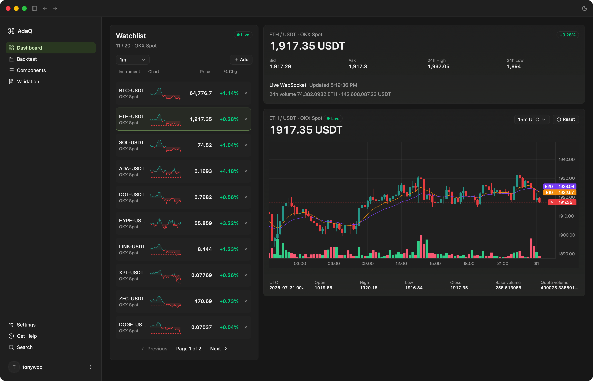
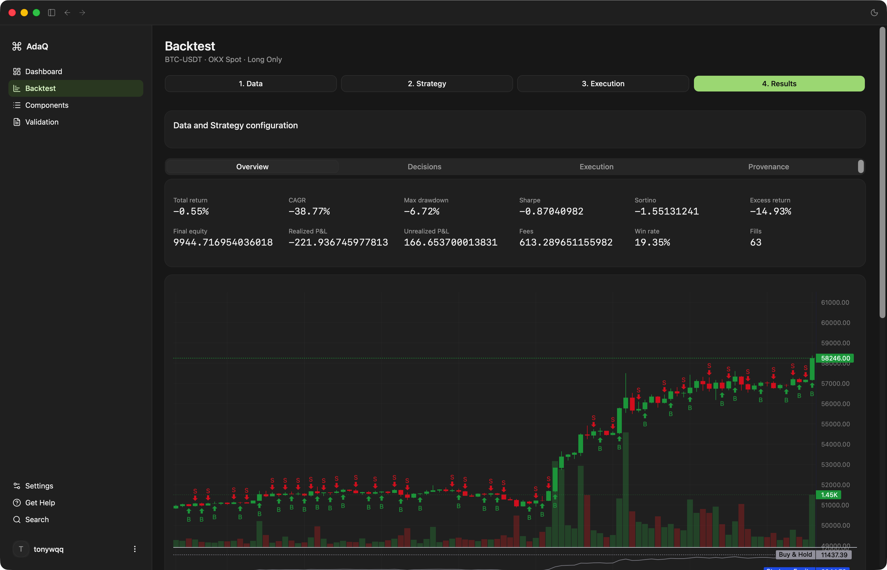
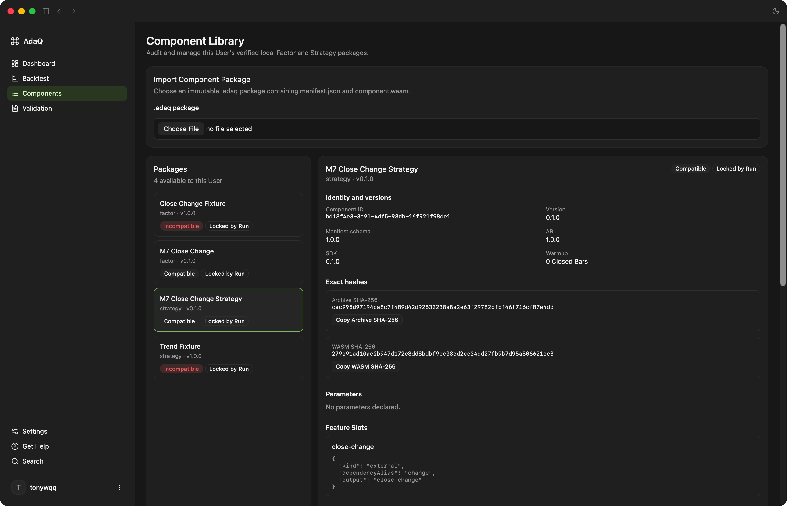
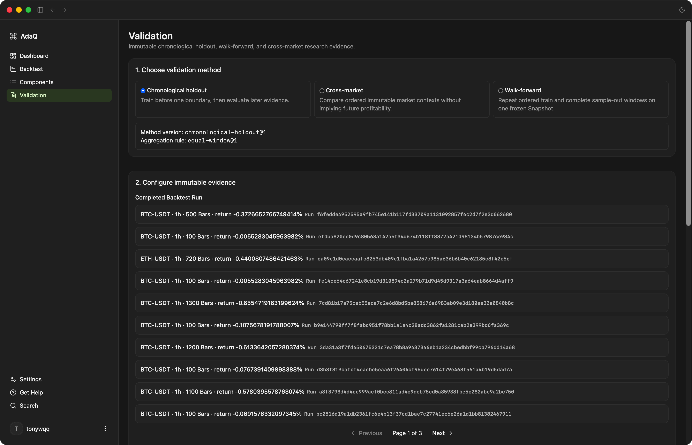

# AdaQ

[English](README.md) | [简体中文](README.zh-CN.md)

[](https://github.com/tonywxx/adaq/actions/workflows/release.yml)

> **AdaQ** (Ada Quant) 是一个 AI 驱动的量化交易平台，支持股票和数字加密资产。

AdaQ V1 是本地优先的研究、回测与模拟桌面应用。它不执行真实账户订单；真实交易属于未来独立的、由主机控制的监督式 Live 里程碑。

## 功能特性

- 可复现的本地市场数据研究与回测
- 沙箱化的 WebAssembly Factor 和 Strategy 组件
- 不可变、可验证的 `.adaq` 组件包
- 主机拥有的 TA-Lib Indicator Catalog 与冻结 Feature Slots
- 带不可变 Backtest Run 的确定性 Spot 模拟
- 原生 Model Component 与外部生成的 Forecast Signal Dataset

## 截图预览

| 仪表盘 | 回测 |
|:---:|:---:|
|  |  |
| **组件库** | **验证** |
|  |  |

## 已实现里程碑

| 里程碑 | 已交付能力 |
| -------- | ------------ |
| M1 | 固定的 WebAssembly Component ABI：`adaq:factor@1.0.0` 与 `adaq:strategy@1.0.0`。Factor Component 将 Closed Bars 转换为具名标量输出；Strategy Component 消费密集的 Feature Slots，并输出完整的 Target Exposure 决策。 |
| M2 | 确定性的内存 Run Engine。主机校验 Closed Bars、执行沙箱资源限制、绑定有序 Feature Slots、记录 Warmup 或 Missing Input 暂停，并在无效数据或无效目标仓位时 fail closed。 |
| M3 | 可复现的 crypto Spot Backtest。Backtest Run 不可变地绑定 Market Data Snapshot、Component Lock、参数、Indicator Plan、Execution Profile、引擎版本与 seed。结果本地持久化，包括 Target Decisions、模拟订单、成交、权益、费用、指标、历史记录和图表。 |
| M4 | Component Developer Kit。Rust SDK、`adaq-component` CLI、模板、conformance 检查与 `.adaq` 打包流程支持 Factor 和 Strategy Component 的 `new`、`build`、`verify`。 |
| M5 | TA-Lib Indicator Engine、Indicator Catalog 与 Feature Slots。主机固定官方 C TA-Lib v0.7.1，暴露含 160 个 Indicators、179 个输出的 `adaq-indicator-catalog@1.0.0`，用 `planHash` 冻结 canonical Indicator Plans，支持 Market、Built-in、External Factor 三类 Slot source，按 Continuous Bar Segment 执行，在 Bar Gaps 重置分析状态，并执行 typed Plan/Run errors 与固定资源上限。 |
| M6 | 可执行组件与研究验证。双语可执行 Factor 和 Strategy 示例讲解受支持的 SDK 与 CLI 工作流；可重放级 Backtest Run provenance 保留全部权威输入；不可变 Validation Protocol 与 Validation Report 支持时间顺序留出、滚动前推和跨市场研究，并提供可追溯证据及 JSON/Markdown 导出。 |
| M7 | 研究工作区产品化。Components、Backtest 和 Validation 在不可变本地证据之上提供引导式、可审计的桌面工作流；[双语人工验收指南](docs/m7-manual-acceptance.zh-CN.md)覆盖从空项目开始的完整路径。 |
| M8 | Model 研究与 Dataset-first Backtest。原生 Model Component 和外部 `.adaq-signals` 证据生成不可变 Forecast Signal Dataset、Forecast Evaluation Report，以及兼容的 Signal-driven 或 Hybrid Strategy Run。[外部 Kronos Adapter 指南](examples/external-models/kronos/README.zh-CN.md)记录完整的 `Kronos-small` + `Kronos-Tokenizer-base` 路径。 |

M1-M8 合起来形成当前可用闭环：开发或导入 Component，冻结精确市场数据与 Feature Plan，生成或导入不可变 Forecast Signal 证据，评估预测，运行 Dataset-first 沙箱化 Strategy Backtest，检查持久化 provenance 与结果，并生成研究验证证据。

## 开发组件

组件源代码使用 Rust 编写。Tauri 应用导入并运行编译完成的 `.adaq` 包；它不提供 GUI 代码编辑器，也不捆绑 `adaq-component` CLI。

在本仓库中：

```sh
rustup toolchain install stable
rustup target add --toolchain stable wasm32-unknown-unknown
cargo install cargo-component --locked
cargo install --path src-tauri/crates/adaq-component-tooling

adaq-component new factor my-factor
cd my-factor
# 编辑 src/lib.rs 和 manifest.json。
adaq-component build
adaq-component verify dist/my-factor-0.1.0.adaq
```

使用 `adaq-component new strategy my-strategy` 创建 Strategy 组件。将 `dist/` 中验证通过的文件导入 ADAQ 的组件库。

请先阅读[可执行 Factor 与 Strategy 双语示例](examples/components/README.zh-CN.md)，再将 [SDK 指南](src-tauri/crates/adaq-component-sdk/README.zh-CN.md)、[CLI 指南](src-tauri/crates/adaq-component-tooling/README.zh-CN.md)和[组件架构](CONTEXT.md)作为参考。这些 crate 目前从本仓库安装；发布之后，`cargo install adaq-component-tooling --locked` 将独立于桌面应用安装相同的 CLI。

## 文档

| English | 简体中文 | 说明 |
| --- | --- | --- |
| [M7 Manual Acceptance](docs/m7-manual-acceptance.md) | [M7 人工验收](docs/m7-manual-acceptance.zh-CN.md) | 完整、需人工复核的研究工作区验收路径 |
| [External Kronos Adapter](examples/external-models/kronos/README.md) | [外部 Kronos Adapter](examples/external-models/kronos/README.zh-CN.md) | 外部 `Kronos-small` 推理、规范 Forecast Signals、评估与 Dataset-first Backtest |

Microsoft Qlib 集成属于未来工作，并将使用同一 External Model Adapter 边界。M8 不包含训练、内嵌或受控 Python Runner、Verified external inference 或 Marketplace 发布。
