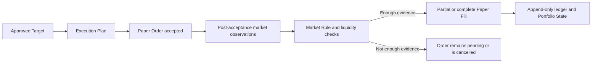

# A-share Paper Trading Fill Guide

[简体中文](./a-share-paper-trading.zh-CN.md)

Status: V1 user and evidence contract. Exact exchange-rule values and supported order types will be added after their Market Rule Snapshots are finalized.

Related guides: [Paper Trading Accounts](./paper-trading-accounts.md) and [Strategy, Risk, and Execution](./strategy-risk-execution.md).

## What the simulator is

`adaq-a-share-paper` is an ADAQ-owned local Paper Execution Adapter. It does not send an order to a broker or claim that a real exchange would have assigned the same queue position. It tests live data flow, Strategy decisions, hard Risk, order lifecycle, account accounting, recovery, and conservative simulated execution using CNY 1,000,000 as the default Paper Funding Target.

## V1 account scope: ordinary securities only

V1 simulates one **A-share Ordinary Securities Account**. It uses only its own available cash and owned securities:

- A buy must reserve and settle from available cash after fees.
- A sell may use only the position's eligible sellable quantity under the applicable settlement rules, including T+1 when required.
- Cash, frozen funds, positions, sellable quantity, cost basis, fees, taxes, and corporate actions remain explicit ledger evidence.

V1 does **not** simulate an A-share Credit Account (margin financing and securities lending). Financing buys, borrowed-security short sales, credit limits, collateral transfers, liabilities, interest, maintenance ratios, repayment contracts, margin calls, and forced liquidation are unsupported. An order that requires one of those capabilities is rejected before submission, and the Paper Execution Capability Snapshot reports the capability as unavailable. Negative cash or a negative position never acts as a shortcut for an unimplemented Credit Account.

## Evidence flow



The engine never reads observations that were unavailable when the simulated decision had to be made.

## Order lifecycle

A Paper Order retains every transition:

```text
Submitted
→ Accepted
→ Partially Filled
→ Filled
→ Cancelled
→ Rejected
```

Not every order visits every state. Rejection records the exact rule or validation reason. Cancellation never deletes earlier acceptance or partial-Fill evidence. A retry is a new order identity linked to the previous attempt rather than a rewrite.

## Fill Evidence States

| State | Evidence | Permitted conclusion |
| --- | --- | --- |
| Trade Observed | A post-acceptance market trade or auction result with usable price and quantity evidence. | A simulated Fill may be bounded by that observed event and remaining order quantity. |
| Quote Constrained | A post-acceptance best Bid or Ask proves the order is executable, with visible size when supplied. | A simulated Fill may use the adverse executable side and declared slippage; it does not claim queue priority. |
| Bar Constrained | Only a post-acceptance Bar and volume are available. | A conservative participation rule may simulate a degraded Fill; the Bar's best price and intra-Bar order are unknown. |
| Unavailable | No admissible post-acceptance observation or required rule evidence exists. | No Fill is produced. |

The State is shown beside every local Paper Fill. It is not a probability and must not be averaged into a misleading “fill confidence.”

## Price and liquidity rules

- A marketable buy is bounded by the first admissible executable Ask plus the frozen adverse-slippage rule.
- A marketable sell is bounded by the first admissible executable Bid minus the frozen adverse-slippage rule.
- A non-marketable limit order waits for a later admissible quote, trade, or auction result that crosses its limit.
- The simulated price can never violate the order's limit.
- Visible size caps the quantity available from that observation.
- When size is unavailable, the frozen conservative participation rate caps the Fill against observed post-acceptance volume.
- A missing size never means infinite liquidity.
- Remaining quantity stays open, may receive later partial Fills, or follows the frozen cancellation policy.

## Why a crossed Bar is not enough

Suppose a buy limit order is accepted at 10:00:05 with limit CNY 10.00:

```text
10:00:03 Ask 9.99     ignored for Fill because it preceded acceptance
10:00:06 Ask 10.01    not executable at the limit
10:00:08 Trade 9.98   later crossing evidence; quantity and policy may permit a Fill
```

If ADAQ later receives only a 10:00–10:01 Bar with low 9.90 and high 10.20, it does not know whether 9.90 occurred before or after 10:00:05 or whether the order had queue priority. A Bar Constrained policy may use only the causally available portion and declared conservative assumptions; it cannot fill at the Bar low merely because that would be profitable.

## Auctions and session phases

Orders are interpreted under the exact Trading Date, Session Phase, Trading Calendar Snapshot, and Market Rule Snapshot. A scheduled break is not a data gap. An opening or closing auction produces a simulated Fill only when ADAQ has an admissible clearing price and volume result; otherwise the order remains unfilled or follows its declared auction-expiry rule.

## A-share rules are evidence, not constants

The engine reads effective-time Market Rule Snapshots for:

- Order types and session eligibility.
- Buy and sell quantity units, including odd-lot handling.
- T+1 sell availability and cash treatment.
- Instrument- and board-specific price limits.
- Suspensions, special-treatment states, listings, and exceptional no-limit periods.
- Fees, taxes, transfer charges, and minimum commissions.

If a required rule is Unknown, the simulator blocks the affected risk or order. It does not fall back to a generic “all A-shares use the same rule.”

## Relationship to Backtest

Backtest and A-share Paper Trading may reuse exact decimal accounting, Risk Policy, order-state types, and performance calculations. They do not share a fill shortcut:

- Backtest operates on frozen historical data and declared simulated fill assumptions.
- Paper Trading advances from live observations and wall-clock arrival evidence.
- Paper results include latency, stale-data, connection, polling, and recovery behavior absent from an ordinary historical Run.

The Dashboard must label the engine and Fill Evidence State so a user cannot mistake a Bar-based Backtest Fill for a live Paper Fill.

## User-visible evidence

For each Paper Order and Fill, users must be able to inspect:

- Strategy Target, Risk Decision, Approved Target, and Execution Plan.
- Order identity, submission and acceptance times, limit and requested quantity.
- Trading Calendar, Market Rule Snapshot, Execution Profile, and data-provider identities.
- Every market observation used to establish price or liquidity.
- Fill Evidence State, participation limit, slippage, fees, and remaining quantity.
- Every lifecycle transition, rejection, cancellation, and recovery action.
- Resulting cash, sellable quantity, positions, cost basis, and Portfolio State.

## Fail-safe behavior

- Stale or unavailable market data creates no new Fill.
- An Unknown calendar or market rule blocks the affected order.
- A data-provider or app interruption records the gap and requires recovery before new risk.
- Duplicate market events and duplicate order submissions are idempotently rejected or correlated.
- Restart replays the append-only ledger and never reconstructs a different historical Fill.
- A user may cancel an eligible pending order, but cannot edit its previous evidence.

## Known limitation

Without broker or exchange queue data, local Paper Trading cannot measure real queue priority, market impact, information leakage, or exact fill probability. ADAQ preserves that limitation in every Report instead of converting conservative simulation into a real-execution claim.
