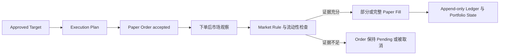

# A 股 Paper Trading 成交指南

[English](./a-share-paper-trading.md)

状态：V1 用户与证据契约。精确交易所规则数值和支持的 Order Type 将在 Market Rule Snapshot 确认后补充。

相关指南：[Paper Trading Account](./paper-trading-accounts.zh-CN.md) 与 [Strategy、Risk、Execution](./strategy-risk-execution.zh-CN.md)。

## 模拟器是什么

`adaq-a-share-paper` 是 ADAQ 自有本地 Paper Execution Adapter。它不会把订单发送给 Broker，也不会声称真实交易所一定给予相同排队位置。它使用默认 1,000,000 CNY Paper Funding Target，测试实时数据流、Strategy Decision、Host Risk、Order Lifecycle、账户记账、恢复流程和保守模拟成交。

## V1 账户范围：仅普通证券账户

V1 只模拟一个 **A 股普通证券账户**，只使用账户自有可用资金和已持有证券：

- Buy 必须在计入 Fee 后从 Available Cash 中冻结并结算。
- Sell 只能使用该 Position 在适用结算规则下的 Sellable Quantity，包括规则要求的 T+1。
- Cash、Frozen Funds、Position、Sellable Quantity、Cost Basis、Fee、Tax 与 Corporate Action 都保留为显式 Ledger Evidence。

V1 **不模拟信用账户（融资融券账户）**。融资买入、融券卖空、授信额度、担保品划转、负债、利息、维持担保比例、合约偿还、Margin Call 与强制平仓均不受支持。需要任一此类能力的 Order 必须在提交前被拒绝，Paper Execution Capability Snapshot 也必须把相应能力报告为不可用。系统绝不能用负 Cash 或负 Position 假装实现了信用账户。

## 证据流程



引擎绝不能读取模拟决策当时尚不可获得的观察。

## Order Lifecycle

Paper Order 保留每次状态转换：

```text
Submitted
→ Accepted
→ Partially Filled
→ Filled
→ Cancelled
→ Rejected
```

不是每个 Order 都经过全部状态。Reject 必须记录精确规则或验证原因；Cancel 不得删除之前的 Accepted 或 Partial Fill 证据。Retry 使用新 Order Identity 并链接旧 Attempt，而不是改写旧记录。

## Fill Evidence State

| State | 证据 | 允许得出的结论 |
| --- | --- | --- |
| Trade Observed | 下单后 Market Trade 或 Auction Result，且具有可用 Price 与 Quantity 证据。 | 可根据该事件和剩余 Order Quantity 约束模拟 Fill。 |
| Quote Constrained | 下单后的 Best Bid/Ask 证明订单可执行；Provider 提供时保留 Visible Size。 | 可使用不利一侧可执行价格和声明 Slippage；不声称拥有 Queue Priority。 |
| Bar Constrained | 只有下单后 Bar 与 Volume 可用。 | 可按保守参与率生成降级 Fill；Bar 内顺序和最优价未知。 |
| Unavailable | 不存在合格下单后观察，或缺少必需规则证据。 | 不生成 Fill。 |

每个本地 Paper Fill 旁边都显示该 State。它不是概率，也不能被平均成误导性的“成交置信度”。

## Price 与 Liquidity 规则

- 可立即成交的 Buy 受第一笔合格可执行 Ask 和冻结的不利 Slippage 约束。
- 可立即成交的 Sell 受第一笔合格可执行 Bid 和冻结的不利 Slippage 约束。
- 非立即成交 Limit Order 等待后续合格 Quote、Trade 或 Auction Result 穿过 Limit。
- 模拟 Price 绝不能违反 Order Limit。
- Visible Size 限制该 Observation 可成交的数量。
- Size 不可用时，冻结的保守 Participation Rate 根据下单后 Observed Volume 限制 Fill。
- 缺少 Size 绝不代表无限流动性。
- 剩余 Quantity 保持 Open，可以随后 Partial Fill，或按冻结 Cancel Policy 处理。

## 为什么 Bar 穿价仍不足以证明成交

假设 Buy Limit Order 在 10:00:05 Accepted，Limit 为 10.00 CNY：

```text
10:00:03 Ask 9.99     早于 Accepted，不能用于 Fill
10:00:06 Ask 10.01    在 Limit 下不可成交
10:00:08 Trade 9.98   后续穿价证据；Quantity 与 Policy 可能允许 Fill
```

如果 ADAQ 后来只获得 10:00–10:01 Bar，Low 为 9.90、High 为 10.20，它并不知道 9.90 发生在 10:00:05 之前还是之后，也不知道订单是否具有 Queue Priority。Bar Constrained Policy 只能使用因果上可获得的部分和已声明保守假设，不能因为 Bar Low 更有利就按该价格成交。

## Auction 与 Session Phase

Order 必须在精确 Trading Date、Session Phase、Trading Calendar Snapshot 与 Market Rule Snapshot 下解释。计划内午间休市不是数据缺口。只有 ADAQ 获得合格 Clearing Price 和 Volume Result 时，开盘或收盘集合竞价才产生模拟 Fill；否则 Order 保持未成交或按声明 Auction Expiry Rule 处理。

## A 股规则是证据而不是常量

引擎从 Effective-time Market Rule Snapshot 读取：

- Order Type 与 Session Eligibility。
- Buy/Sell Quantity Unit，包括零股处理。
- T+1 Sell Availability 与 Cash Treatment。
- Instrument 与 Board 特定涨跌幅。
- Suspension、Special Treatment、Listing 与特殊无涨跌幅时期。
- Fee、Tax、Transfer Charge 与 Minimum Commission。

如果必需规则为 Unknown，模拟器会阻止受影响风险或 Order，而不会回退到“所有 A 股规则都一样”的通用假设。

## 与 Backtest 的关系

Backtest 与 A-share Paper Trading 可以复用精确 Decimal 记账、Risk Policy、Order-state Type 与 Performance Calculation，但不能共用成交捷径：

- Backtest 使用冻结历史数据和声明的模拟 Fill Assumption。
- Paper Trading 根据实时 Observation 与 Wall-clock Arrival Evidence 推进。
- Paper Result 包含普通历史 Run 没有的 Latency、Stale Data、Connection、Polling 与 Recovery 行为。

Dashboard 必须显示 Engine 和 Fill Evidence State，使用户不会把 Bar-based Backtest Fill 误认为实时 Paper Fill。

## 用户必须能看到的证据

每个 Paper Order 与 Fill 都必须可以检查：

- Strategy Target、Risk Decision、Approved Target 与 Execution Plan。
- Order Identity、Submission/Acceptance Time、Limit 和 Requested Quantity。
- Trading Calendar、Market Rule Snapshot、Execution Profile 与 Data Provider Identity。
- 用于证明 Price 或 Liquidity 的每一条 Market Observation。
- Fill Evidence State、Participation Limit、Slippage、Fee 和 Remaining Quantity。
- 每个 Lifecycle Transition、Reject、Cancel 与 Recovery Action。
- 最终 Cash、Sellable Quantity、Position、Cost Basis 与 Portfolio State。

## Fail-safe 行为

- Stale 或 Unavailable Market Data 不生成新 Fill。
- Unknown Calendar 或 Market Rule 阻止受影响 Order。
- Data Provider 或 App 中断会记录 Gap，并在增加新风险前要求 Recovery。
- Duplicate Market Event 与 Duplicate Order Submission 必须幂等拒绝或关联。
- Restart 重放 Append-only Ledger，绝不能重建出不同历史 Fill。
- 用户可以取消合格 Pending Order，但不能编辑之前证据。

## 已知限制

没有 Broker 或 Exchange Queue Data 时，本地 Paper Trading 无法测量真实 Queue Priority、Market Impact、Information Leakage 或精确 Fill Probability。ADAQ 必须在每份 Report 保留该限制，不能把保守模拟描述成真实成交能力。
