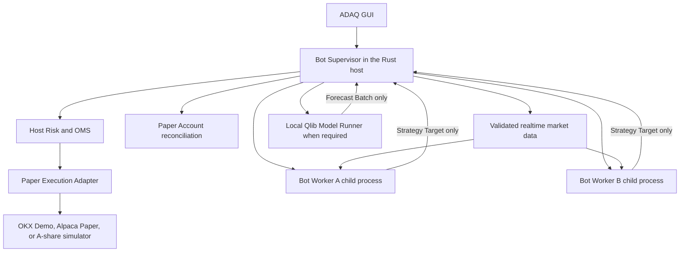
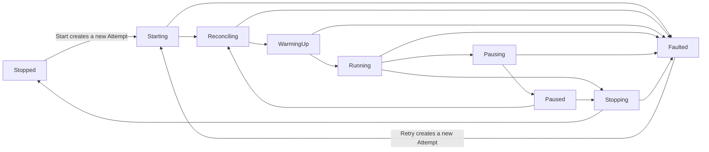

# Trading Bot Runtime Guide

[简体中文](./bot-runtime.zh-CN.md)

Status: V1 Paper Trading runtime, security, and operator contract.

Related guides: [Monitoring and Alerting](./monitoring-and-alerting.md), [Paper Trading Accounts](./paper-trading-accounts.md), [Strategy, Risk, and Execution](./strategy-risk-execution.md), and [GUI Localization](./gui-localization.md).

## The short answer: Sidecar and child process

Sidecar and child process describe different things:

- **Sidecar** describes how ADAQ builds, signs, bundles, and locates the external `adaq-bot-worker` executable.
- **Child process** describes how the running desktop application starts and supervises one Worker instance.

V1 therefore uses one prebuilt Rust Sidecar executable and starts one child-process instance per active Trading Bot. It does not generate and compile a new Rust application when a Bot is deployed.

## Runtime topology



The Trading Bot product includes the deployment, Supervisor, Worker attempt, qualified artifacts, account binding, and retained evidence. The Worker process is replaceable runtime machinery rather than the Bot's durable identity.

## Bot Supervisor responsibilities

The Rust host owns every capability that can affect money or shared account state:

- Starts, stops, monitors, and terminates Workers.
- Verifies Bot Deployment Bundles and runtime identities.
- Acquires validated realtime market data and distributes identity-preserving inputs.
- Owns Paper Account connection, startup and reconnect reconciliation, and authoritative snapshots.
- Reserves account capital across Bots before accepting new exposure.
- Applies hard Risk and records Approve, Constrain, or Reject decisions.
- Converts Approved Targets into Execution Plans through the OMS.
- Calls `adaq-okx-paper`, `adaq-alpaca-paper`, or `adaq-a-share-paper`.
- Journals orders, partial Fills, account events, failures, recoveries, and operator actions.
- Provides Pause, Stop, Freeze All, and other emergency controls.
- Holds credentials through the approved host secret boundary; credentials never enter a Worker message or Deployment Bundle.

The React GUI is an operator console for this host authority. Closing or losing the GUI cannot transfer authority to an unsupervised Worker.

## Bot Worker responsibilities

Every active Bot receives a separate process created from the same exact `adaq-bot-worker` binary. Its Bot Deployment Bundle differs, but the executable identity does not.

A Worker may:

- Verify and load the qualified Feature Plan, Factor and Strategy Components, and supported Model payloads.
- Evaluate host-owned Feature semantics over Supervisor-supplied market inputs.
- Perform qualified WASI or ONNX inference.
- Maintain reconstructible analytical state within declared resource and time limits.
- Emit a complete Strategy Target, structured diagnostic, heartbeat, and progress evidence.

A Worker may not:

- Read credentials, invoke provider endpoints, or open an order channel.
- Mutate account cash, positions, orders, or the authoritative journal.
- approve its own hard Risk exception or bypass a rejected Risk Decision.
- silently substitute a Component, Model, dataset, parameter, or runtime.
- continue as an independent daemon after it loses its Supervisor.

The process boundary limits a faulty Strategy or runtime to analytical output. It is not the only sandbox: WASI capability restrictions, Model runtime limits, schema validation, deadlines, and Host Risk still apply.

## Bot Deployment Bundle

Before a Worker starts, the Supervisor freezes and content-identifies a Bundle containing at least:

- Trading Bot and Strategy Instance identities.
- Paper Portfolio and Paper Trading Account identities, without credentials.
- Exact Component Packages, Component Locks, Models, Model Deployment Profiles, and runtime payload hashes.
- Frozen Feature Plan, parameters, decision schedule, and required Warmup.
- Deployment Qualification and all referenced research, Backtest, Validation, and runtime-equivalence evidence.
- Risk Policy, Execution Profile, resource limits, and failure policy.
- Market Data, Trading Calendar, Market Rule, and provider capability requirements.
- Bot Worker and supported host runtime versions.

Changing any bound item creates a new Bundle identity and requires a new start or deployment decision. A running Worker never receives an unrecorded in-place strategy mutation.

## Decision clock and causality

V1 supports two reproducible Bot Decision Schedules:

| Strategy Scope | Trigger | Decision Batch |
| --- | --- | --- |
| Time Series | A declared Bar Interval becomes a provider-confirmed Closed Bar. | One Instrument, its exact Closed Bar identity, and the complete available Feature and Forecast inputs after Warmup. |
| Cross Sectional | A declared Venue-local scheduled batch boundary is reached. | One deterministic Point-in-Time Instrument Universe at one Decision Time, with explicit availability and missingness for every member. |

Every Feature, Factor output, and Forecast Signal must satisfy `Available At <= Decision Time`. Arrival after the cutoff cannot be backdated into the Batch. The Worker result must also arrive by the frozen Decision Deadline; a late result remains diagnostic evidence but cannot increase risk.

```text
Bar or batch information cutoff
→ input availability validation
→ Decision Batch frozen
→ Worker evaluates Feature / Model / Strategy
→ Strategy Target validated before Decision Deadline
→ Host Risk
→ Approved Target
→ next eligible post-decision execution event
```

A target derived from Closed Bar `t` cannot fill from that Bar's close, high, low, volume, or an earlier Quote or Trade. Execution starts only from the next eligible market event under the frozen Execution Profile and Venue session rules.

If Warmup is incomplete, a Bar Gap reset is active, a required member or input is unavailable, Model inference fails, or the Decision Deadline is missed, the Bot emits no new Strategy Target. Existing exposure remains unchanged unless Host Risk independently reduces it; missing input is never interpreted as zero exposure or permission to repeat a stale decision.

### Market alignment

- A-share schedules and Bar boundaries use `Asia/Shanghai` Trading Dates, sessions, auctions, and the midday break.
- U.S. equity schedules use `America/New_York`, including daylight-saving and early-close calendar evidence.
- Crypto schedules use the recorded UTC continuous-market Bar grid.
- Cross-Sectional Batches never substitute current listings for the exact Point-in-Time Instrument Universe or silently drop a late Instrument.

Realtime Ticker, Trade, Quote, and Level 2 evidence still supports market-data freshness, hard Risk, price protection, liquidity checks, Paper Fill simulation, order reconciliation, and monitoring. It does not trigger a V1 Strategy decision or enter its analytical Feature Batch because V1 does not retain the complete historical event and order-book evidence needed to replay that behavior honestly.

Tick-driven Strategy callbacks, order-book Factors, market making, sub-minute HFT, queue-position models, and latency-arbitrage logic are outside V1. Supporting them later requires a separately versioned event-data contract, immutable event and book snapshots, deterministic replay, latency and queue evidence, a compatible Component ABI, and dedicated deployment qualification.

## Why deployment does not compile Rust

Research may generate an SDK project for a Declarative Factor, Model export wrapper, or Strategy candidate. That source is reviewed, built, packaged, validated, and equivalence-tested before promotion into a `.adaq` Component.

Repeating compilation at Bot startup would create an unqualified executable whose toolchain, dependencies, source, platform output, signing status, and antivirus behavior could differ from the tested artifact. V1 instead starts the already qualified generic Worker and loads exact content-identified Components.

## Local Qlib Paper

A Model that qualifies for Local Qlib Paper uses the original frozen Python/Qlib environment through a separately supervised `adaq-model-runner`. It receives only Prediction Batches and returns Forecast Batches. It has no credentials, Portfolio authority, Risk authority, or order API.

If Qlib inference crashes, misses its deadline, returns the wrong schema, or produces a non-finite value, the affected Bot produces no new risk-increasing target. The failure remains visible and inspectable; the Supervisor never falls back to an unqualified alternate model.

## Failure and restart boundary

Every explicit Start or Retry creates a new Bot Runtime Attempt. The Supervisor records its exact binary and Bundle identities, lifecycle transitions, start and stop reasons, heartbeats, deadlines, resource-limit events, last accepted input and output sequence, operator actions, and diagnostic stream.

### Lifecycle state machine



| State | Meaning and authority |
| --- | --- |
| Stopped | Terminal for the current Attempt. No Worker and no new order authority. |
| Starting | Verifies the Deployment Bundle, Worker binary, runtime compatibility, resource policy, and private IPC before accepting data. |
| Reconciling | Establishes authoritative Paper Account, open-order, Fill, Position, reservation, and journal state. No Strategy order authority. |
| WarmingUp | Rebuilds Feature, Factor, Model, and Strategy state from frozen causal inputs. No Strategy order authority. |
| Running | The only state that may submit a newly validated risk-increasing Strategy Target to Host Risk. |
| Pausing | Blocks new targets immediately and attempts to cancel eligible pending orders and establish reconciled state. |
| Paused | Retains positions and may keep analytical state warm. Host Risk may still reduce exposure, but Strategy targets cannot add risk. |
| Stopping | Blocks decisions, applies the selected stop policy, reconciles, and terminates the Worker. |
| Faulted | Terminal for the current Attempt. Exact unresolved orders, positions, evidence, and Reconciliation Required status remain visible. |

Health severity, connection state, and Reconciliation Required are displayed beside Lifecycle State rather than invented as additional lifecycle aliases. In particular, a Bot cannot be labelled Paused if the Supervisor cannot establish whether its pending orders were cancelled.

### Pause and resume

Pause immediately revokes permission for new Strategy Targets. The Supervisor attempts to cancel eligible pending orders, records every acknowledgement or uncertainty, and retains existing positions. It enters Paused only when the account and journal reach the frozen pause policy's reconciled conditions; otherwise the Attempt becomes Faulted or remains transitional with Reconciliation Required.

Resume never jumps directly from Paused to Running. It passes through Reconciling and WarmingUp, validates current data and account state, and waits for a new Decision Batch. A pre-pause Target or missed Decision is never replayed.

The Supervisor may reconnect providers, reconstruct Worker state, and collect diagnostics automatically. V1 does not automatically restore risk authority after a fault: an operator must explicitly Resume a valid paused Attempt or Retry a Faulted one.

### Stop policies

- **Stop and Keep Position** is the default. It blocks decisions, cancels eligible pending orders, reconciles, stops the Worker, and marks any remaining holding as an Unmanaged Position.
- **Stop and Flatten** requires separate confirmation. It first blocks new risk and cancels pending orders, then uses Host Risk and OMS to attempt liquidation. The Attempt reaches Stopped only after the flat account allocation is reconciled.
- If a Flatten order is rejected, partially filled, disconnected, or otherwise unresolved, the UI must not claim the Bot stopped flat. It remains Stopping or becomes Faulted with the exact remaining exposure.
- **Freeze All** pauses every Bot, blocks new risk, and attempts to cancel open orders while retaining positions. **Flatten All** remains a separately confirmed system-wide operation.

On Worker crash, invalid output, missed heartbeat, IPC loss, or parent-control loss:

1. No further Worker output is authorized.
2. The Supervisor blocks new risk for the affected Bot.
3. Existing pending orders follow the frozen failure policy; no order is silently forgotten.
4. Account and order evidence remains in the host journal.
5. The current Runtime Attempt becomes Faulted and retains Reconciliation Required when authority is uncertain.
6. An operator Retry creates a new Attempt and verifies the exact Bundle and Worker binary again.
7. Analytical state is reconstructed from frozen inputs, checkpoint evidence, or deterministic replay.
8. Account reconciliation and Warmup complete before the operator may restore Running.

A restarted process is not assumed equivalent merely because it has the same Bot name.

## Multiple Bots and shared accounts

Separate Workers do not imply separate capital when Bots share one Paper Trading Account. The Supervisor is the single account-level authority and reserves cash, buying power, positions, and pending-order exposure across all Bots before approving a target. One Worker cannot spend capital reserved for another.

The V1 one-Worker-per-Bot model costs more memory than a shared process, but it provides a clear crash boundary, independent deadlines and resource limits, simpler termination, and precise diagnostics. A Worker pool is deferred until measured concurrency proves the process overhead material; it cannot decentralize account Risk or OMS authority.

## Operator-visible evidence

For every Trading Bot, the Dashboard must expose:

- Bot, Deployment Bundle, Worker binary, Strategy, Model, Component, Paper Account, Risk Policy, and Execution Profile identities.
- Current Runtime Attempt, process and Lifecycle State, transition reason and actor, PID when useful, uptime, last heartbeat, last valid input, and last Strategy Target.
- Bot Decision Schedule, current Decision Time, input watermark, Decision Deadline, and every skipped or late decision reason.
- Data freshness, account reconciliation, Model runtime, Risk, OMS, and Adapter health separately.
- CPU, memory, deadline misses, restarts, stop reason, and failure policy outcome.
- Pending orders, partial Fills, reserved capital, positions, Unmanaged Positions, Reconciliation Required, and unresolved account differences.
- Direct links to retained diagnostics without exposing credentials.

## V1 boundary

V1 runs Paper Trading only. The same isolation shape may inform a later Real Trading design, but successful Paper operation does not provide Real Trading Qualification. Cloud execution, unattended Workers, self-updating Bot binaries, user-compiled startup executables, and hundreds-of-Bot Worker pools are outside V1.
