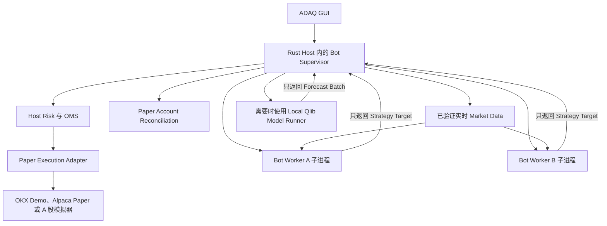
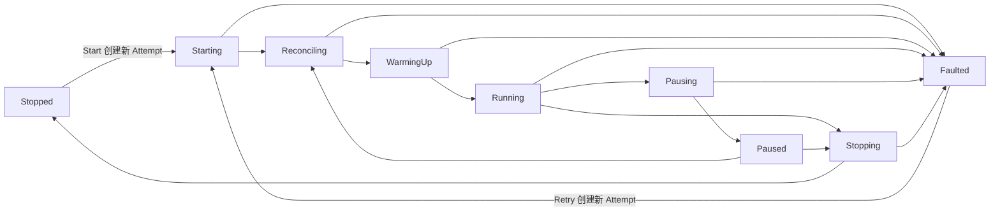

# Trading Bot 运行时指南

[English](./bot-runtime.md)

状态：V1 Paper Trading 运行时、安全与操作员契约。

相关指南：[实时监控与异常报警](./monitoring-and-alerting.zh-CN.md)、[Paper Trading Account](./paper-trading-accounts.zh-CN.md)、[Strategy、Risk、Execution](./strategy-risk-execution.zh-CN.md) 与 [GUI 多语言](./gui-localization.zh-CN.md)。

## 简短答案：Sidecar 与子进程

Sidecar 与子进程描述的是两件不同的事：

- **Sidecar** 描述 ADAQ 如何构建、签名、随应用打包并定位外部 `adaq-bot-worker` 可执行文件。
- **子进程** 描述正在运行的 Desktop Application 如何启动和监督一个 Worker Instance。

因此，V1 使用一个预编译 Rust Sidecar 可执行文件，并为每个 Active Trading Bot 启动一个 Child-process Instance。部署 Bot 时不会生成并编译新的 Rust Application。

## 运行拓扑



Trading Bot 产品包含 Deployment、Supervisor、Worker Attempt、已资格认证 Artifact、Account Binding 与保留证据。Worker Process 是可替换的运行机械，不是 Bot 的持久身份。

## Bot Supervisor 职责

Rust Host 拥有所有能够影响资金或共享账户状态的能力：

- 启动、停止、监控和终止 Worker。
- 验证 Bot Deployment Bundle 与 Runtime Identity。
- 获取已验证实时 Market Data，并分发保留身份的 Input。
- 管理 Paper Account Connection、启动与重连 Reconciliation 以及权威 Snapshot。
- 在允许新 Exposure 前协调多个 Bot 的 Account Capital Reservation。
- 执行 Hard Risk，记录 Approve、Constrain 或 Reject Decision。
- 通过 OMS 把 Approved Target 转换为 Execution Plan。
- 调用 `adaq-okx-paper`、`adaq-alpaca-paper` 或 `adaq-a-share-paper`。
- 记录 Order、Partial Fill、Account Event、Failure、Recovery 与 Operator Action。
- 提供 Pause、Stop、Freeze All 等 Emergency Control。
- 通过批准的 Host Secret Boundary 持有 Credential；Credential 绝不能进入 Worker Message 或 Deployment Bundle。

React GUI 是该 Host Authority 的操作控制台。关闭或失去 GUI 不能把权限转移给无人监督的 Worker。

## Bot Worker 职责

每个 Active Bot 都使用同一份精确 `adaq-bot-worker` Binary 创建独立进程。不同 Bot 的 Deployment Bundle 不同，但 Executable Identity 相同。

Worker 可以：

- 验证并加载已资格认证的 Feature Plan、Factor/Strategy Component 与支持的 Model Payload。
- 对 Supervisor 提供的 Market Input 执行 Host-owned Feature Semantics。
- 执行已资格认证的 WASI 或 ONNX Inference。
- 在声明的 Resource 与 Time Limit 内维护可重建 Analytical State。
- 输出完整 Strategy Target、Structured Diagnostic、Heartbeat 与 Progress Evidence。

Worker 不可以：

- 读取 Credential、调用 Provider Endpoint 或打开 Order Channel。
- 修改 Account Cash、Position、Order 或权威 Journal。
- 批准自己的 Hard Risk Exception，或绕过被拒绝的 Risk Decision。
- 静默替换 Component、Model、Dataset、Parameter 或 Runtime。
- 失去 Supervisor 后作为独立 Daemon 继续运行。

Process Boundary 把有缺陷 Strategy 或 Runtime 的影响限制为 Analytical Output，但它不是唯一 Sandbox；WASI Capability Restriction、Model Runtime Limit、Schema Validation、Deadline 与 Host Risk 仍然生效。

## Bot Deployment Bundle

Worker 启动前，Supervisor 至少冻结并按内容识别以下内容：

- Trading Bot 与 Strategy Instance Identity。
- Paper Portfolio 与 Paper Trading Account Identity，不含 Credential。
- 精确 Component Package、Component Lock、Model、Model Deployment Profile 与 Runtime Payload Hash。
- Frozen Feature Plan、Parameter、Decision Schedule 与所需 Warmup。
- Deployment Qualification 以及引用的 Research、Backtest、Validation 与 Runtime-equivalence Evidence。
- Risk Policy、Execution Profile、Resource Limit 与 Failure Policy。
- Market Data、Trading Calendar、Market Rule 与 Provider Capability Requirement。
- Bot Worker 与支持的 Host Runtime Version。

修改任何绑定项都会产生新的 Bundle Identity，并要求新的 Start 或 Deployment Decision。运行中的 Worker 不能收到未记录的原地 Strategy Mutation。

## 决策时钟与因果边界

V1 支持两种可重放 Bot Decision Schedule：

| Strategy Scope | Trigger | Decision Batch |
| --- | --- | --- |
| Time Series | 声明的 Bar Interval 成为 Provider-confirmed Closed Bar。 | 一个 Instrument、精确 Closed Bar Identity，以及 Warmup 后完整可用的 Feature 与 Forecast Input。 |
| Cross Sectional | 到达声明的 Venue-local Scheduled Batch Boundary。 | 一个 Decision Time 下确定性 Point-in-Time Instrument Universe，并为每个成员保留显式 Availability 与 Missingness。 |

每个 Feature、Factor Output 与 Forecast Signal 都必须满足 `Available At <= Decision Time`。Cutoff 之后才到达的数据不能被倒填进 Batch。Worker Result 还必须在冻结 Decision Deadline 前返回；Late Result 保留为诊断证据，但不能增加风险。

```text
Bar 或 Batch Information Cutoff
→ Input Availability Validation
→ 冻结 Decision Batch
→ Worker 执行 Feature / Model / Strategy
→ 在 Decision Deadline 前验证 Strategy Target
→ Host Risk
→ Approved Target
→ 下一个合格 Post-decision Execution Event
```

根据 Closed Bar `t` 产生的 Target 不能使用该 Bar 的 Close、High、Low、Volume 或更早 Quote/Trade 成交。Execution 只能根据冻结 Execution Profile 与 Venue Session Rule，从下一个合格市场事件开始。

如果 Warmup 未完成、Bar Gap Reset 生效、必需成员或 Input 不可用、Model Inference 失败或错过 Decision Deadline，Bot 不产生新 Strategy Target。Existing Exposure 保持不变，除非 Host Risk 独立降低风险；Missing Input 绝不能被解释为 Zero Exposure，也不能授权重复使用过期 Decision。

### 市场对齐

- A 股 Schedule 与 Bar Boundary 使用 `Asia/Shanghai` Trading Date、Session、Auction 与午间休市。
- 美股 Schedule 使用 `America/New_York`，包括 Daylight-saving 与 Early-close Calendar Evidence。
- Crypto Schedule 使用已记录 UTC Continuous-market Bar Grid。
- Cross-Sectional Batch 绝不能用当前上市列表替换精确 Point-in-Time Instrument Universe，也不能静默丢弃迟到 Instrument。

Realtime Ticker、Trade、Quote 与 Level 2 Evidence 仍用于 Market-data Freshness、Hard Risk、Price Protection、Liquidity Check、Paper Fill Simulation、Order Reconciliation 与 Monitoring。它们不能触发 V1 Strategy Decision，也不能进入 Analytical Feature Batch，因为 V1 没有保留诚实重放该行为所需的完整历史 Event 与 Order-book Evidence。

Tick-driven Strategy Callback、Order-book Factor、Market Making、亚分钟 HFT、Queue-position Model 与 Latency-arbitrage Logic 均不属于 V1。以后支持这些能力时，必须增加独立版本的 Event-data Contract、Immutable Event/Book Snapshot、Deterministic Replay、Latency/Queue Evidence、兼容 Component ABI 与专门 Deployment Qualification。

## 为什么部署时不编译 Rust

Research 可以为 Declarative Factor、Model Export Wrapper 或 Strategy Candidate 生成 SDK Project。Source 必须在晋升为 `.adaq` Component 前完成 Review、Build、Package、Validation 与 Equivalence Test。

如果 Bot 每次启动都重新编译，就会产生未经资格认证的 Executable；其 Toolchain、Dependency、Source、Platform Output、Signing State 与 Antivirus Behavior 都可能不同于已测试 Artifact。V1 只启动已经资格认证的通用 Worker，并加载精确 Content-identified Component。

## Local Qlib Paper

通过 Local Qlib Paper 资格认证的 Model 使用独立监督的 `adaq-model-runner` 执行原始冻结 Python/Qlib Environment。它只接收 Prediction Batch 并返回 Forecast Batch，不拥有 Credential、Portfolio Authority、Risk Authority 或 Order API。

如果 Qlib Inference Crash、超过 Deadline、返回错误 Schema 或产生 Non-finite Value，受影响 Bot 不得产生增加风险的新 Target。Failure 必须可见且可检查；Supervisor 绝不能回退到未经资格认证的替代 Model。

## Failure 与 Restart Boundary

每次显式 Start 或 Retry 都会创建新的 Bot Runtime Attempt。Supervisor 记录其精确 Binary 与 Bundle Identity、Lifecycle Transition、Start/Stop Reason、Heartbeat、Deadline、Resource-limit Event、最后接受的 Input/Output Sequence、Operator Action 与 Diagnostic Stream。

### Lifecycle State Machine



| State | 含义与权限 |
| --- | --- |
| Stopped | 当前 Attempt 的终态。没有 Worker，也没有新 Order Authority。 |
| Starting | 在接受 Data 前验证 Deployment Bundle、Worker Binary、Runtime Compatibility、Resource Policy 与 Private IPC。 |
| Reconciling | 建立权威 Paper Account、Open Order、Fill、Position、Reservation 与 Journal State。没有 Strategy Order Authority。 |
| WarmingUp | 根据冻结因果 Input 重建 Feature、Factor、Model 与 Strategy State。没有 Strategy Order Authority。 |
| Running | 唯一可以把新产生并已验证的 Risk-increasing Strategy Target 提交给 Host Risk 的状态。 |
| Pausing | 立即阻止新 Target，并尝试取消合格 Pending Order 和建立 Reconciled State。 |
| Paused | 保留 Position，并可以保持 Analytical State Warm。Host Risk 仍可降风险，但 Strategy Target 不能增加风险。 |
| Stopping | 阻止 Decision，执行所选 Stop Policy，完成 Reconciliation 并终止 Worker。 |
| Faulted | 当前 Attempt 的终态。精确 Unresolved Order、Position、Evidence 与 Reconciliation Required 状态保持可见。 |

Health Severity、Connection State 与 Reconciliation Required 必须显示在 Lifecycle State 旁边，不能伪装成额外 Lifecycle Alias。特别是 Supervisor 无法确认 Pending Order 是否已取消时，Bot 不能被标记为 Paused。

### Pause 与 Resume

Pause 会立即撤销新 Strategy Target 权限。Supervisor 尝试取消合格 Pending Order，记录每一项 Acknowledgement 或 Uncertainty，并保留 Existing Position。只有 Account 与 Journal 达到冻结 Pause Policy 的 Reconciled Condition 后才能进入 Paused；否则 Attempt 必须进入 Faulted，或带 Reconciliation Required 停留在 Transitional State。

Resume 绝不能从 Paused 直接跳到 Running。它必须经过 Reconciling 与 WarmingUp，验证当前 Data 和 Account State，并等待新的 Decision Batch。暂停前 Target 或错过的 Decision 绝不能被重放。

Supervisor 可以自动重连 Provider、重建 Worker State 并收集 Diagnostic。V1 不会在 Fault 后自动恢复 Risk Authority；操作员必须显式 Resume 有效 Paused Attempt，或者 Retry Faulted Attempt。

### Stop Policy

- **Stop and Keep Position** 是默认行为：阻止 Decision、取消合格 Pending Order、完成 Reconciliation、停止 Worker，并把任何剩余 Holding 标记为 Unmanaged Position。
- **Stop and Flatten** 必须单独确认：先阻止新风险并取消 Pending Order，再通过 Host Risk 与 OMS 尝试平仓。只有 Flat Account Allocation 完成 Reconciliation 后，Attempt 才能进入 Stopped。
- 如果 Flatten Order 被拒绝、部分成交、断线或存在其他未解决状态，UI 绝不能声称 Bot 已经 Flat Stop；它必须保持 Stopping，或带精确 Remaining Exposure 进入 Faulted。
- **Freeze All** 会暂停全部 Bot、阻止新风险并尝试取消 Open Order，同时保留 Position；**Flatten All** 仍然是单独确认的系统级操作。

当 Worker Crash、输出无效、Heartbeat 丢失、IPC 中断或失去 Parent Control 时：

1. 后续 Worker Output 不再获得授权。
2. Supervisor 阻止该 Bot 增加新风险。
3. Existing Pending Order 按冻结 Failure Policy 处理，绝不能被静默遗忘。
4. Account 与 Order Evidence 保留在 Host Journal。
5. 当前 Runtime Attempt 进入 Faulted；权限不确定时保留 Reconciliation Required。
6. 操作员 Retry 创建新 Attempt，并再次验证精确 Bundle 与 Worker Binary。
7. 根据 Frozen Input、Checkpoint Evidence 或 Deterministic Replay 重建 Analytical State。
8. 完成 Account Reconciliation 与 Warmup 后，操作员才可以恢复 Running。

不能因为重启进程沿用同一个 Bot Name，就假设它与旧进程等价。

## 多个 Bot 与共享 Account

独立 Worker 不代表共享同一个 Paper Trading Account 的 Bot 拥有独立资金。Supervisor 是唯一 Account-level Authority；批准 Target 前，必须跨所有 Bot 预留 Cash、Buying Power、Position 与 Pending-order Exposure。一个 Worker 不能花费另一个 Worker 已预留的资金。

V1 每 Bot 一个 Worker 比共享进程占用更多内存，但获得了明确 Crash Boundary、独立 Deadline 与 Resource Limit、更简单的 Termination 以及精确诊断。只有实际并发测量证明 Process Overhead 显著时，才在 V1 之后考虑 Worker Pool；Worker Pool 也不能分散 Account Risk 或 OMS Authority。

## 操作员必须能看到的证据

Dashboard 必须为每个 Trading Bot 展示：

- Bot、Deployment Bundle、Worker Binary、Strategy、Model、Component、Paper Account、Risk Policy 与 Execution Profile Identity。
- 当前 Runtime Attempt、Process 与 Lifecycle State、Transition Reason/Actor、必要时的 PID、Uptime、Last Heartbeat、Last Valid Input 与 Last Strategy Target。
- Bot Decision Schedule、当前 Decision Time、Input Watermark、Decision Deadline，以及每次 Skip 或 Late Decision Reason。
- 分别展示 Data Freshness、Account Reconciliation、Model Runtime、Risk、OMS 与 Adapter Health。
- CPU、Memory、Deadline Miss、Restart、Stop Reason 与 Failure Policy Outcome。
- Pending Order、Partial Fill、Reserved Capital、Position、Unmanaged Position、Reconciliation Required 与 Unresolved Account Difference。
- 不暴露 Credential 的 Retained Diagnostic 链接。

## V1 边界

V1 只执行 Paper Trading。相同隔离结构可以为未来 Real Trading 提供参考，但 Paper 运行成功不等于获得 Real Trading Qualification。Cloud Execution、Unattended Worker、自更新 Bot Binary、用户在启动时编译 Executable 以及数百 Bot Worker Pool 均不属于 V1。
