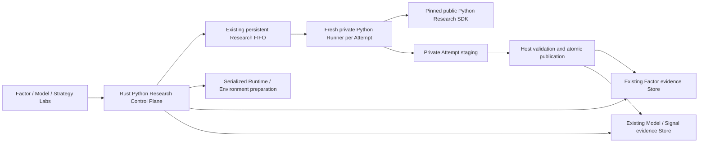

# M12 Python Research SDK and Qlib-first Model Lab

[简体中文](./m12-python-research-and-model-lab.zh-CN.md)

Status: implementation and verification record for the accepted M12 contract published as [parent specification #97](https://github.com/tonywxx/adaq/issues/97) with child issues #98–#104. Design decisions Q1-Q92 remain the boundary; child issue closure still requires criterion-level evidence and supported-platform CI.

The corresponding phased acceptance contract is [M12 Python Research manual acceptance](./m12-python-research-manual-acceptance.md).

## Outcome

M12 makes Python the editable local research surface for ADAQ without making Python the deployment boundary. A User can create, inspect, tune, import, export, and reproducibly execute one Factor or Model Python Research Project over exact Host-supplied evidence. M13 adds the same workflow for Strategy Projects. M14 generates qualified WASI Components only from canonical portable Definitions or registered data-only Model Artifacts.

The App installs and manages its own pinned CPython 3.12 runtime on demand. It does not use or require the system Python, and the rest of ADAQ continues to work when the Python Runtime is absent. Python receives no credential, order, authoritative database, internal Parquet layout, or deployment authority.

The three bundled examples form one guided, executable journey:

1. `py-factor-cross-sectional-momentum` builds and evaluates a portable cross-sectional momentum Factor.
2. `py-model-qlib-ridge-return` fits a Qlib Ridge Model and publishes one Forecast Signal Dataset.
3. `py-strategy-top-n-forecast` combines the Forecast and Factor in a portable Long-only Top-N Strategy.

The first two are M12 deliverables, the third becomes executable in M13, and all three become Component-generation inputs in M14 where eligible.

## Product boundary

M12 includes:

- One public Python Research SDK for Factor, Model, and frozen future Strategy contracts.
- Source-visible Python Project creation, validation, inert import/export, immutable Revisions, exact Trust Decisions, locked Environments, Runs, cancellation, logs, and evidence navigation inside the owning Lab.
- An ADAQ-managed CPython 3.12.x Runtime installed only on first Python use.
- One private Python Research Runner process per Attempt and one versioned Host protocol.
- Python Factor as a third M11 Factor Candidate source using existing Dataset, Evaluation, Family, and Promotion evidence.
- A Host-fed Qlib Dataset Bridge and one registered Qlib Ridge Adapter producing `adaq:linear-model@1`.
- Host-owned finite parameter Grids, Selection Decisions, held-out Final Evaluation, Repeatability Reports, and existing Forecast Signal contracts.
- The Factor and Model portions of a bilingual, offline, synthetic tutorial.

M12 excludes:

- System or User-selected Python interpreters, Conda, mutable virtual environments, `pip install` during Run, source distributions, and dependency build scripts.
- Embedded Monaco, Jupyter, terminal, notebook execution as authoritative evidence, or notebook-to-WASM translation.
- Generic Qlib compatibility, Qlib Providers or downloaders, Alpha158 implicit data, arbitrary Python serialization, and generic Python-to-WASM or Qlib-to-ONNX conversion.
- Python Strategy execution, Portfolio Backtest changes, and the complete tutorial chain, which belong to M13.
- Component generation, compilation, conformance, equivalence, and import, which belong to M14.
- Marketplace hosting, payments, licence enforcement, or a strong arbitrary-code sandbox.

## Architecture and ownership



Ownership is deliberately narrow:

- `src-tauri/crates/adaq-python-research` is Tauri-independent and owns Manifest, Archive, Revision, Trust, Runner Protocol, Resource Policy, and staged Result validation contracts.
- `src-tauri/src/python_research/` owns Python Research SQLite lifecycle, Working Copies, Runtime and Environment files, private process supervision, and attachment to the persistent FIFO already owned by `Features`.
- `src-tauri/crates/adaq-factor-research` and `src-tauri/src/factor_research/` retain Factor Dataset, Evaluation, Family, Promotion, and storage ownership.
- Existing Model and Forecast Signal modules retain Model Artifact, Dataset, Evaluation, and storage ownership.
- `python/adaq-research-sdk/` builds the public `adaq-research-sdk` wheel and `adaq` namespace, including `adaq.qlib`.
- `python/adaq-python-research-runner/` builds the private bundled Runner wheel launched as managed CPython `-I -m adaq_runner`.
- Tauri commands remain thin validation, enqueue, cancel, retry, and query boundaries. They do not run Python, SQLite-heavy, filesystem-heavy, or training work inline.

## Project kinds and modes

One Python Research Project declares exactly one Kind:

- Factor
- Model
- Strategy

A Factor or Strategy additionally declares one Mode:

- `imperative-python`: arbitrary trusted Python for Research Only.
- `portable-definition`: Python constructs one canonical Host Definition; arbitrary Python is absent from the Definition and generated Component.

Model Projects do not declare that Mode. Portability is determined by a registered Model Research Adapter, canonical Artifact schema, and Model Exporter.

A Project may contain several Python modules and declared outputs, but it exposes one stable `module:function` entry point. Notebooks may be used beside the Project for exploration but are never the execution, Revision, Archive, or publication source.

## Project identity and layout

Every immutable lower-kebab-case Project ID begins with the Kind-matching prefix:

- `py-factor-*`
- `py-model-*`
- `py-strategy-*`

Changing the ID creates a different Project. Copy from Example never overwrites a conflicting Working Copy and requires another matching ID.

The fixed root layout is:

```text
adaq-project.toml
pyproject.toml
pylock.toml
src/
  project.py
  ... optional declared Python modules
README.md
README.zh-CN.md      # required for bundled examples; otherwise optional
LICENSE
```

`adaq-project.toml` is the exact-schema execution Manifest. It declares Project ID, Kind, Mode when applicable, Scope, `project:create_project` or another exact entry point, logical SDK and Runtime Profiles, typed parameters, ordered Input Slots and outputs, Target or Signal contracts, Dependency Lock hash, and bounded resource requests. Local Dataset IDs never appear in a portable Manifest.

`pyproject.toml` is editable dependency intent. ADAQ alone generates `pylock.toml` with exact Runtime and platform wheel versions and hashes. `setup.py`, `requirements.txt`, shell launchers, data, results, environments, caches, and secrets are not authoritative Project files.

Unknown Manifest fields, enum values, and schema versions fail static Validate and block Prepare and Run. Source and historical evidence remain viewable and exportable. V1 never silently upgrades or rewrites an incompatible Project; a future second schema may add an explicit copy-and-upgrade action when it actually exists.

## Working Copy, Revision, Archive, and trust

A User-scoped Working Copy lives under ADAQ local data and is opened in the User's external editor. Its visible state is Clean, Dirty, or Invalid. File changes do not execute, hot-reload, synchronize an external source directory, or mutate evidence.

Run freezes one immutable content-addressed Project Revision from the current valid Working Copy. The Revision binds the Manifest, declared source, Lock, exact SDK wheel, logical Runtime Profile, and resolved platform Runtime Artifact. A running Attempt never observes later edits.

A deterministic Project Archive is an ordinary source-visible ZIP of the validated layout. Export requires a licence declaration and matching `LICENSE`:

- `LicenseRef-Proprietary` is valid for local private exchange.
- A future zero-price Community listing requires an explicit SPDX open-source licence that permits source redistribution.

Offline import rejects absolute or parent-traversing paths, symbolic or hard links, duplicate or case-fold-colliding paths, undeclared entries, count or size limit violations, and Lock hash mismatch before copying an inert Untrusted Working Copy. Import never loads a module, prepares an Environment, or executes code.

Trust authorizes one exact Revision only. Import, installation, App bundling, Marketplace review, publisher reputation, name continuity, or trust in an older Revision grants no authority. The tutorial may present three exact Revisions in one confirmation, but it records three separate Trust Decisions; only a changed Project is re-prompted.

## Managed Runtime and dependencies

Projects declare logical `adaq-python@1`. The App resolves that Profile to one exact platform-specific CPython 3.12.x Artifact and records its version, platform, and hash in the Revision. A newer Runtime Profile never changes old evidence. A historical Runtime may be downloaded again when supported; security-disabled Runtime evidence remains readable but cannot execute.

First Python use downloads, verifies, stages, and atomically publishes the Runtime under ADAQ local data. There is no system-interpreter discovery, custom interpreter path, or V1 offline Runtime import. Non-Python ADAQ functionality remains available before installation or after cache eviction.

Each supported platform receives an ADAQ-signed base Wheelhouse containing `adaq-research-sdk`, the private `adaq-python-research-runner`, the embedded `adaq-qlib-ridge-adapter`, platform-qualified Arrow/NumPy wheels, and their qualified dependencies. Project-specific dependencies must be compatible wheels from trusted indexes; V1 rejects source distributions and arbitrary build scripts.

Dependency operations are explicit:

1. Edit `pyproject.toml`.
2. Invoke Sync Environment.
3. Resolve only under trusted-index, wheel-only, and hash policies.
4. Atomically replace `pylock.toml`.
5. Treat the resulting source and Lock as a new untrusted Revision.

Run never resolves, downloads from an index, modifies the Lock, or installs a package. Runtime, Wheelhouse, and prepared Environment bytes are evictable caches; their identities remain in historical evidence and rerun reconstructs them when still permitted.

## Attempt and queue lifecycle

Runtime and Environment preparation is a separate explicit Attempt. Matching active requests coalesce, preparation is serialized, and failed or cancelled staging is never executable. Preparation does not grant execution trust.

Heavy Feature, Factor, Python, Model, and later Strategy research uses the existing persistent device-wide FIFO. There is one fresh Python process per Python Research Attempt and no process pool. The process exits at the terminal Attempt state.

A Python Research Attempt binds one Revision and prepared Environment to exact Input Slot bindings, one normalized parameter set, Seed, deterministic runtime settings, Host Resource Policy, outputs, diagnostics, and logs. Its lifecycle is:

```text
Pending → Running → Completed | Failed | Cancelled
```

Retry creates another Attempt. Pending survives restart; stale Running becomes Failed with an Interrupted reason. Cancellation requests cooperative shutdown, waits a bounded grace period, then terminates the process tree. Cancelled is recorded only after exit and staging isolation. Late results cannot mutate evidence.

## Runner protocol and result publication

The Host creates a random loopback port on `127.0.0.1` and a one-time token. Before Project execution, the Runner must complete an exact Protocol, SDK, Revision, and Attempt handshake. Incompatible peers fail closed.

- Length-prefixed canonical JSON carries bounded control messages.
- Arrow IPC carries typed identity-preserving tables.
- Large declared artifacts use private Attempt-scoped staged files with hashes.
- `stdout` and `stderr` are capped User-scoped logs, never protocol channels and never uploaded automatically.

The Runner receives a private working directory and allowlisted child environment with no credentials, provider tokens, signing keys, order endpoints, or internal store paths. Process isolation is a failure boundary, not a claimed cross-platform filesystem or network sandbox for trusted arbitrary code.

The Runner cannot write ADAQ SQLite or final Dataset locations. The Host validates identity, order, schema, availability, finite values, canonical Decimal rules, count and size limits, and hashes before atomic publication. Failed or Cancelled Factor and Strategy work publishes no partial result. A Model may retain only declared capped diagnostic checkpoints, which are never deployable.

## Public SDK entry and contexts

Every Manifest entry point is an exact `module:function` referring to a zero-argument `create_project()`. After Trust, the Runner imports the module, calls the function once at the relevant lifecycle boundary, and requires the returned SDK object to match Kind and Mode. It performs no file, class, decorator, or framework discovery.

Parameters, Seed, identities, frozen inputs, event times, progress, and diagnostics arrive only through later typed Context calls. The SDK exposes no current wall clock, GUI object, database handle, order API, or generic query surface. `progress(...)` and `diagnostic(...)` are structured and bounded. An uncaught exception, missing required result, invalid output, or deadline failure fails the Attempt without falling back to historical output.

Before import, the Runner applies the Attempt Seed to `PYTHONHASHSEED` and the registered Python, NumPy, and framework random sources and fixes thread counts under the Resource Policy. Ambient time, undeclared randomness, mutable module globals, disk caches, and cross-Attempt state are outside the reproducible contract.

## Input and numeric boundary

The Manifest declares stable ordered Input Slots by semantic contract and Scope. The Lab Run binds them to exact local Snapshot, Dataset, Universe, Promoted Factor, Forecast Signal, Target, or Portfolio evidence. The Attempt freezes those identities. Project code cannot discover a similarly named or “latest” local object.

Boundary representations are exact:

- IDs and enum-like identities use stable strings.
- Event times use signed 64-bit integers.
- Financial amounts, parameters, and Target weights use canonical Decimal strings.
- Feature, Factor, and Forecast analytical values use finite binary64 or explicit typed Unavailable.
- NaN, infinity, object dtype, inferred pandas identity types, silent row deletion, approximate joins, and implicit filling are invalid.

Arrow-compatible schemas and Parquet or Arrow IPC are authoritative for tables. Pandas is an SDK convenience, not the identity, ordering, missingness, or dtype contract.

## Python Factor path

Python becomes the third M11 Factor Candidate source beside Declarative and private Custom WASM Candidates. A Python Candidate binds one exact Factor Project Revision and Environment and materializes the standard Factor Dataset. Existing M11 Evaluation, Research Family, Trial, Promotion Policy, Decision, and Promoted Factor Library semantics remain authoritative.

Portable Factor implements `define(context) -> FactorDefinition` without Dataset access. It constructs the existing Feature Definition graph and Feature Plan under the versioned Feature Operator Catalog, then returns the canonical Declarative Factor Definition. Python lambdas and custom operators cannot enter it.

Imperative Factor implements `evaluate(context, batches) -> Iterator[FactorOutputBatch]`. The Host supplies scope-correct batches and Continuous Bar Segment boundaries. A Bar Gap creates a new Project/evaluator object. Output identity, order, availability, and finite values must match exactly.

Imperative Python may become Research Validated after repeatability and normal M11 gates, but it is not Component Eligible. Component eligibility requires an accepted Portable Definition or another future explicit exporter. Introducing the Python Candidate source advances `FACTOR_RESEARCH_SCHEMA_VERSION` from `1.0.0` to `1.1.0`; incompatible evidence requires the separately accepted explicit device-level Factor Research Reset.

The reference Project builds:

```text
close → backward-simple-return(lookback) → cross-sectional-percentile → momentum-score
```

Its finite Grid is `lookback={5,20,60}`, with tutorial default 20.

## Qlib-first Model path

M12 supports one registered Model Research Adapter: Qlib `LinearModel` in Ridge mode. Importability or inheritance from a Qlib base class does not make another algorithm supported.

`adaq.qlib` converts Host-supplied Arrow partitions into read-only pandas tables indexed by `(datetime, instrument)` and supplies only the supported `DatasetH.prepare()` surface for `train`, `valid`, and feature-only `test`. It never initializes a Qlib Provider, uses a Qlib data directory, downloads data, constructs Alpha158, or accesses a network.

The Project lifecycle is split:

1. `fit(context)` sees Train and Validation inputs and labels only.
2. The registered Adapter extracts a canonical candidate Artifact.
3. The Adapter reloads that Artifact rather than a live Python object.
4. `predict(context, fitted_model)` emits Validation or Test Forecasts.
5. Test labels remain Host-only and final metrics are Host-computed.

Host-owned preprocessing fits only on Train, freezes a Fitted Transformation Artifact, and applies it unchanged to Validation and Test. Custom script preprocessing is valid exploration but remains Research Only until it becomes an explicit supported transformation and Artifact schema.

The first Project declares exactly one Continuous Forecast Target, five-Bar horizon, and one Forecast Signal. Multi-target or multi-output training uses separate Projects in this slice. Its finite selection Grid is `alpha={0.1,1,10}`.

The Adapter publishes `adaq:linear-model@1`, containing ordered Input Slots, finite coefficients, intercept, numeric representation, exact Transformation Artifact, one Forecast contract, and Adapter provenance. It reloads that data-only schema before published Forecast generation. Python pickle, executable object graphs, Dataset bytes, and training source are never authoritative Artifact contents.

M14's first Model Exporter supports only `adaq:linear-model@1 → WASI Model Component`. Generic Qlib-to-WASM, Qlib-to-ONNX, and Local Qlib Paper qualification are not promised by M12.

## Parameter selection and evidence truth

V1 supports a single typed parameter set or finite Host-expanded Cartesian Grid. Every combination creates a distinct Trial and Attempt under Factor Family, Model Experiment, or later Strategy study lineage. Hidden script Sweeps, Optuna, Bayesian search, and automatic recovery are excluded.

Parameter comparison uses a declared Selection Window. The User then records an immutable Parameter Selection Decision binding one Revision, parameter set, inputs, lineage, and selection metrics. Only after that Decision may one disjoint Final Evaluation expose results. If a User changes or chooses another candidate using Final results, ADAQ creates derived lineage and marks affected evidence Overlapping rather than Out-of-sample.

A Python Repeatability Report replays one exact Revision, Environment, Input bindings, parameters, and Seed in a fresh process and across permitted Batch partitions:

- Factor and Strategy require exact equality.
- A registered Model profile may declare a strict finite numeric tolerance.

Unverified or Divergent outputs remain inspectable but cannot pass Promotion, Component Generation, or Runtime Qualification.

## Strategy boundary for M13

M12 freezes SDK types but does not execute Strategy Projects. M13 adds `start(context) -> StrategySession`, followed by strictly serial Host calls to `decide(decision_batch, portfolio_state)`. No calls are pipelined and no future batch is prefetched. A Bar Gap creates a new Project and Session.

The Strategy returns only one complete Target Decision or Portfolio Target. Host Risk, Execution, Backtest, fills, and Portfolio updates remain authoritative. Missing any required Slot for a required Universe member records `Run Pause::MissingInput` before invocation; silent eligibility filtering is invalid.

The first Portable Strategy Operation Catalog contains only:

- finite `weighted-sum`
- deterministic `top-n`, sorting score descending then Instrument ID ascending
- `equal-weight`
- `cash-reserve`

The reference Strategy uses `forecast-weight={0.5,0.7}`, `top-n={3,5}`, and `cash-reserve={0,0.1}`, with defaults 0.7, 3, and 0.1. It emits a complete Long-only Portfolio Target: every Universe member has a nonnegative canonical Decimal weight, unselected members are zero, Cash Reserve is nonnegative, and the exact sum is one. Short, leverage, optimizers, stops, orders, loops, and custom callbacks are not Portable V1 operations.

## Portable parameters and Component generation

Factor and Strategy Portable Definitions may use typed Parameter References only to finite Manifest Allowed Values. The selected research value becomes the generated Component default. M14 must run conformance and equivalence for every allowed combination within Host limits. Model training hyperparameters stay frozen in the Model Artifact and do not become inference parameters.

M14 feeds only a canonical Declarative Factor or Strategy Definition or `adaq:linear-model@1` into fixed Rust SDK Generators, then compiles WASM. Python source, Runtime, Wheelhouse, Environment, and Lock never enter `.adaq`.

Generated Component Provenance binds Project Revision, Definition or Artifact, parameter schema, Promotion or Selection Decision, Generator, SDK, ABI, toolchain, Build Attempt, and Component Equivalence Report. WASM omits source and raises reverse-engineering cost but does not guarantee secrecy on a User-owned device; stronger protection requires managed remote execution.

## Community source sharing

Marketplace hosting is post-V1. Its planned Community Python Project is a separate product class from qualified Components and Models:

- Exact immutable source-visible Project Archive.
- SPDX open-source licence permitting redistribution.
- Fixed price zero.
- No payment, refund, or paid Entitlement lifecycle.
- Installation does not grant Trust, research validity, Component eligibility, Paper authority, or Real Trading Qualification.

Qualified WASI or future Model products may be free or paid under separate provenance, conformance, equivalence, security, rights, review, and entitlement gates. A free Community source listing cannot bypass those gates.

## Tutorial fixture and examples

The Host-owned `python-tutorial-a-share@1` fixture lives under `src-tauri/fixtures/python-tutorial/`, outside Project Archives. Its Manifest binds clearly fictional Instrument identities, Instrument Master, Calendar, and daily Bar JSON for exactly 12 A-share-like Instruments across 180 Trading Sessions. The committed Instrument, Calendar, Bar, and combined Content SHA-256 values are `a6963ebf7e0481749a1db2db22ef2f23bc5fee6d39d5afe258ca27c3c17fdaca`, `2e423b9b46a4af56729da0fee4298ed47cdaee70b6e0bc4e4e8f5fb03cd978a9`, `fd4dc3bcccb554ad29ca08e89c35c220dafcb546db4df436009612f795a2bb4e`, and `6d44423e009d2251d442f388f1621242fc4dac1e0eb5d9b774fc62ecd135d848`. It is offline and makes no claim about a real issuer, live market, or profitable pattern.

Fixed windows are:

| Purpose | Trading Sessions |
| --- | --- |
| Train | 1–100 |
| Purge | 101–105 |
| Selection Validation | 106–140 |
| Embargo | 141–145 |
| Final Evaluation | 146–180 |

A five-session Target crossing a boundary is Unavailable rather than shifted.

All three bundled Projects are Apache-2.0. Factor and Strategy depend only on the pinned SDK. Model uses only SDK, Arrow, NumPy, and Qlib Ridge Adapter from the signed base Wheelhouse. None adds Project-specific wheels, data download, or network access.

Golden evidence is exact for Factor rows, identities, Unavailable states, Strategy ordering, and Portfolio Targets. Ridge coefficients and Forecasts use the Adapter's strict finite tolerance. The Fixture preserves enough ranking separation that tolerated Forecast variation cannot change Top-N, so final Targets remain exact.

Run Python Tutorial is guided rather than unattended. The bilingual panel is mounted at the Model Lab route and prepares the two executable examples without trusting or executing code; its exact-contract links then take the User to the Factor and Model Labs:

1. Show exact Revisions, entry points, Locks, download and disk needs, and trusted-code warning.
2. Record independent exact-Revision Trust Decisions after User confirmation.
3. Run Factor Grid and display Evaluation evidence.
4. Wait for User Factor Parameter Selection and Research Validated Promotion Decisions.
5. Run Model Grid, wait for Model Parameter Selection, then run held-out Final Evaluation.
6. In M13, run Strategy Grid, wait for Strategy Parameter Selection, then run the final Backtest.

Mechanical validation, preparation, execution, and navigation may be automated. Trust, Promotion, Selection, and claims about Final evidence may not be automated.

Each Project has complete English and Simplified Chinese instructions for Create from Example, Validate, Prepare, Trust, Run, tune, inspect evidence, and troubleshoot. One bilingual top-level tutorial links the chain. CI validates documented paths, parameters, and expected structures. Any displayed return is labelled Synthetic Demonstration rather than expected profitability.

## Lab and Settings UX

There is no generic Scripts page. Factor, Model, and Strategy Projects live in their owning Labs. Each Project shows:

- Working Copy: Clean, Dirty, Invalid
- Environment: Missing, Preparing, Ready, Failed
- Trust: Untrusted, Trusted
- Latest Attempt and evidence link

Common actions are Validate, Sync or Prepare Environment, Run, Cancel, Open Folder, and Export. Validate is static and requires no Python. Prepare does not request execution trust. Run freezes the Revision and requests Trust only when required. Create from Example copies source into the User Working Copy area.

Settings shows the managed Runtime profile, Environment and Wheelhouse disk use, and explicit removal of inactive cache. Historical identity remains readable after eviction; rerun downloads again when permitted. V1 adds no custom interpreter picker, terminal, or notebook server.

Routes paint immediately. Pending state belongs to the initiating button, Project card, or Attempt row, while navigation and unrelated App functions remain usable. Logs, errors, trust warnings, evidence state, and docs are localized in en-US and zh-CN and remain keyboard and screen-reader accessible.

## Resource, security, and recovery policy

The versioned Host Resource Policy caps wall time, memory, threads, input rows, columns and cells, protocol bytes, artifact bytes, diagnostic checkpoints, logs, and later Strategy decision deadlines. A Project may request smaller limits but never raise Host caps. Exact supported-platform values are benchmark-derived during implementation, not guessed in the Manifest.

Required failure coverage includes invalid Manifest or Archive, Lock mismatch, missing or disabled Runtime, wheel verification failure, untrusted Revision, handshake mismatch, oversized message or artifact, invalid Arrow schema, duplicate or reordered identity, NaN or infinity, invalid Decimal, exception, log cap, cancellation escalation, child crash, App restart, late results, staging cleanup, User isolation, and secret/path redaction.

## Schema and reset

Python metadata uses exact `PYTHON_RESEARCH_SCHEMA_VERSION=1.0.0`. An incompatible value blocks Python Research until explicit device-level Reset Python Research Evidence. The reset stops Python research and removes Project Revision, Attempt, Trust, local binding, and result metadata while preserving User-authored Working Copies and exported Archives. Runtime, Wheelhouse, and Environment bytes remain separate evictable cache.

Python Factor integration separately advances `FACTOR_RESEARCH_SCHEMA_VERSION` from `1.0.0` to `1.1.0`. Incompatible Factor evidence uses the existing explicit device-level Factor Research Reset. Neither path migrates, dual-reads, or auto-deletes pre-v1 internal-testing evidence.

## Delivery slices

M12 uses seven dependency-ordered child issues with one initial executable frontier:

1. [#98 — Project, Archive, public SDK contracts, and static validation](https://github.com/tonywxx/adaq/issues/98).
2. [#99 — Managed CPython, signed Wheelhouse, Lock, Sync, and Environment lifecycle](https://github.com/tonywxx/adaq/issues/99).
3. [#100 — Runner Protocol, Attempt, Trust, Resource, cancellation, recovery, and shared Queue integration](https://github.com/tonywxx/adaq/issues/100).
4. [#101 — Python Factor Candidate, Factor schema/reset, Factor Lab, and `py-factor-cross-sectional-momentum`](https://github.com/tonywxx/adaq/issues/101).
5. [#102 — Qlib Dataset Bridge, Ridge Adapter, Host transformations, and Linear Model Artifact](https://github.com/tonywxx/adaq/issues/102).
6. [#103 — Model Lab, Grid, Selection, Repeatability, Final Evaluation, and `py-model-qlib-ridge-return`](https://github.com/tonywxx/adaq/issues/103).
7. [#104 — Bilingual guided tutorial Factor/Model stages, failure matrix, and three-platform M12 acceptance](https://github.com/tonywxx/adaq/issues/104).

Every child contains independently actionable Problem, Solution, Acceptance Criteria, and Out of Scope sections. Native GitHub `blocked_by` edges express `#98 → #99 → #100 → #101 → #102 → #103 → #104`; #98 is the only initial executable frontier.

M13 owns Strategy execution, Portfolio Backtest integration, Portable Strategy Operations, `py-strategy-top-n-forecast`, and the complete tutorial chain. M14 owns fixed Rust Generators, Build, Conformance, Equivalence, Package identity, `.adaq`, and Component Library import. M12 adds no non-executable placeholder implementation for those milestones beyond the accepted versioned public contract types.

## CI and acceptance

Pull requests run the complete no-network Factor → Model tutorial path on Linux x86_64 and fast Manifest, Archive, and SDK contract checks on macOS ARM64, Windows x86_64, and Linux x86_64. `main`, Release, and manual workflows run Runtime preparation, the applicable full tutorial chain, Golden evidence, and cancellation, trust, Lock, and invalid-output failures on all three platforms.

Each accepting M12, M13, and M14 slice records at least one all-platform green run for the capability it adds. A local pass never substitutes for supported-platform evidence. Full criteria and evidence capture are in the [manual acceptance guide](./m12-python-research-manual-acceptance.md).

## Decision index

This architecture is governed by:

- [ADR 0036](./adr/0036-train-models-in-controlled-workers-and-deploy-inference-only-components.md)
- [ADR 0039](./adr/0039-publish-portable-models-before-managed-qlib-models.md)
- [ADR 0062](./adr/0062-run-factor-research-in-a-native-core-and-shared-research-queue.md)
- [ADR 0063](./adr/0063-separate-editable-python-research-from-portable-components.md)
- [ADR 0064](./adr/0064-treat-local-python-research-as-explicitly-trusted-code.md)
- [ADR 0065](./adr/0065-freeze-python-source-environments-and-trials-before-research.md)
- [ADR 0066](./adr/0066-route-python-through-existing-research-evidence-boundaries.md)
- [ADR 0067](./adr/0067-separate-free-community-source-from-qualified-marketplace-products.md)
- [ADR 0068](./adr/0068-install-and-manage-python-runtimes-on-demand.md)
- [ADR 0069](./adr/0069-install-only-verified-python-wheels.md)
- [ADR 0070](./adr/0070-keep-python-runner-results-staged-and-host-authoritative.md)
- [ADR 0071](./adr/0071-use-one-explicit-python-entry-point-and-kind-specific-lifecycles.md)
- [ADR 0072](./adr/0072-make-python-tuning-host-owned-and-repeatability-gated.md)
- [ADR 0073](./adr/0073-start-qlib-with-a-host-fed-ridge-adapter-and-data-only-artifact.md)
- [ADR 0074](./adr/0074-build-portable-python-projects-from-existing-finite-host-contracts.md)
- [ADR 0075](./adr/0075-make-python-projects-explicit-inert-and-source-visible.md)
- [ADR 0076](./adr/0076-make-the-python-examples-one-guided-reproducible-tutorial.md)
- [ADR 0077](./adr/0077-separate-public-python-contracts-from-private-runner-control.md)
