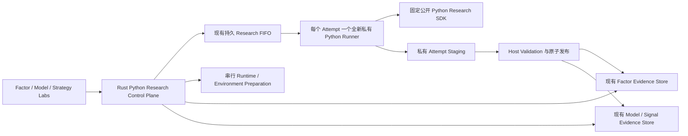

# Model Research：Python Research SDK 与 Qlib-first Model Lab

[English](./model-research.md)

状态：Python Research 与 Model Lab 合同的已接受架构与验证记录。Q1–Q92 仍是边界。

[验证](#验证)一节记录分阶段验收合同与 Automated Gates。

## 结果

Model Lab 把 Python 作为 ADAQ 可编辑的本地研究界面，但不把 Python 变成部署边界。用户可以针对 Host 提供的精确证据，创建、检查、调参、导入、导出并可复现地运行一个 Factor 或 Model Python Research Project。后续扩展为 Strategy Project 加入相同工作流；另一个后续扩展只从规范 Portable Definition 或已注册的纯数据 Model Artifact 生成合格 WASI Component。

App 在需要时安装并管理固定的 CPython 3.12 Runtime，不使用也不要求 System Python；缺少 Python Runtime 时，ADAQ 其他功能仍可使用。Python 不获得 Credential、Order、权威 Database、内部 Parquet Layout 或 Deployment Authority。

三个内置 Example 形成一条引导式可执行路径：

1. `py-factor-cross-sectional-momentum` 构建并评估 Portable Cross-sectional Momentum Factor。
2. `py-model-qlib-ridge-return` 训练 Qlib Ridge Model 并发布一个 Forecast Signal Dataset。
3. `py-strategy-top-n-forecast` 把 Forecast 与 Factor 组合为 Portable Long-only Top-N Strategy。

前两个已交付；第三个随未来 Strategy 扩展变为可执行；符合条件时，三者在未来 Component-generation 扩展中成为 Component Generation 输入。

## 产品边界

Model Lab 包含：

- 一个覆盖 Factor、Model 与已冻结未来 Strategy Contract 的公开 Python Research SDK。
- 在所属 Lab 内完成源码可见的 Project 创建、静态验证、惰性 Import/Export、不可变 Revision、精确 Trust Decision、锁定 Environment、Run、Cancel、Log 与 Evidence 导航。
- 首次使用 Python 时安装 ADAQ 管理的 CPython 3.12.x Runtime。
- 每个 Attempt 一个私有 Python Research Runner Process，以及一个版本化 Host Protocol。
- 把 Python Factor 作为第三种 Factor Candidate Source，并复用既有 Dataset、Evaluation、Family 与 Promotion Evidence。
- Host-fed Qlib Dataset Bridge 和一个注册 Qlib Ridge Adapter，生成 `adaq:linear-model@1`。
- Host-owned 有限 Parameter Grid、Selection Decision、Held-out Final Evaluation、Repeatability Report 与既有 Forecast Signal Contract。
- 双语、离线、合成 Tutorial 的 Factor 与 Model 两段。

不包含：

- System/User-selected Python、Conda、Mutable Virtual Environment、Run 时 `pip install`、Source Distribution 或 Dependency Build Script。
- Embedded Monaco、Jupyter、Terminal、把 Notebook 当作权威执行证据，或 Notebook-to-WASM 翻译。
- 通用 Qlib 兼容、Qlib Provider/Downloader、Alpha158 隐式数据、任意 Python Serialization，以及通用 Python-to-WASM 或 Qlib-to-ONNX 转换。
- Python Strategy Execution、Portfolio Backtest 改动与完整 Tutorial 链；这些属于未来 Strategy 扩展。
- Component Generation、Compilation、Conformance、Equivalence 与 Import；这些属于未来 Component-generation 扩展。
- Marketplace Hosting、Payment、Licence Enforcement 或任意代码的强 Sandbox 承诺。

## 架构与所有权



所有权保持窄而明确：

- `src-tauri/crates/adaq-python-research` 与 Tauri 无关，负责 Manifest、Archive、Revision、Trust、Runner Protocol、Resource Policy 与 Staged Result Validation Contract。
- `src-tauri/src/python_research/` 通过一个进程内 Control Plane Facade 负责完整 Python Research Lifecycle：Project、Trust、Runtime、Environment、Attempt、Recovery、Reset、私有进程监督，以及接入 `Features` 已拥有的持久 FIFO。Store 细节保持私有；同步 Lifecycle 方法与 Tauri 无关，Command 只负责 IPC 与 `spawn_blocking` 适配。
- `src-tauri/crates/adaq-factor-research` 与 `src-tauri/src/factor_research/` 继续负责 Factor Dataset、Evaluation、Family、Promotion 与 Storage。
- 现有 Model/Forecast Signal 模块继续负责 Model Artifact、Dataset、Evaluation 与 Storage。
- `python/adaq-research-sdk/` 构建公开 `adaq-research-sdk` Wheel 和 `adaq` Namespace，包括 `adaq.qlib`。
- `python/adaq-python-research-runner/` 构建 App 私有 Runner Wheel，由托管 CPython 以 `-I -m adaq_runner` 启动。
- Tauri Command 仅负责对 Typed Lifecycle、入队、取消、重试和查询方法做 IPC 适配，不组合 Store，也不在 Command 或 UI Thread 内运行 Python、重 SQLite/File 或 Training Work；Factor/Model 只拉取 Host 已验证结果。

## Project Kind 与 Mode

一个 Python Research Project 只声明一个 Kind：Factor、Model 或 Strategy。

Factor 或 Strategy 还声明一个 Mode：

- `imperative-python`：运行任意已信任 Python，仅限 Research Only。
- `portable-definition`：Python 只构造一个规范 Host Definition；任意 Python 不进入 Definition 或生成 Component。

Model Project 不声明该 Mode。其 Portability 由注册 Model Research Adapter、规范 Artifact Schema 与 Model Exporter 决定。

Project 可以包含多个 Python Module 与声明输出，但只暴露一个稳定 `module:function` Entry Point。Notebook 可以辅助探索，但永远不是 Execution、Revision、Archive 或发布来源。

## Project Identity 与 Layout

不可变 Lower-kebab-case Project ID 必须使用与 Kind 一致的前缀：

- `py-factor-*`
- `py-model-*`
- `py-strategy-*`

修改 ID 等于创建另一个 Project。Create from Example 遇到冲突时要求新的同类 ID，绝不覆盖 Working Copy。

固定 Root Layout：

```text
adaq-project.toml
pyproject.toml
pylock.toml
src/
  project.py
  ... 可选且已声明的 Python Module
README.md
README.zh-CN.md      # 内置 Example 必须；其他 Project 可选
LICENSE
```

`adaq-project.toml` 是精确 Schema 的执行 Manifest，声明 Project ID、Kind、必要时的 Mode、Scope、`project:create_project` 或其他精确 Entry Point、逻辑 SDK/Runtime Profile、类型化 Parameter、有序 Input Slot/Output、Target/Signal Contract、Dependency Lock Hash，以及受限 Resource Request。可移植 Manifest 不写本机 Dataset ID。

`pyproject.toml` 表达可编辑 Dependency Intent；只有 ADAQ 生成包含精确 Runtime 与各平台 Wheel Version/Hash 的 `pylock.toml`。`setup.py`、`requirements.txt`、Shell Launcher、Data、Result、Environment、Cache 与 Secret 都不是权威 Project File。

未知 Manifest Field、Enum Value 或 Schema Version 会导致 Static Validate 失败，并阻止 Prepare/Run。源码与历史 Evidence 仍可查看和导出。V1 不静默升级或重写不兼容 Project；真实出现第二版 Schema 后，才考虑显式 Copy-and-upgrade。

## Working Copy、Revision、Archive 与 Trust

User-scoped Working Copy 位于 ADAQ Local Data，并用用户现有外部 Editor 打开。可见状态为 Clean、Dirty 或 Invalid。文件修改不会执行、Hot Reload、同步外部原目录或修改 Evidence。

Run 从当前有效 Working Copy 冻结一个不可变 Content-addressed Project Revision。Revision 绑定 Manifest、已声明 Source、Lock、精确 SDK Wheel、逻辑 Runtime Profile 与解析后的平台 Runtime Artifact。运行中的 Attempt 永远看不到后续编辑。

Deterministic Project Archive 是普通的源码可见 ZIP。Export 要求 Licence Declaration 与匹配的 `LICENSE`：

- 本地私有交换可使用 `LicenseRef-Proprietary`。
- 未来零价格 Community Listing 必须使用允许源码再分发的明确 SPDX Open-source Licence。

离线 Import 在复制惰性 Untrusted Working Copy 前，拒绝 Absolute/Parent-traversing Path、Symbolic/Hard Link、Duplicate 或大小写折叠冲突 Path、Undeclared Entry、数量/大小超限及 Lock Hash 不一致。Import 不加载 Module、不 Prepare Environment、不执行代码。

Trust 只授权一个精确 Revision。Import、Installation、随 App 内置、Marketplace Review、Publisher Reputation、Name Continuity 或旧 Revision Trust 都不授予权限。Tutorial 可以一次展示三个精确 Revision，但记录三条独立 Trust Decision；只对发生变化的 Project 重新询问。

## 托管 Runtime 与 Dependency

Project 声明逻辑 `adaq-python@1`。App 把该 Profile 解析到一个精确的 Platform-specific CPython 3.12.x Artifact，并把 Version、Platform 与 Hash 记录到 Revision。新 Runtime Profile 不改变旧 Evidence。仍受支持的历史 Runtime 可重新下载；被安全禁用的 Runtime Evidence 可读但不可执行。

首次 Python 使用会在 ADAQ Local Data 中下载、验证、Stage 并原子发布 Runtime。V1 不做 System Interpreter Discovery、Custom Interpreter Path 或 Offline Runtime Import。安装前或 Cache Eviction 后，ADAQ 非 Python 功能仍可使用。

每个支持平台都有 ADAQ-signed Base Wheelhouse，包含 `adaq-research-sdk`、私有 `adaq-python-research-runner`、内置 `adaq-qlib-ridge-adapter`、按平台限定的 Arrow/NumPy Wheel 与合格依赖。Project-specific Dependency 必须来自 Trusted Index 且有兼容 Wheel；V1 拒绝 Source Distribution 和任意 Build Script。

Dependency 操作为显式流程：

1. 编辑 `pyproject.toml`。
2. 执行 Sync Environment。
3. 仅按 Trusted-index、Wheel-only 与 Hash Policy 解析。
4. 原子替换 `pylock.toml`。
5. 把新 Source/Lock 视为新的 Untrusted Revision。

Run 不解析 Dependency、不访问 Index、不修改 Lock、不安装 Package。Runtime、Wheelhouse 与 Prepared Environment Byte 都是可清理 Cache；历史 Evidence 保留其 Identity，允许时 Rerun 可重建。

## Attempt 与 Queue Lifecycle

Runtime/Environment Preparation 是单独显式 Attempt。相同 Active Request 合并，Preparation 串行，Failed/Cancelled Staging 永远不可执行；Preparation 不授予 Execution Trust。

Feature、Factor、Python、Model 和未来 Strategy Heavy Research 共用现有 Device-wide Persistent FIFO。每个 Python Research Attempt 启动一个全新 Process，不使用 Process Pool；Terminal 后进程退出。

Python Research Attempt 绑定 Revision、Prepared Environment、精确 Input Slot Binding、一个 Normalized Parameter Set、Seed、Deterministic Runtime Setting、Host Resource Policy、Output、Diagnostic 与 Log：

```text
Pending → Running → Completed | Failed | Cancelled
```

Retry 创建新 Attempt。Pending 在 Restart 后保留；Stale Running 变为带 Interrupted Reason 的 Failed。Cancel 先请求 Cooperative Shutdown，经过有限 Grace Period 后终止 Process Tree。Runner 退出且 Staging 隔离后才记录 Cancelled；Late Result 不得修改 Evidence。

## Runner Protocol 与 Result Publication

Host 在 `127.0.0.1` 创建随机 Loopback Port 和 One-time Token。执行 Project 前，Runner 必须完成精确 Protocol、SDK、Revision 与 Attempt Handshake；不兼容时 Fail Closed。

- Length-prefixed Canonical JSON 传输有界 Control Message。
- Arrow IPC 传输类型化且保持 Identity 的 Table。
- 大型声明 Artifact 通过私有 Attempt-scoped Staged File 与 Hash 传递。
- `stdout`/`stderr` 只是有上限的 User-scoped Log，不是 Protocol Channel，也不会自动上传。

Runner 获得私有 Working Directory 和 Allowlisted Child Environment，不含 Credential、Provider Token、Signing Key、Order Endpoint 或内部 Store Path。Process Isolation 是故障边界，不是对已信任任意代码的跨平台 File/Network Strong Sandbox 承诺。

Runner 不能写 ADAQ SQLite 或最终 Dataset Location。Host 在原子发布前验证 Identity、Order、Schema、Availability、Finite Value、Canonical Decimal、Count/Size Limit 与 Hash。Failed/Cancelled Factor 或 Strategy 不发布 Partial Result；Model 只可保留声明且有上限的 Diagnostic Checkpoint，且永不可部署。

## Public SDK Entry 与 Context

每个 Manifest Entry Point 是指向零参数 `create_project()` 的精确 `module:function`。Trust 后 Runner 导入 Module，在相应 Lifecycle Boundary 调用一次，并要求返回 SDK Object 匹配 Kind/Mode；不执行 File、Class、Decorator 或 Framework Discovery。

Parameter、Seed、Identity、Frozen Input、Event Time、Progress 与 Diagnostic 只通过后续 Typed Context 提供。SDK 不暴露 Current Wall Clock、GUI Object、Database Handle、Order API 或 Generic Query Surface。`progress(...)` 与 `diagnostic(...)` 结构化且有界。Unhandled Exception、Missing Required Result、Invalid Output 或 Deadline Failure 会使 Attempt 失败，不回退旧结果。

导入前 Runner 为 `PYTHONHASHSEED` 和注册的 Python、NumPy、Framework Random Source 应用 Attempt Seed，并按 Resource Policy 固定 Thread Count。Ambient Time、Undeclared Randomness、Mutable Module Global、Disk Cache 与 Cross-Attempt State 不属于可复现 Contract。

## Input 与数值边界

Manifest 按 Semantic Contract 与 Scope 声明稳定有序 Input Slot。Lab Run 把它们绑定到精确本机 Snapshot、Dataset、Universe、Promoted Factor、Forecast Signal、Target 或 Portfolio Evidence，Attempt 冻结这些 Identity。Project Code 不得动态寻找同名或“Latest”对象。

Boundary Representation：

- ID 与 Enum-like Identity 使用稳定 String。
- Event Time 使用 Signed 64-bit Integer。
- Financial Amount、Parameter 与 Target Weight 使用 Canonical Decimal String。
- Feature、Factor、Forecast Analytical Value 使用 Finite Binary64 或显式 Typed Unavailable。
- NaN、Infinity、Object Dtype、Pandas 推断 Identity Type、Silent Row Deletion、Approximate Join 与 Implicit Fill 均无效。

Arrow-compatible Schema 与 Parquet/Arrow IPC 是权威 Table Contract。Pandas 只是 SDK Convenience，不定义 Identity、Order、Missingness 或 Dtype。

## Python Factor 路径

Python 成为 Declarative 和私有 Custom WASM 之外的第三种 Factor Candidate Source。Python Candidate 绑定一个精确 Factor Project Revision 与 Environment，并生成标准 Factor Dataset；现有 Factor Evaluation、Research Family、Trial、Promotion Policy/Decision 与 Promoted Factor Library 仍是权威。

Portable Factor 实现 `define(context) -> FactorDefinition`，且 Definition 阶段不能读取 Dataset。它在版本化 Feature Operator Catalog 下构造现有 Feature Definition Graph 与 Feature Plan，再返回规范 Declarative Factor Definition。Python Lambda 与 Custom Operator 不能进入 Definition。

Imperative Factor 实现 `evaluate(context, batches) -> Iterator[FactorOutputBatch]`。Host 提供 Scope-correct Batch 与 Continuous Bar Segment Boundary；Bar Gap 后创建新 Project/Evaluator Object。Output Identity、Order、Availability 与 Finite Value 必须精确匹配。

Imperative Python 通过 Repeatability 与正常 Factor Research Gate 后可以成为 Research Validated，但不是 Component Eligible。Component Eligibility 要求已接受 Portable Definition 或未来明确 Exporter。引入 Python Candidate Source 将 `FACTOR_RESEARCH_SCHEMA_VERSION` 从 `1.0.0` 提升为 `1.1.0`；不兼容 Evidence 必须走独立的显式 Device-level Factor Research Reset。

参考 Project 构建：

```text
close → backward-simple-return(lookback) → cross-sectional-percentile → momentum-score
```

有限 Grid 为 `lookback={5,20,60}`，Tutorial Default 为 20。

## Qlib-first Model 路径

Model Lab 只支持一个注册 Model Research Adapter：Qlib `LinearModel` Ridge Mode。能 Import 或继承 Qlib Base Class 不代表其他 Algorithm 已受支持。

`adaq.qlib` 把 Host-supplied Arrow Partition 转换为只读 `(datetime, instrument)` Pandas Table，只提供 `train`、`valid` 和 Feature-only `test` 所需的有限 `DatasetH.prepare()` Surface。它不初始化 Qlib Provider、不使用 Qlib Data Directory、不下载数据、不构造 Alpha158、不访问 Network。

Project Lifecycle 分开：

1. `fit(context)` 只能看到 Train/Validation Input 与 Label。
2. 注册 Adapter 提取规范 Candidate Artifact。
3. Adapter 重新加载 Artifact，而不是继续使用 Live Python Object。
4. `predict(context, fitted_model)` 生成 Validation/Test Forecast。
5. Test Label 始终属于 Host，Final Metric 由 Host 计算。

Host-owned Preprocessing 只在 Train 上 Fit，冻结 Fitted Transformation Artifact，再原样应用于 Validation/Test。Script Custom Preprocessing 可用于探索，但在成为明确支持的 Transformation/Artifact Schema 前保持 Research Only。

首个 Project 只声明一个 Continuous Forecast Target、五 Bar Horizon 与一个 Forecast Signal。该 Slice 的 Multi-target/Multi-output 通过多个 Project 表达。Selection Grid 为 `alpha={0.1,1,10}`。

Adapter 发布 `adaq:linear-model@1`：有序 Input Slot、Finite Coefficient、Intercept、Numeric Representation、精确 Transformation Artifact、一个 Forecast Contract 与 Adapter Provenance。公开 Forecast 生成前必须重新加载该纯数据 Schema。Python Pickle、Executable Object Graph、Dataset Byte 与 Training Source 永不属于权威 Artifact。

未来 Component-generation 扩展的首个 Model Exporter 只支持 `adaq:linear-model@1 → WASI Model Component`。通用 Qlib-to-WASM、Qlib-to-ONNX 或 Local Qlib Paper Qualification 均不承诺。

## Forecast Signal Dataset 与 Dataset-first Backtest

除 Python Lab 外，Models Workspace 还生产与消费不可变 Forecast Signal Evidence：

- **Native Model Component** 在不可变 Market Data Snapshot 上执行离线 Single-Instrument 推理；每个 Completed Attempt 原子发布恰好一个 Forecast Signal Dataset，以 Parquet Hash、Feature Plan、Component Lock、Seed 与 Producer Segment Provenance 进行 Content-address 标识。
- **外部 `.adaq-signals` Evidence**（例如 [Kronos Adapter](../examples/external-models/kronos/README.zh-CN.md)）通过原子校验导入：Archive/Parquet Hash 检查、Snapshot 对齐、Artifact 与 Preprocessing Provenance，以及绝不静默升级的 Externally Generated 信任状态。Export 保持 Dataset Identity 不变。
- **Forecast Evaluation Report** 按 Signal Contract Kind 度量预测证据：Expected Value（MAE/RMSE/Bias/Correlation）、Probability（Brier/Log Loss/ROC AUC/Calibration）与 Score（IC/ICIR/Quantile），并包含 Coverage、Missingness、Distribution 与 Stability Window。Evidence State 为 Out-of-sample、Overlapping 或 Unknown；上游窗口重叠绝不升级 Trust。
- **Dataset-first Backtest** 把 Strategy 的 Forecast Signal Slot 绑定到恰好一个兼容 Dataset Signal——不提供 Approximate Join、Resample、Forward-fill 或混合 Snapshot。`availableAt` 被强制执行，Fill 不得早于下一根 Bar，不可用的对齐值使 Run 以 `Run Pause::MissingInput` 暂停，绝不替换为零、不变仓位或未来数据。
- 负面路径同样是合同：非法 Horizon 或 Kind/Target 组合在导入前失败；畸形或 Hash 不匹配的 Archive 被原子拒绝；取消的 Attempt 不发布任何结果；被引用的 Dataset/Artifact 被 Deletion Lock。

Forecast Evaluation 度量预测证据；Backtest 与 Validation 度量 Strategy 行为。两者都不是盈利结论、Live Trading、Verified External Inference 或 Marketplace 准入。Training/Fitting/Tuning 与嵌入式 Python 是 Model Lab 的职责（见下文）；Cross-sectional Inference、把生成未来路径当作已实现数据、Portfolio Optimization、OMS/EMS 与受控 GPU/ONNX Runner 均不在范围内。

## Parameter Selection 与 Evidence Truth

V1 支持一个 Typed Parameter Set 或有限 Host-expanded Cartesian Grid。每个组合在 Factor Family、Model Experiment 或未来 Strategy Study Lineage 下创建独立 Trial 与 Attempt。Hidden Script Sweep、Optuna、Bayesian Search 与 Automatic Recovery 不包含在内。

Parameter 比较只使用声明 Selection Window。然后用户记录不可变 Parameter Selection Decision，绑定 Revision、Parameter Set、Input、Lineage 与 Selection Metric。只有完成该 Decision 后，才可运行一个不相交 Final Evaluation 并暴露结果。如果用户依据 Final Result 修改或选择其他 Candidate，ADAQ 创建 Derived Lineage，并把受影响 Evidence 标为 Overlapping，而不是 Out-of-sample。

Python Repeatability Report 在全新进程与允许 Batch Partition 下重放相同 Revision、Environment、Input Binding、Parameter 与 Seed：

- Factor/Strategy 要求 Exact Equality。
- 注册 Model Profile 可声明严格有限 Numeric Tolerance。

Unverified/Divergent Output 仍可检查，但不能通过 Promotion、Component Generation 或 Runtime Qualification。

## Strategy 扩展边界

SDK 冻结 Strategy Type，但当前不执行 Strategy Project。未来 Strategy 扩展加入 `start(context) -> StrategySession`，随后由 Host 严格串行调用 `decide(decision_batch, portfolio_state)`；不 Pipeline，不 Prefetch Future Batch。Bar Gap 后创建新 Project/Session。

Strategy 只返回一个完整 Target Decision 或 Portfolio Target。Host Risk、Execution、Backtest、Fill 与 Portfolio Update 仍是权威。任何 Required Universe Member 缺少 Required Slot 时，在调用前记录 `Run Pause::MissingInput`；Silent Eligibility Filtering 无效。

首版 Portable Strategy Operation Catalog 只包含：

- finite `weighted-sum`
- deterministic `top-n`：Score 降序，再按 Instrument ID 升序处理并列
- `equal-weight`
- `cash-reserve`

参考 Strategy 使用 `forecast-weight={0.5,0.7}`、`top-n={3,5}`、`cash-reserve={0,0.1}`，Default 为 0.7、3、0.1。它返回完整 Long-only Portfolio Target：每个 Universe Member 都有非负 Canonical Decimal Weight，未选择者为零，Cash Reserve 非负且精确总和为一。Short、Leverage、Optimizer、Stop、Order、Loop 与 Custom Callback 不是 Portable V1 Operation。

## Portable Parameter 与 Component Generation

Factor/Strategy Portable Definition 只能通过 Typed Parameter Reference 引用有限 Manifest Allowed Value。研究选中值成为生成 Component Default。未来 Component-generation 扩展必须在 Host Limit 内对每个允许组合运行 Conformance/Equivalence。Model Training Hyperparameter 固定在 Artifact 内，不变成 Inference Parameter。

该扩展只把规范 Declarative Factor/Strategy Definition 或 `adaq:linear-model@1` 输入固定 Rust SDK Generator，再编译 WASM。Python Source、Runtime、Wheelhouse、Environment 与 Lock 不进入 `.adaq`。

Generated Component Provenance 绑定 Project Revision、Definition/Artifact、Parameter Schema、Promotion/Selection Decision、Generator、SDK、ABI、Toolchain、Build Attempt 与 Component Equivalence Report。WASM 不带源码并提高逆向成本，但不能在用户自有设备上保证绝对保密；更强保护需要 Managed Remote Execution。

## Community 源码分享

Marketplace Hosting 属于 V1 后工作。计划中的 Community Python Project 与合格 Component/Model 是不同 Product Class：

- 精确不可变、源码可见的 Project Archive。
- 允许再分发的 SPDX Open-source Licence。
- 固定价格零。
- 无 Payment、Refund 或 Paid Entitlement Lifecycle。
- Installation 不授予 Trust、Research Validity、Component Eligibility、Paper Authority 或 Real Trading Qualification。

合格 WASI 或未来 Model Product 可在独立 Provenance、Conformance、Equivalence、Security、Rights、Review 与 Entitlement Gate 下免费或收费。免费 Community Source Listing 不能绕过这些 Gate。

## Tutorial Fixture 与 Example

Host-owned `python-tutorial-a-share@1` 位于 `src-tauri/fixtures/python-tutorial/`，不进入 Project Archive。Manifest 绑定明显虚构的 Instrument Identity、Instrument Master、Calendar，以及 12 个 A-share-like Instrument × 180 个 Trading Session 的 Daily Bar JSON。已提交的 Instrument、Calendar、Bar 与合并 Content SHA-256 分别为 `a6963ebf7e0481749a1db2db22ef2f23bc5fee6d39d5afe258ca27c3c17fdaca`、`2e423b9b46a4af56729da0fee4298ed47cdaee70b6e0bc4e4e8f5fb03cd978a9`、`fd4dc3bcccb554ad29ca08e89c35c220dafcb546db4df436009612f795a2bb4e` 与 `6d44423e009d2251d442f388f1621242fc4dac1e0eb5d9b774fc62ecd135d848`。它离线运行，不声称对应真实 Issuer、Live Market 或 Profit Pattern。

固定 Window：

| 用途 | Trading Session |
| --- | --- |
| Train | 1–100 |
| Purge | 101–105 |
| Selection Validation | 106–140 |
| Embargo | 141–145 |
| Final Evaluation | 146–180 |

跨越边界的五 Session Target 标记 Unavailable，不移动到相邻 Window。

三个 Example 均使用 Apache-2.0。Factor/Strategy 只依赖固定 SDK；Model 只使用 Signed Base Wheelhouse 中的 SDK、Arrow、NumPy 与 Qlib Ridge Adapter。均不加入 Project-specific Wheel、Data Download 或 Network Access。

Factor Row、Identity、Unavailable State、Strategy Order 与 Portfolio Target 的 Golden Evidence 必须精确。Ridge Coefficient/Forecast 使用 Adapter 的严格有限 Tolerance。Fixture 保留足够 Rank Separation，使容差内 Forecast 差异不能改变 Top-N，因此 Final Target 仍精确。

Run Python Tutorial 是引导流程。双语面板挂载在 Model Lab 路由中，只准备两个可执行 Example，不会自动 Trust 或执行代码；随后通过精确契约链接进入 Factor 与 Model Lab：

1. 展示精确 Revision、Entry Point、Lock、Download/Disk Requirement 与 Trusted-code Warning。
2. 用户确认后记录独立 Exact-revision Trust Decision。
3. 运行 Factor Grid 并展示 Evaluation Evidence。
4. 等待用户 Factor Parameter Selection 与 Research Validated Promotion Decision。
5. 运行 Model Grid，等待 Model Parameter Selection，再运行 Held-out Final Evaluation。
6. 未来 Strategy 扩展可用后，运行 Strategy Grid，等待 Strategy Parameter Selection，再运行最终 Backtest。

可以自动化机械 Validation、Preparation、Execution 与 Navigation；不能自动化 Trust、Promotion、Selection 或 Final Evidence Claim。

每个 Project 都有完整 English/简体中文说明，覆盖 Create from Example、Validate、Prepare、Trust、Run、Tune、Evidence Inspection 与 Troubleshooting；一个双语 Top-level Tutorial 串联三者。CI 校验文档路径、Parameter 与 Expected Structure。任何 Return 都标记为 Synthetic Demonstration，不是 Expected Profitability。

## Lab 与 Settings UX

不新增 Generic Scripts Page。Factor、Model、Strategy Project 位于所属 Lab。每个 Project 显示：

- Working Copy：Clean、Dirty、Invalid
- Environment：Missing、Preparing、Ready、Failed
- Trust：Untrusted、Trusted
- Latest Attempt 与 Evidence Link

公共 Action 为 Validate、Sync/Prepare Environment、Run、Cancel、Open Folder、Export。Validate 是静态的且不需要 Python；Prepare 不请求 Execution Trust；Run 冻结 Revision，并仅在需要时请求 Trust。Create from Example 把 Source 复制到 User Working Copy Area。

Settings 显示 Managed Runtime Profile、Environment/Wheelhouse Disk Use，以及显式移除 Inactive Cache。Eviction 后历史 Identity 仍可读；允许时 Rerun 重新下载。V1 不提供 Custom Interpreter Picker、Terminal 或 Notebook Server。

Route 立即 Paint；Pending State 属于发起操作的 Button、Project Card 或 Attempt Row，Navigation 与无关功能保持可用。Log、Error、Trust Warning、Evidence State 与 Doc 在 en-US/zh-CN 中本地化，并支持 Keyboard/Screen Reader。

## Resource、Security 与 Recovery Policy

版本化 Host Resource Policy 限制 Wall Time、Memory、Thread、Input Row/Column/Cell、Protocol Byte、Artifact Byte、Diagnostic Checkpoint、Log，以及未来 Strategy Decision Deadline。Project 可请求更小值但不能提高 Host Cap。精确支持平台数值在实现时通过 Benchmark 冻结，不在 Manifest 中猜测。

必须覆盖 Invalid Manifest/Archive、Lock Mismatch、Missing/Disabled Runtime、Wheel Verification Failure、Untrusted Revision、Handshake Mismatch、Oversized Message/Artifact、Invalid Arrow Schema、Duplicate/Reordered Identity、NaN/Infinity、Invalid Decimal、Exception、Log Cap、Cancel Escalation、Child Crash、App Restart、Late Result、Staging Cleanup、User Isolation 与 Secret/Path Redaction。

## Schema 与 Reset

Python Metadata 使用精确 `PYTHON_RESEARCH_SCHEMA_VERSION=1.0.0`。不兼容值阻止 Python Research，直到显式 Device-level Reset Python Research Evidence。Reset 停止 Python Research，并删除 Project Revision、Attempt、Trust、Local Binding 与 Result Metadata，但保留 User-authored Working Copy 与 Exported Archive。Runtime、Wheelhouse 与 Environment Byte 是独立可清理 Cache。

Python Factor Integration 单独把 `FACTOR_RESEARCH_SCHEMA_VERSION` 从 `1.0.0` 提升到 `1.1.0`。不兼容 Factor Evidence 走现有显式 Device-level Factor Research Reset。两条路径都不 Migration、Dual-read 或自动删除 Pre-v1 Internal-testing Evidence。

## 验证

任何验证运行前的前置条件：

- App 在未安装 ADAQ Python Runtime 时即可启动，非 Python 路由可用；测试不使用 System Python、Conda Environment、激活的 Virtualenv 或 User `PATH` Interpreter。
- 三个 Example 位于 `examples/python/`；共享 Dataset Fixture 位于 `src-tauri/fixtures/python-tutorial/`，且不出现在任何 Project Archive 中；所有 Instrument 与价格历史均明确标注为合成数据。
- Research Attempt 在无必需网络数据下运行；只有显式 Runtime 或 Wheel Preparation 步骤允许联网。

负面边界检查不得发现嵌入式 IDE、Jupyter Server、Generic Scripts Page、Python Order API、子进程环境中的凭据、Qlib Data Downloader/Provider、Alpha158 隐式输入、通用 Qlib Model 承诺、通用 Python-to-WASM Converter 或 Marketplace 发布 UI。

Automated Gates 在被审阅 Revision 上运行：

```sh
(
  cd src-tauri
  cargo fmt --all --check
  cargo test -p adaq-python-research
  cargo test --workspace
  cargo check --workspace
)
pnpm exec jest --watchman=false --runInBand
pnpm run build
pnpm run lint
git diff --check
```

同时运行各 Slice 提交的仓库托管命令，覆盖：公开 SDK 与私有 Runner 的单元/合同测试；确定性 Project Archive 生成与 hostile-archive Fixture；Runtime/Wheelhouse 签名与 Lock 测试；Runner Protocol、Cancel、Restart、Resource 与 Redaction 测试；Python Factor 精确 Golden 与 Repeatability 测试；Qlib Ridge Artifact/Reload、Withheld-label、Tolerance 与 Forecast Dataset 测试；双语文档路径/Parameter/预期结构检查（含 `python/tutorial_tests/run_tutorial_tests.py`）；以及 Retained Diagnostic Secret/Path Scan。

Tutorial Parity Contract 断言固定 Fixture Window（Train 1–100、Purge 101–105、Selection Validation 106–140、Embargo 141–145、Final Evaluation 146–180）、三个示例 Project ID、双语引导式 `Run Python Tutorial` 入口，以及验收 Workflow 中的支持平台。每条命令退出码必须为 0，并记录精确测试计数、忽略项、警告、Fixture Hash 与平台限制。

完整 Failure Matrix 包括 Cancel、Untrusted Revision、Lock/Hash Failure、Invalid Output、Restart Recovery 与 Staging Isolation。Factor/Model Example 必须保持可执行、双语、准备后离线且可独立检查；任何 Partial、Divergent、Overlapping、Untrusted、Unsupported 或 Failed Result 都不得呈现为 Qualified。本地通过不能替代 CI 记录的 Supported-platform Evidence。

## 决策索引

本架构受以下 ADR 约束：

- [ADR 0036](./adr/0036-train-models-in-controlled-workers-and-deploy-inference-only-components.md)
- [ADR 0039](./adr/0039-publish-portable-models-before-managed-qlib-models.md)
- [ADR 0062](./adr/0062-run-factor-research-in-a-native-core-and-shared-research-queue.md)
- [ADR 0063](./adr/0063-separate-editable-python-research-from-portable-components.md)
- [ADR 0064](./adr/0064-treat-local-python-research-as-explicitly-trusted-code.md)
- [ADR 0065](./adr/0065-freeze-python-source-environments-and-trials-before-research.md)
- [ADR 0066](./adr/0066-route-python-through-existing-research-evidence-boundaries.md)
- [ADR 0067](./adr/0067-separate-free-community-source-from-qualified-marketplace-products.md)
- [ADR 0068](./adr/0068-install-and-manage-python-runtimes-on-demand.md)
- [ADR 0069](./adr/0069-install-only-verified-python-wheels.md)
- [ADR 0070](./adr/0070-keep-python-runner-results-staged-and-host-authoritative.md)
- [ADR 0071](./adr/0071-use-one-explicit-python-entry-point-and-kind-specific-lifecycles.md)
- [ADR 0072](./adr/0072-make-python-tuning-host-owned-and-repeatability-gated.md)
- [ADR 0073](./adr/0073-start-qlib-with-a-host-fed-ridge-adapter-and-data-only-artifact.md)
- [ADR 0074](./adr/0074-build-portable-python-projects-from-existing-finite-host-contracts.md)
- [ADR 0075](./adr/0075-make-python-projects-explicit-inert-and-source-visible.md)
- [ADR 0076](./adr/0076-make-the-python-examples-one-guided-reproducible-tutorial.md)
- [ADR 0077](./adr/0077-separate-public-python-contracts-from-private-runner-control.md)
