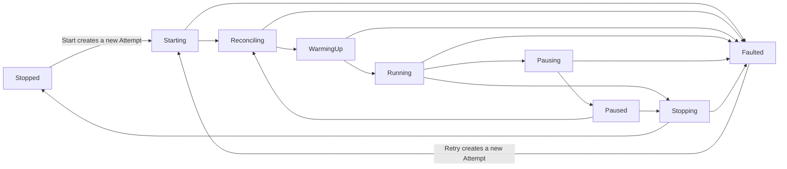
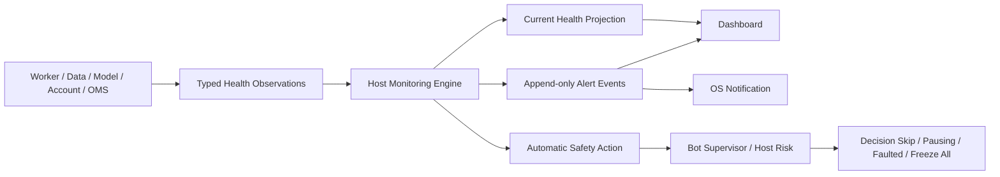

# Monitoring and Alerting Guide

[简体中文](./monitoring-and-alerting.zh-CN.md)

Status: V1 operational-health, safety-action, notification, and user-acceptance contract.

Related guides: [Paper-to-Research Feedback Loop](./research-feedback-loop.md), [Trading Bot Runtime](./bot-runtime.md), [Paper Trading Accounts](./paper-trading-accounts.md), and [Strategy, Risk, and Execution](./strategy-risk-execution.md).

## The three things users must not confuse

ADAQ displays three related but different concepts:

1. **Lifecycle State** answers whether a Bot has runtime authority: Running, Paused, Faulted, and so on.
2. **Health State** answers whether one operational dependency is working: Healthy, Degraded, Critical, or Unknown.
3. **Operational Alert** records an incident, its severity, acknowledgement, resolution, and linked safety action.

A Running Bot may briefly have one Degraded non-critical Dimension. A Critical or Unknown required Dimension removes risk authority through an explicit Lifecycle transition or Decision skip. A red Alert never silently changes a State, and a green Overall Health never bypasses Lifecycle or Risk gates.

## Bot Lifecycle and fail-closed state machine

This is the V1 control-authority state machine. The same diagram is retained in the [Trading Bot Runtime Guide](./bot-runtime.md) with the full state definitions.



Only Running may authorize a new risk-increasing Strategy Target. Pausing blocks that authority immediately. Paused is shown only after eligible pending orders and account state meet the frozen pause policy. Faulted is terminal for one Runtime Attempt and retains unresolved orders, positions, and Reconciliation Required evidence.

## Monitoring and alerting architecture



Workers, data connectors, Model runners, account services, Risk, OMS, and Execution Adapters report typed observations. They do not decide that their own output is safe. The host Monitoring Engine validates those observations, appends Operational Events, derives current Health projections, creates Alerts under frozen policies, and asks the Bot Supervisor or Host Risk to perform any required safety action.

The Dashboard is a projection and control surface. It is not the authoritative event store and cannot clear a problem by changing a badge.

## Health Dimensions

Each active Bot exposes independent Health Dimensions:

| Dimension | Evidence examples | Typical fail-closed effect |
| --- | --- | --- |
| Market Data | Provider connection, last event and Closed Bar age, gaps, coverage, sequence, venue time, clock skew. | Skip affected Decision; sustained or required-data loss enters Pausing. |
| Worker | Heartbeat, process exit, IPC sequence, CPU, memory, runtime limits, Decision Deadline. | Reject output; crash or invalid protocol makes the Attempt Faulted. |
| Feature / Model / Strategy | Warmup, missingness, schema, finite values, inference latency, Component trap, invalid Target. | No new Target; repeated or fatal runtime failure makes the Attempt Faulted. |
| Paper Account | Authentication, Account Snapshot age, cash, positions, buying power, reservations, reconciliation. | Block new risk; uncertainty sets Reconciliation Required. |
| Risk / OMS | Policy evaluation, reservation integrity, duplicate or stuck orders, cancel and replacement state. | Reject Target, enter Pausing, or Fault when order authority is uncertain. |
| Execution Adapter | REST and stream status, rate limits, acknowledgements, partial Fills, rejects, cancel results. | Block submission; account/order uncertainty requires reconciliation. |
| Local System | Device network, DNS/TLS, SQLite journal, disk space, system clock, process resources. | Degrade, Pause, or Freeze All before evidence integrity is lost. |
| Research Feedback | Factor effectiveness, Forecast calibration, Model drift, Paper versus Backtest divergence. | Raise Research Review warning; never auto-replace deployed logic. |

Dimensions are evaluated against the exact Deployment Bundle. A Bot that does not use Local Qlib does not become unhealthy merely because no Qlib Runner exists. A dependency required by the Bundle cannot be omitted from Overall Health.

## Health States

| State | Meaning |
| --- | --- |
| Healthy | Required evidence is current and within the frozen policy. |
| Degraded | The dependency works but has a bounded warning such as elevated latency or reduced non-critical coverage. |
| Critical | A verified condition violates a safety, correctness, authority, or evidence-integrity threshold. |
| Unknown | There is insufficient trustworthy evidence to establish the condition. Required Unknown dependencies fail closed. |

Overall Bot Health is the worst current State among the Bot's required Dimensions. It is a triage summary, not an average or a score. The Dashboard always allows users to expand the underlying Dimensions and their evidence.

## Network and provider detection

“The Internet is reachable” does not prove that a Bot can trade safely. V1 distinguishes:

- Device interface and route availability.
- DNS resolution and TLS establishment.
- Provider REST reachability and authentication.
- Market-data WebSocket or polling health.
- Account and order-event stream health.
- Last authoritative data and Account Snapshot age.
- Provider rate limits, throttling, and retry deadlines.
- Local versus provider clock drift.
- Sequence gaps and the resulting reconciliation state.

Each layer retains its own timestamp and error category. A generic ping cannot clear a stale order stream or an unreconciled account.

## Alert Severity and lifecycle

Alert Severity answers how urgently an incident needs attention:

| Severity | Meaning |
| --- | --- |
| Info | An operational event worth retaining, such as a normal restart or completed recovery. |
| Warning | A bounded abnormal condition that needs review but does not yet violate the applicable safety gate. |
| Critical | A condition that has triggered or requires an immediate fail-closed safety action. |

Every deduplicated Alert has an append-only lifecycle:

```text
Active → Acknowledged → Resolved
   └──────────────────→ Resolved
```

- Active means the condition currently applies.
- Acknowledged records the User and time that the Alert was seen. The condition remains active.
- Resolved requires new validated evidence showing that the policy's recovery condition has been met.
- A recurrence after resolution creates or reactivates evidence according to the frozen deduplication policy; previous history is never deleted.

## Automatic Safety Actions

| Condition | Default V1 action |
| --- | --- |
| One bounded latency excursion | Warning; remain Running if the applicable Deadline and safety limits still pass. |
| One Decision Deadline miss | Reject the late output and skip that Decision. |
| Sustained required Market Data staleness | Enter Pausing and block new risk. |
| Worker or Model Runner crash, invalid protocol, or non-finite output | Reject output and make the affected Runtime Attempt Faulted. |
| Account stream loss, unknown open-order state, or reconciliation mismatch | Enter Pausing or Faulted and set Reconciliation Required. |
| Critical SQLite journal, disk-space, or system-clock integrity failure | Invoke Freeze All before new unjournaled risk can be created. |
| Factor decay, Model drift, or Paper-performance divergence | Create a Research Review warning only; do not retrain, promote, or redeploy automatically. |

Every automatic action links to the exact Alert Policy, observations, threshold, Bot, Runtime Attempt, affected orders, and resulting Lifecycle transition. An Alert cannot directly call a Strategy Component or provider API outside the Bot Supervisor and Host Risk boundary.

## Preventing alert storms

Alert Policies may declare:

- **Debounce**: a short wait to exclude a transient state before opening a non-critical Alert.
- **Occurrence threshold**: a required count within one window.
- **Hysteresis**: different enter and recovery thresholds so a value near the boundary does not flap.
- **Deduplication key**: Bot, Dimension, condition, provider, account, or Instrument identity defining one incident.
- **Cooldown**: a minimum notification interval while occurrences continue.

The first Critical observation is never hidden behind a long debounce. Repeated occurrences update the active incident count and latest evidence rather than generating hundreds of indistinguishable notifications.

## Storage and retention

SQLite stores typed Operational Events, Alert lifecycle events, linked safety actions, operator acknowledgements, and rebuildable current projections. High-frequency numeric Metrics use bounded samples or rollups under an explicit retention policy.

V1 does not duplicate every market Tick or Level 2 update into the monitoring journal. Market evidence remains in its owning data store, and monitoring Events reference the relevant identity and time. V1 also does not require a local Prometheus server, cloud telemetry service, or external observability cluster.

## User notifications

V1 delivers Alerts through:

- A localized GUI Notification Center with filters for Severity, State, Bot, Account, and Health Dimension.
- A persistent Critical banner while any unacknowledged or unresolved system-level Critical condition applies.
- Native operating-system notifications when permission is available and the application is not focused.

OS notification failure never suppresses the persisted GUI Alert. Email, SMS, Slack, mobile push, and cloud notification routing are outside supervised local V1.

Translated summaries use the active Interface Locale, while raw provider errors, codes, timestamps, and diagnostic evidence remain inspectable without translation or mutation.

## Research feedback boundary

Paper Trading can produce evidence that a Factor's IC weakened, Forecast calibration shifted, realized turnover exceeded research assumptions, or live-style Paper performance diverged from Backtest. These observations create Research Feedback Events and Review-required Alerts after the applicable realization horizon.

They never automatically retrain a Model, change a Strategy, select a new candidate, overwrite a Component, or redeploy a Bot. A change returns through the normal Research → Validation → Promotion → Deployment Qualification workflow and creates a new Bot Deployment Bundle.

## V1 acceptance checks

1. Every Lifecycle transition and automatic safety action can be traced to retained Operational Events.
2. Each Health Dimension can independently become Healthy, Degraded, Critical, or Unknown without hiding the others.
3. Required Unknown states fail closed and cannot be dismissed into Healthy by acknowledgement.
4. Alert deduplication, acknowledgement, resolution, cooldown, and recurrence retain correct append-only history.
5. Market-data, Worker, Model, account-stream, journal, disk, and clock fault scenarios trigger their declared actions.
6. Restart rebuilds current Health and active Alerts from the journal without changing their identities or resolution history.
7. GUI and OS notifications do not expose credentials and remain usable in English (US) and Simplified Chinese.
8. Research Feedback never modifies deployed logic automatically.
