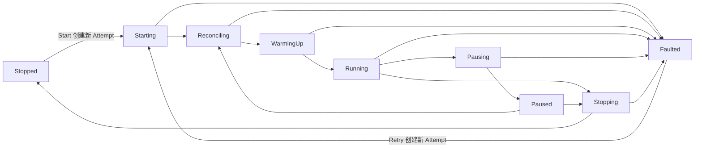
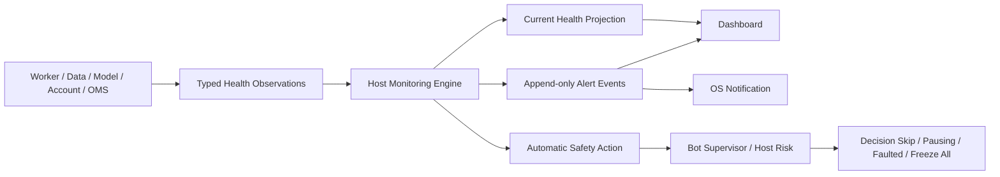

# 实时监控与异常报警指南

[English](./monitoring-and-alerting.md)

状态：V1 Operational Health、Safety Action、Notification 与用户验收契约。

相关指南：[Paper-to-Research 反馈闭环](./research-feedback-loop.zh-CN.md)、[Trading Bot 运行时](./bot-runtime.zh-CN.md)、[Paper Trading Account](./paper-trading-accounts.zh-CN.md) 与 [Strategy、Risk、Execution](./strategy-risk-execution.zh-CN.md)。

## 用户绝不能混淆的三件事

ADAQ 分别显示三个相关但不同的概念：

1. **Lifecycle State** 回答 Bot 是否拥有运行权限，例如 Running、Paused、Faulted。
2. **Health State** 回答某个运行依赖是否正常，例如 Healthy、Degraded、Critical、Unknown。
3. **Operational Alert** 记录一次 Incident、Severity、Acknowledgement、Resolution 与关联 Safety Action。

Running Bot 可以短暂存在一个非关键 Degraded Dimension。必需 Dimension 为 Critical 或 Unknown 时，系统必须通过显式 Lifecycle Transition 或 Decision Skip 移除风险权限。红色 Alert 不能静默改变 State，绿色 Overall Health 也不能绕过 Lifecycle 或 Risk Gate。

## Bot Lifecycle 与 Fail-closed 状态机

这是 V1 Control-authority State Machine；[Trading Bot 运行时指南](./bot-runtime.zh-CN.md) 也保留同一张图和完整状态定义。



只有 Running 可以授权增加风险的新 Strategy Target。Pausing 会立即阻止该权限。只有合格 Pending Order 与 Account State 满足冻结 Pause Policy 时才能显示 Paused。Faulted 是一个 Runtime Attempt 的终态，并保留 Unresolved Order、Position 与 Reconciliation Required Evidence。

## 实时监控与异常报警架构



Worker、Data Connector、Model Runner、Account Service、Risk、OMS 与 Execution Adapter 报告 Typed Observation，但不能自行决定其输出是否安全。Host Monitoring Engine 验证 Observation、追加 Operational Event、推导 Current Health Projection、根据冻结 Policy 创建 Alert，并要求 Bot Supervisor 或 Host Risk 执行所需 Safety Action。

Dashboard 是 Projection 与 Control Surface，不是权威 Event Store，也不能通过修改 Badge 清除问题。

## Health Dimension

每个 Active Bot 分别展示以下 Health Dimension：

| Dimension | Evidence 示例 | 典型 Fail-closed 结果 |
| --- | --- | --- |
| Market Data | Provider Connection、Last Event/Closed Bar Age、Gap、Coverage、Sequence、Venue Time、Clock Skew。 | Skip 受影响 Decision；持续或必需数据丢失进入 Pausing。 |
| Worker | Heartbeat、Process Exit、IPC Sequence、CPU、Memory、Runtime Limit、Decision Deadline。 | Reject Output；Crash 或 Invalid Protocol 使 Attempt Faulted。 |
| Feature / Model / Strategy | Warmup、Missingness、Schema、Finite Value、Inference Latency、Component Trap、Invalid Target。 | 不生成新 Target；重复或致命 Runtime Failure 使 Attempt Faulted。 |
| Paper Account | Authentication、Account Snapshot Age、Cash、Position、Buying Power、Reservation、Reconciliation。 | 阻止新风险；不确定时设置 Reconciliation Required。 |
| Risk / OMS | Policy Evaluation、Reservation Integrity、Duplicate/Stuck Order、Cancel/Replacement State。 | Reject Target、进入 Pausing，或在 Order Authority 不确定时 Fault。 |
| Execution Adapter | REST/Stream、Rate Limit、Acknowledgement、Partial Fill、Reject、Cancel Result。 | 阻止提交；Account/Order 不确定时要求 Reconciliation。 |
| Local System | Device Network、DNS/TLS、SQLite Journal、Disk Space、System Clock、Process Resource。 | 在证据完整性丢失前 Degrade、Pause 或 Freeze All。 |
| Research Feedback | Factor Effectiveness、Forecast Calibration、Model Drift、Paper/Backtest Divergence。 | 产生 Research Review Warning；绝不自动替换已部署逻辑。 |

Dimension 根据精确 Deployment Bundle 评估。未使用 Local Qlib 的 Bot 不会因为不存在 Qlib Runner 而变为 Unhealthy；Bundle 必需 Dependency 也不能从 Overall Health 中省略。

## Health State

| State | 含义 |
| --- | --- |
| Healthy | 必需 Evidence 当前有效，并处于冻结 Policy 范围内。 |
| Degraded | Dependency 仍工作，但存在有界 Warning，例如延迟升高或非关键 Coverage 降低。 |
| Critical | 已验证情况违反 Safety、Correctness、Authority 或 Evidence-integrity Threshold。 |
| Unknown | 没有足够可信 Evidence 确定状态；必需 Unknown Dependency 必须 Fail-closed。 |

Overall Bot Health 是 Bot 所有必需 Dimension 中最严重的当前 State，用于 Triage，不是平均分或评分。Dashboard 必须允许展开查看每个底层 Dimension 与 Evidence。

## 网络与 Provider 检测

“Internet 可访问”不能证明 Bot 可以安全交易。V1 必须分别检测：

- Device Interface 与 Route Availability。
- DNS Resolution 与 TLS Establishment。
- Provider REST Reachability 与 Authentication。
- Market-data WebSocket 或 Polling Health。
- Account 与 Order-event Stream Health。
- Last Authoritative Data 与 Account Snapshot Age。
- Provider Rate Limit、Throttling 与 Retry Deadline。
- Local/Provider Clock Drift。
- Sequence Gap 与产生的 Reconciliation State。

每一层都保留独立 Timestamp 与 Error Category。通用 Ping 不能清除 Stale Order Stream 或 Unreconciled Account。

## Alert Severity 与 Lifecycle

Alert Severity 表示 Incident 需要多快处理：

| Severity | 含义 |
| --- | --- |
| Info | 值得保留的运行事件，例如正常 Restart 或 Recovery Completed。 |
| Warning | 需要 Review、但尚未违反适用 Safety Gate 的有界异常。 |
| Critical | 已触发或要求立即 Fail-closed Safety Action 的情况。 |

每个 Deduplicated Alert 都有 Append-only Lifecycle：

```text
Active → Acknowledged → Resolved
   └──────────────────→ Resolved
```

- Active 表示 Condition 当前仍成立。
- Acknowledged 记录看到 Alert 的 User 与 Time，Condition 仍然 Active。
- Resolved 需要新的 Validated Evidence 证明满足 Policy Recovery Condition。
- Resolution 后再次发生时，根据冻结 Deduplication Policy 新建或重新激活 Evidence；旧历史绝不能删除。

## Automatic Safety Action

| Condition | V1 默认动作 |
| --- | --- |
| 一次有界 Latency Excursion | Warning；如果 Deadline 与 Safety Limit 仍通过则保持 Running。 |
| 一次 Decision Deadline Miss | Reject Late Output 并 Skip 本次 Decision。 |
| 持续 Required Market Data Staleness | 进入 Pausing 并阻止新风险。 |
| Worker/Model Runner Crash、Invalid Protocol 或 Non-finite Output | Reject Output，并使受影响 Runtime Attempt Faulted。 |
| Account Stream Loss、Unknown Open-order State 或 Reconciliation Mismatch | 进入 Pausing/Faulted，并设置 Reconciliation Required。 |
| Critical SQLite Journal、Disk-space 或 System-clock Integrity Failure | 在产生无法记录的新风险前执行 Freeze All。 |
| Factor Decay、Model Drift 或 Paper-performance Divergence | 只创建 Research Review Warning；不自动 Retrain、Promote 或 Redeploy。 |

每个 Automatic Action 都必须链接精确 Alert Policy、Observation、Threshold、Bot、Runtime Attempt、Affected Order 与结果 Lifecycle Transition。Alert 不能绕过 Bot Supervisor 和 Host Risk，直接调用 Strategy Component 或 Provider API。

## 防止 Alert Storm

Alert Policy 可以声明：

- **Debounce**：打开非关键 Alert 前短暂等待，排除瞬时状态。
- **Occurrence Threshold**：一个 Window 内要求的发生次数。
- **Hysteresis**：进入与恢复使用不同 Threshold，避免边界附近反复跳变。
- **Deduplication Key**：由 Bot、Dimension、Condition、Provider、Account 或 Instrument Identity 定义同一 Incident。
- **Cooldown**：Condition 持续期间两次通知之间的最短间隔。

第一条 Critical Observation 绝不能被长 Debounce 隐藏。重复发生时更新 Active Incident Count 与 Latest Evidence，而不是生成数百条无法区分的通知。

## Storage 与 Retention

SQLite 保存 Typed Operational Event、Alert Lifecycle Event、关联 Safety Action、Operator Acknowledgement 与可重建 Current Projection。高频 Numeric Metric 使用显式 Retention Policy 下的有界 Sample 或 Rollup。

V1 不会把每个 Market Tick 或 Level 2 Update 复制进 Monitoring Journal。Market Evidence 留在所属 Data Store 中，Monitoring Event 只引用相关 Identity 与 Time。V1 也不要求本地 Prometheus Server、Cloud Telemetry Service 或外部 Observability Cluster。

## 用户通知

V1 通过以下渠道发送 Alert：

- 支持按 Severity、State、Bot、Account 与 Health Dimension 筛选的本地化 GUI Notification Center。
- 存在任何未确认或未解决 System-level Critical Condition 时持续显示 Critical Banner。
- 操作系统已授权且应用未聚焦时发送 Native OS Notification。

OS Notification 失败不能抑制持久化 GUI Alert。Email、SMS、Slack、Mobile Push 与 Cloud Notification Routing 不属于 Supervised Local V1。

翻译摘要使用当前 Interface Locale；Raw Provider Error、Code、Timestamp 与 Diagnostic Evidence 保持可检查，不翻译也不改写。

## Research Feedback Boundary

Paper Trading 可以产生 Factor IC 下降、Forecast Calibration 变化、Realized Turnover 超出 Research Assumption 或 Paper Performance 偏离 Backtest 的证据。这些 Observation 在适用 Realization Horizon 后产生 Research Feedback Event 与 Review-required Alert。

它们绝不能自动 Retrain Model、修改 Strategy、选择新 Candidate、覆盖 Component 或重新部署 Bot。任何变更都必须返回正常 Research → Validation → Promotion → Deployment Qualification 工作流，并创建新的 Bot Deployment Bundle。

## V1 验收检查

1. 每个 Lifecycle Transition 与 Automatic Safety Action 都可以追溯到保留的 Operational Event。
2. 每个 Health Dimension 都可以独立成为 Healthy、Degraded、Critical 或 Unknown，且不会隐藏其它 Dimension。
3. 必需 Unknown State 必须 Fail-closed，不能通过 Acknowledgement 被清成 Healthy。
4. Alert Deduplication、Acknowledgement、Resolution、Cooldown 与 Recurrence 保留正确 Append-only History。
5. Market Data、Worker、Model、Account Stream、Journal、Disk 与 Clock Fault Scenario 触发各自声明动作。
6. Restart 能从 Journal 重建 Current Health 与 Active Alert，且不改变 Identity 或 Resolution History。
7. GUI 与 OS Notification 不暴露 Credential，并在 English (US) 与简体中文下可用。
8. Research Feedback 绝不自动修改已部署逻辑。
