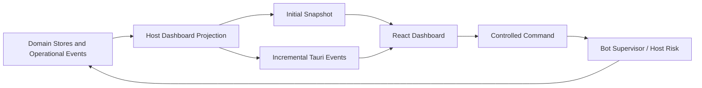

# Operations Dashboard Guide

[简体中文](./operations-dashboard.zh-CN.md)

Status: V1 global-operations, research-status, navigation, and user-acceptance contract.

Related guides: [Paper-to-Research Feedback Loop](./research-feedback-loop.md), [Market Workspaces](./market-workspaces.md), [Monitoring and Alerting](./monitoring-and-alerting.md), [Trading Bot Runtime](./bot-runtime.md), and [Paper Trading Accounts](./paper-trading-accounts.md).

## Product role

The existing `/` route becomes ADAQ's Operations Dashboard. It answers four questions at a glance:

1. Is the local quantitative system safe and healthy?
2. Which Paper Accounts and Trading Bots are active, paused, or faulted?
3. Which data, Factor, Model, Component-build, Backtest, and Validation work is running or needs attention?
4. Where should the User drill down for exact evidence or take an emergency action?

It is not a market-quotes page, event database, Worker console, provider client, or replacement for each domain workspace.

The current Crypto Watchlist, Ticker, and Kline experience is retained but moved from `/` to a dedicated Crypto Market route under the sidebar's market navigation.

## Information architecture

```text
Operations Dashboard /
├── Global Status
│   ├── System Health
│   ├── Critical Alerts
│   ├── Market Session Status
│   └── Freeze All
├── Paper Accounts
│   ├── A-share / CNY
│   ├── Alpaca / USD
│   └── OKX / USDT
├── Active Bots
│   ├── Lifecycle and Health
│   ├── Strategy / Model / Account
│   ├── Position / PnL / Drawdown
│   └── Last Decision / Heartbeat
├── Trading Operations
│   ├── Orders / Fills
│   ├── Risk Decisions
│   └── Reconciliation
├── Research Work
│   ├── Data Pipeline
│   ├── Factor Evaluation
│   ├── Model Training
│   ├── Component Builds
│   └── Backtest / Validation
└── Alerts and Infrastructure
    ├── Notification Center
    ├── Provider / Network
    └── Disk / Journal / Clock
```

The home route shows summaries and exceptions. Selecting a Bot, account, Alert, Factor study, Model Attempt, Component Build Attempt, Backtest, or Validation result opens its dedicated page with complete evidence. The Dashboard does not grow into one endless screen containing every domain workflow.

## Data and control flow



The frontend reads a user-scoped Dashboard Projection. It never opens SQLite, talks to a Worker, submits provider requests, or infers account truth from cached cards. Emergency and lifecycle controls call explicit host commands, and the resulting authoritative Events update the projection.

## Immediate-paint behavior

- Navigation to `/` paints the route shell immediately.
- Every card owns its Loading, Empty, Degraded, Failure, and Stale state.
- Native database, filesystem, projection, or reconciliation work never blocks the main UI thread.
- On first entry, the host supplies the current projection snapshot and then incremental updates.
- On re-entry in the same User session, the GUI may show the user-scoped in-memory cache immediately and refresh it in the background.
- Cached values display their observation time and stale state. A cache never re-enables a control whose host authority is unavailable.
- A slow research card cannot prevent Critical Alerts, Bot controls, or account state from rendering.

## Global status and emergency controls

The top status area always shows:

- Overall System Health and each active Critical Alert count.
- Active, Paused, Faulted, Starting, Reconciling, and WarmingUp Bot counts.
- Paper Account reconciliation and provider connectivity summaries.
- Current A-share, U.S. equity, and Crypto session states under their Venue calendars.
- Local journal, disk, clock, and notification health.

When any Bot is active, Freeze All remains visible and keyboard accessible. It requires confirmation, calls the host authority, and displays progress and partial failures. Flatten All is visually and semantically separate, requires stronger confirmation, and never becomes a convenient adjacent icon that can be clicked accidentally.

## Paper Accounts and currencies

The Dashboard shows the three Paper Accounts separately:

```text
A-share Ordinary Paper Account   CNY
Alpaca Paper Account             USD
OKX Demo Trading Account         USDT
```

Each card may show equity, cash, buying power, reserved capital, exposure, PnL, drawdown, reconciliation, connection, and active Bots in its native Valuation Currency. V1 does not sum these accounts into one global equity value. A future converted total requires an exact FX Snapshot and reporting currency.

## Active Bots

Each active or recently faulted Bot summary includes:

- Trading Bot, Runtime Attempt, Deployment Bundle, Strategy, Model, and Paper Account identity.
- Lifecycle State and Overall Bot Health, with underlying Health Dimensions available on drill-down.
- Position, reserved capital, native-currency PnL and drawdown, pending orders, and partial Fills.
- Last valid Decision Time, Strategy Target, Risk Decision, order activity, Worker heartbeat, and data freshness.
- Pause, Resume, Retry, Stop and Keep Position, or separately confirmed Stop and Flatten actions only when the host reports them as eligible.

The Dashboard never derives action eligibility from the visible badge alone.

## Research work

The research section projects each domain's own lifecycle rather than replacing them with one generic mutable Job:

- Market-data acquisition and Data Quality publication.
- Feature and Factor materialization, evaluation, Promotion Decisions, and Component builds.
- Model Dataset generation, Model Training Attempts, evaluation, export, and runtime qualification.
- Strategy Backtests, Validation Protocols, Reports, optimization work, and Component builds.

Each row retains its domain identity, progress units, owner, input evidence, start time, terminal outcome, and relevant next action. Selecting it opens the owning workspace.

## Alerts and infrastructure

The Dashboard embeds the current Critical and Warning Alerts and links to the complete Notification Center. System-level Critical Alerts remain in a persistent banner until resolved; acknowledgement alone does not remove the underlying condition.

Provider, network, account stream, data freshness, Worker, journal, disk, and clock health remain distinct. One green Internet icon cannot conceal an unreconciled order stream or stale market data.

## Localization and accessibility

- English (US) and Simplified Chinese ship with identical Dashboard capability.
- Status text, card headings, controls, Alerts, empty states, and accessible names use translation resources.
- Canonical Bot, Instrument, Component, account, error, and evidence identities remain unchanged.
- Color is never the only carrier of Health, Severity, or Lifecycle State.
- Keyboard focus, screen-reader labels, table semantics, chart alternatives, confirmation dialogs, and notification announcements are verified in both locales.

## Why V1 has no TUI

ADAQ already has a desktop GUI, charts, account controls, research workspaces, navigation, localization, and accessibility infrastructure. A TUI would duplicate those concerns while presenting less useful portfolio, time-series, progress, and evidence visualization.

A future headless execution service may justify a read-only CLI or TUI for remote diagnosis. It must consume the same host projections and command authorization rather than becoming a second source of truth. It is outside V1.

## V1 acceptance checks

1. `/` paints immediately and no card-level load blocks another critical region.
2. Initial snapshots, incremental updates, cached re-entry, staleness, reconnect, and restart preserve user-scoped projection semantics.
3. Bot, account, Alert, research, and infrastructure summaries link to their exact domain evidence.
4. Freeze All and every Bot action invoke host commands, show progress, and preserve partial-failure evidence.
5. Native-currency account values are never added without an FX Snapshot.
6. Every lifecycle, Health, Alert, research-progress, empty, and failure state works in both V1 languages.
7. The existing Crypto Watchlist, Ticker, and Kline functionality remains available in its separate market workspace.
