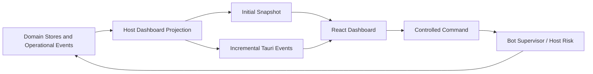

# Operations Dashboard 用户指南

[English](./operations-dashboard.md)

状态：V1 全局运行、Research Status、Navigation 与用户验收契约。

相关指南：[Paper-to-Research 反馈闭环](./research-feedback-loop.zh-CN.md)、[行情工作区](./market-workspaces.zh-CN.md)、[实时监控与异常报警](./monitoring-and-alerting.zh-CN.md)、[Trading Bot 运行时](./bot-runtime.zh-CN.md) 与 [Paper Trading Account](./paper-trading-accounts.zh-CN.md)。

## 产品职责

现有 `/` Route 将成为 ADAQ Operations Dashboard，用于快速回答四个问题：

1. 本地量化系统当前是否安全、健康？
2. 哪些 Paper Account 与 Trading Bot 正在运行、暂停或故障？
3. 哪些 Data、Factor、Model、Component Build、Backtest 与 Validation 工作正在执行或需要处理？
4. 用户应该进入哪个详细页面检查精确 Evidence，或者执行 Emergency Action？

它不是行情页面、Event Database、Worker Console、Provider Client，也不替代各 Domain Workspace。

现有 Crypto Watchlist、Ticker 与 Kline 功能会保留，但从 `/` 移到 Side Menu 行情导航下的独立 Crypto Market Route。

## Information Architecture

```text
Operations Dashboard /
├── Global Status
│   ├── System Health
│   ├── Critical Alerts
│   ├── Market Session Status
│   └── Freeze All
├── Paper Accounts
│   ├── A-share / CNY
│   ├── Alpaca / USD
│   └── OKX / USDT
├── Active Bots
│   ├── Lifecycle and Health
│   ├── Strategy / Model / Account
│   ├── Position / PnL / Drawdown
│   └── Last Decision / Heartbeat
├── Trading Operations
│   ├── Orders / Fills
│   ├── Risk Decisions
│   └── Reconciliation
├── Research Work
│   ├── Data Pipeline
│   ├── Factor Evaluation
│   ├── Model Training
│   ├── Component Builds
│   └── Backtest / Validation
└── Alerts and Infrastructure
    ├── Notification Center
    ├── Provider / Network
    └── Disk / Journal / Clock
```

Home Route 只显示 Summary 与 Exception。选择 Bot、Account、Alert、Factor Study、Model Attempt、Component Build Attempt、Backtest 或 Validation Result 后，进入其专用页面查看完整 Evidence。Dashboard 不会变成包含全部 Domain Workflow 的无限长页面。

## Data 与 Control Flow



Frontend 读取 User-scoped Dashboard Projection，不直接打开 SQLite、连接 Worker、提交 Provider Request，也不根据 Cached Card 推断 Account Truth。Emergency 与 Lifecycle Control 调用显式 Host Command，产生的 Authoritative Event 再更新 Projection。

## Immediate-paint 行为

- 导航到 `/` 时立即 Paint Route Shell。
- 每张 Card 自己拥有 Loading、Empty、Degraded、Failure 与 Stale State。
- Native Database、Filesystem、Projection 或 Reconciliation Work 绝不能阻塞 Main UI Thread。
- 首次进入时，Host 提供 Current Projection Snapshot，随后发送 Incremental Update。
- 同一 User Session 返回页面时，GUI 可以立即显示 User-scoped In-memory Cache，再在后台刷新。
- Cached Value 必须显示 Observation Time 与 Stale State；Cache 绝不能重新启用 Host Authority 已不可用的 Control。
- 较慢 Research Card 不能阻止 Critical Alert、Bot Control 或 Account State 显示。

## Global Status 与 Emergency Control

顶部状态区始终显示：

- Overall System Health 与 Active Critical Alert Count。
- Active、Paused、Faulted、Starting、Reconciling 与 WarmingUp Bot Count。
- Paper Account Reconciliation 与 Provider Connectivity Summary。
- A 股、美股与 Crypto 在各自 Venue Calendar 下的当前 Session State。
- Local Journal、Disk、Clock 与 Notification Health。

存在任何 Active Bot 时，Freeze All 必须保持可见且支持 Keyboard 操作。它要求确认、调用 Host Authority，并显示 Progress 与 Partial Failure。Flatten All 在视觉和语义上必须与其分开，需要更强确认，不能成为旁边容易误点的小图标。

## Paper Account 与 Currency

Dashboard 分别显示三个 Paper Account：

```text
A-share Ordinary Paper Account   CNY
Alpaca Paper Account             USD
OKX Demo Trading Account         USDT
```

每张 Card 可以用原生 Valuation Currency 显示 Equity、Cash、Buying Power、Reserved Capital、Exposure、PnL、Drawdown、Reconciliation、Connection 与 Active Bot。V1 不会把这些 Account 相加成 Global Equity；未来换算总额必须绑定精确 FX Snapshot 与 Reporting Currency。

## Active Bot

每个 Active 或最近 Faulted Bot Summary 包括：

- Trading Bot、Runtime Attempt、Deployment Bundle、Strategy、Model 与 Paper Account Identity。
- Lifecycle State 与 Overall Bot Health，并可 Drill-down 查看底层 Health Dimension。
- Position、Reserved Capital、Native-currency PnL/Drawdown、Pending Order 与 Partial Fill。
- Last Valid Decision Time、Strategy Target、Risk Decision、Order Activity、Worker Heartbeat 与 Data Freshness。
- 仅在 Host 报告 Eligible 时提供 Pause、Resume、Retry、Stop and Keep Position 或单独确认的 Stop and Flatten。

Dashboard 绝不能只根据可见 Badge 推导 Action Eligibility。

## Research Work

Research Section 投影每个 Domain 自己的 Lifecycle，而不是用一个通用 Mutable Job 替换：

- Market-data Acquisition 与 Data Quality Publication。
- Feature/Factor Materialization、Evaluation、Promotion Decision 与 Component Build。
- Model Dataset Generation、Model Training Attempt、Evaluation、Export 与 Runtime Qualification。
- Strategy Backtest、Validation Protocol、Report、Optimization Work 与 Component Build。

每一行保留 Domain Identity、Progress Unit、Owner、Input Evidence、Start Time、Terminal Outcome 与适用 Next Action；选择后进入所属 Workspace。

## Alert 与 Infrastructure

Dashboard 嵌入当前 Critical/Warning Alert，并链接完整 Notification Center。System-level Critical Alert 在 Resolved 前保持 Persistent Banner；Acknowledgement 本身不能移除底层 Condition。

Provider、Network、Account Stream、Data Freshness、Worker、Journal、Disk 与 Clock Health 保持独立。一个绿色 Internet Icon 不能隐藏 Unreconciled Order Stream 或 Stale Market Data。

## 多语言与 Accessibility

- English (US) 与简体中文交付完全相同的 Dashboard 能力。
- Status Text、Card Heading、Control、Alert、Empty State 与 Accessible Name 使用 Translation Resource。
- Canonical Bot、Instrument、Component、Account、Error 与 Evidence Identity 保持不变。
- Color 绝不能成为 Health、Severity 或 Lifecycle State 的唯一表达方式。
- Keyboard Focus、Screen-reader Label、Table Semantic、Chart Alternative、Confirmation Dialog 与 Notification Announcement 必须用两种语言验证。

## 为什么 V1 不做 TUI

ADAQ 已经拥有 Desktop GUI、Chart、Account Control、Research Workspace、Navigation、Localization 与 Accessibility Infrastructure。TUI 会重复这些职责，却更难展示 Portfolio、Time Series、Progress 与 Evidence。

未来 Headless Execution Service 可能需要只读 CLI 或 TUI 用于远程诊断；它也必须消费相同 Host Projection 与 Command Authorization，不能成为第二个 Source of Truth。该能力不属于 V1。

## V1 验收检查

1. `/` 立即 Paint，任何 Card-level Load 都不能阻塞其它 Critical Region。
2. Initial Snapshot、Incremental Update、Cached Re-entry、Staleness、Reconnect 与 Restart 保持 User-scoped Projection Semantics。
3. Bot、Account、Alert、Research 与 Infrastructure Summary 都链接到精确 Domain Evidence。
4. Freeze All 与每个 Bot Action 都调用 Host Command、显示 Progress 并保留 Partial-failure Evidence。
5. 没有 FX Snapshot 时绝不相加 Native-currency Account Value。
6. 每种 Lifecycle、Health、Alert、Research Progress、Empty 与 Failure State 都能用两种 V1 语言工作。
7. 现有 Crypto Watchlist、Ticker 与 Kline 功能在独立 Market Workspace 中继续可用。
