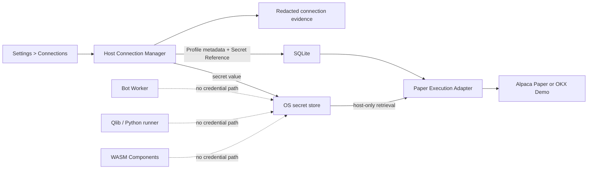

# Paper Provider Connections and Credentials

[简体中文](./paper-connections.zh-CN.md)

Status: V1 user, security, and operational contract.

Related guides: [Paper Trading Accounts and Portfolios](./paper-trading-accounts.md), [Trading Bot Runtime](./bot-runtime.md), and [Monitoring and Alerting](./monitoring-and-alerting.md).

## What you need to provide

Do not send provider credentials in chat, commit them to the repository, or place them in `.env`. When the relevant V1 connection screen is delivered, enter them only in **Settings > Connections** on the device that will run ADAQ.

| Connection | Values entered in ADAQ | Fixed environment | Notes |
| --- | --- | --- | --- |
| Alpaca Paper | Paper API Key ID and Paper Secret Key | Trading: `https://paper-api.alpaca.markets`; market data: `https://data.alpaca.markets` | Paper and Live credentials are different. V1 accepts only Paper. |
| OKX Demo Trading | Demo API Key, Secret Key, and Passphrase | OKX Demo; every private request enforces `x-simulated-trading: 1` | Create the key inside Demo Trading. Use only the permissions required by the Adapter and never `Withdraw`. |
| A-share Paper | No broker credential | ADAQ-owned local Ordinary Securities Account simulator | Market-data provenance is configured separately; no external Paper broker account is used. |

Alpaca documents the separate Paper domain and credentials in [Authentication](https://docs.alpaca.markets/us/v1.1/reference/authentication-2), and documents Trading API market-data Key/Secret authentication in [About Market Data API](https://docs.alpaca.markets/us/docs/about-market-data-api). OKX documents the Key, Secret Key, Passphrase, permissions, and signing contract in its [API guide](https://www.okx.com/docs-v5/en/); its [API FAQ](https://www.okx.com/help/api-faq) explains Demo-key creation and the required simulated-environment header.

## The security boundary

The operating-system secret store is the credential authority: macOS Keychain, Windows Credential Manager, or the supported Linux Secret Service. ADAQ generates a random Secret Reference for each saved credential. SQLite stores that reference and non-secret connection metadata; it does not store an encrypted secret blob, a reversible value, or the passphrase.

The Profile is scoped to the current ADAQ User and device. Another signed-in ADAQ User cannot use it. A Profile and a Paper Trading Account remain distinct: the Profile authenticates a provider connection, while the Account Snapshot and execution journal describe cash, positions, orders, and Fills.

## Saving a connection

1. Open **Settings > Connections** and choose **Alpaca Paper** or **OKX Demo Trading**.
2. Enter the provider-issued values. The UI never redisplays a saved Secret Key or Passphrase.
3. Save. The Host writes the secret to the operating-system store and writes only the Profile plus Secret Reference to SQLite.
4. ADAQ runs a Paper Connection Test before the Profile becomes usable.
5. Review the provider, environment, account, Valuation Currency, permissions, capability summary, and masked Key suffix.
6. Bind the validated Profile to the matching Paper Trading Account. Bot start still performs full account reconciliation.

There is no custom endpoint field in V1. This prevents a typo, malicious URL, or Live domain from turning a Paper configuration into a different trust boundary.

## What the connection test does

The Paper Connection Test is read-only and produces retained, redacted evidence. It:

1. Retrieves the credential through the Secret Reference inside the Host.
2. Authenticates against the fixed provider environment.
3. Retrieves provider time where available and checks local clock skew.
4. Retrieves account identity, status, native currency, and non-ordering capability information.
5. Confirms that Alpaca is Paper or OKX is simulated, not Live.
6. Confirms that required permissions exist and unsupported dangerous permissions are absent where the provider exposes them.
7. Records success or a typed, redacted failure without retaining provider secrets.

It never submits, cancels, replaces, or fills a test order. A successful authentication test does not replace Bot startup reconciliation and does not prove that a later order will be accepted.

## Fail-closed conditions

A Profile is unusable and blocks a dependent Bot from Starting when any of these is true:

- The Secret Reference is missing or inaccessible.
- Authentication fails or the provider reports an inactive account.
- Paper/Demo and Live environments do not match the fixed Profile.
- The account identity or Valuation Currency differs from the confirmed binding.
- Required read or trading capability is missing.
- OKX reports a real-environment key, the request is not simulated, or the key has withdrawal capability that V1 can observe.
- Endpoint, TLS, clock, rate-limit, or provider capability evidence is Unknown where it is required for safe operation.
- The credential changed after the latest successful test.

Frontend cache state, an old green badge, or a previously successful Bot Attempt cannot override these checks.

## Rotation and deletion

Rotation never overwrites a working credential in place. ADAQ creates a new secret entry, tests it, updates the Profile atomically, and retires the prior entry only when no active operation can still depend on it. A failed replacement test leaves the previous validated Profile unchanged.

Credential deletion is an explicit **Settings > Connections** action. It is blocked while an active Bot depends on the Profile. After safe shutdown, deletion removes the operating-system secret, marks the Profile unusable, and makes the next Bot start require a newly tested Profile and account reconciliation.

Signing out does not reveal or transfer secrets. The credential may remain safely stored for the same User on that device, but no other User can resolve its Secret Reference. Resetting research data does not silently delete credentials; Connections has its own explicit removal flow.

## Logs, exports, and support evidence

ADAQ may retain provider, environment, Profile ID, account ID, masked Key suffix, capability state, timestamps, HTTP status class, provider error code, and a redacted diagnostic. It must never retain:

- API Secret Key or OKX Passphrase.
- Authorization or signature headers.
- Raw request bodies that contain credentials.
- Secret-store coordinates that another User could resolve.
- Credentials inside screenshots, copied diagnostics, exports, Deployment Bundles, Components, or Paper Feedback Snapshots.

When reporting a connection problem, provide the Profile ID, provider, timestamp, typed error code, and redacted diagnostic. Do not provide the credential.

## Common failures

| Symptom | Safe action |
| --- | --- |
| Alpaca rejects the Key | Confirm it is the Paper Key pair, regenerate it in Alpaca if necessary, and rotate the ADAQ Profile. Do not switch to the Live endpoint. |
| OKX reports environment mismatch | Create or select a Demo API key and retest. ADAQ will not change `x-simulated-trading` to Live mode. |
| OKX Passphrase was lost | OKX cannot recover it; create a new Demo API key and rotate the Profile. |
| Clock-skew or timestamp failure | Synchronize the device clock, then rerun the read-only test. Do not weaken timestamp validation. |
| Secret-store access is denied | Unlock or authorize the operating-system credential store; do not copy the secret into SQLite or a config file. |
| Account balance differs from the funding target | Keep the provider Account Snapshot authoritative and follow the provider-supported reset workflow; do not edit local cash. |

## V1 boundary

V1 connects only to Alpaca Paper and OKX Demo for execution. It does not accept a Live endpoint, Real Trading credential, custom proxy endpoint, cloud secret sync, shared team credential, plaintext configuration, or Component-owned connection. Real Trading requires a separate post-V1 qualification and a new explicit operator decision.
