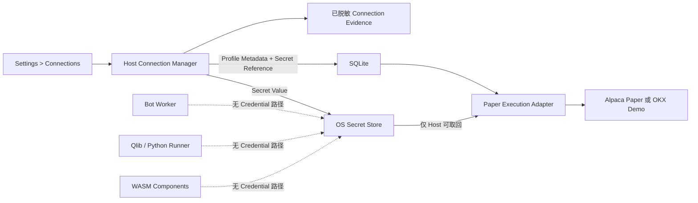

# Paper Provider 连接与 Credential

[English](./paper-connections.md)

状态：V1 用户、安全与运行契约。

相关指南：[Paper Trading Account 与 Portfolio](./paper-trading-accounts.zh-CN.md)、[Trading Bot 运行时](./bot-runtime.zh-CN.md) 与 [监控和报警](./monitoring-and-alerting.zh-CN.md)。

## 你需要提供什么

不要在聊天中发送 Provider Credential，不要提交到仓库，也不要写进 `.env`。V1 相应连接页面交付后，只能在将要运行 ADAQ 的设备上，通过 **Settings > Connections** 输入。

| Connection | 在 ADAQ 中输入的值 | 固定环境 | 说明 |
| --- | --- | --- | --- |
| Alpaca Paper | Paper API Key ID 与 Paper Secret Key | Trading：`https://paper-api.alpaca.markets`；Market Data：`https://data.alpaca.markets` | Paper 与 Live Credential 不同；V1 只接受 Paper。 |
| OKX Demo Trading | Demo API Key、Secret Key 与 Passphrase | OKX Demo；每个私有请求强制 `x-simulated-trading: 1` | 必须在 Demo Trading 中创建；只授予 Adapter 所需权限，绝不授予 `Withdraw`。 |
| A-share Paper | 不需要 Broker Credential | ADAQ 自有本地普通证券账户模拟器 | Market Data Provenance 单独配置；不连接外部 Paper Broker Account。 |

Alpaca 在 [Authentication](https://docs.alpaca.markets/us/v1.1/reference/authentication-2) 中说明 Paper Domain 与 Credential 相互独立，并在 [About Market Data API](https://docs.alpaca.markets/us/docs/about-market-data-api) 中说明 Trading API Market Data 的 Key/Secret 认证。OKX 的 [API Guide](https://www.okx.com/docs-v5/en/) 定义 Key、Secret Key、Passphrase、权限与签名；[API FAQ](https://www.okx.com/help/api-faq) 说明 Demo Key 创建和模拟环境 Header。

## 安全边界

操作系统 Secret Store 是 Credential 权威来源：macOS Keychain、Windows Credential Manager 或受支持的 Linux Secret Service。ADAQ 为每个 Credential 生成随机 Secret Reference。SQLite 只保存该 Reference 与非秘密 Connection Metadata，不保存加密 Secret Blob、可逆值或 Passphrase。

Profile 只属于当前 ADAQ User 与当前设备，另一个已登录 User 不能使用。Profile 与 Paper Trading Account 必须分离：Profile 负责向 Provider 认证；Account Snapshot 与 Execution Journal 描述 Cash、Position、Order 与 Fill。

## 保存 Connection

1. 打开 **Settings > Connections**，选择 **Alpaca Paper** 或 **OKX Demo Trading**。
2. 输入 Provider 颁发的值。UI 不会重新显示已保存的 Secret Key 或 Passphrase。
3. 保存。Host 把 Secret 写入操作系统存储，只把 Profile 和 Secret Reference 写入 SQLite。
4. Profile 可用前，ADAQ 运行 Paper Connection Test。
5. 检查 Provider、Environment、Account、Valuation Currency、Permission、Capability Summary 与遮罩后的 Key 后缀。
6. 把已验证 Profile 绑定到对应 Paper Trading Account；Bot 启动时仍需执行完整 Account Reconciliation。

V1 不提供自定义 Endpoint 字段，防止拼写错误、恶意 URL 或 Live Domain 把 Paper 配置变成另一个信任边界。

## Connection Test 做什么

Paper Connection Test 是只读操作，并生成可保留、已脱敏的证据。它会：

1. 在 Host 内通过 Secret Reference 取回 Credential。
2. 对固定 Provider Environment 进行认证。
3. 在可用时获取 Provider Time，并检查本机 Clock Skew。
4. 获取 Account Identity、Status、Native Currency 与非下单 Capability 信息。
5. 确认 Alpaca 为 Paper、OKX 为 Simulated，而不是 Live。
6. 确认所需权限存在，并在 Provider 可见时确认危险权限不存在。
7. 只记录成功状态或 Typed、Redacted Failure，不保留 Provider Secret。

它绝不提交、取消、替换或成交 Test Order。认证测试成功不能替代 Bot 启动 Reconciliation，也不证明未来 Order 一定会被接受。

## Fail-closed 条件

出现以下任一情况时，Profile 不可用，并阻止依赖它的 Bot 进入 Starting：

- Secret Reference 缺失或无法访问。
- 认证失败，或 Provider 报告 Account 不可用。
- 固定 Profile 的 Paper/Demo Environment 与 Live 不匹配。
- Account Identity 或 Valuation Currency 与确认绑定不同。
- 缺少必需的 Read 或 Trade Capability。
- OKX 报告 Real Environment Key、请求不是 Simulated，或 V1 能观察到 Key 具有 Withdrawal Capability。
- 安全运行所需的 Endpoint、TLS、Clock、Rate Limit 或 Provider Capability Evidence 为 Unknown。
- Credential 在最近一次成功测试后发生变化。

Frontend Cache、旧的绿色 Badge 或此前成功的 Bot Attempt 都不能覆盖这些检查。

## Rotation 与删除

Rotation 不会原地覆盖可用 Credential。ADAQ 先创建新的 Secret Entry 并测试，随后原子更新 Profile；只有不存在仍依赖旧值的 Active Operation 时才退役旧 Entry。替换测试失败时，原有已验证 Profile 保持不变。

删除 Credential 是 **Settings > Connections** 中的显式操作。Active Bot 仍依赖 Profile 时禁止删除。安全停止后，删除会移除操作系统 Secret、把 Profile 标记为不可用，并要求下一次 Bot Start 使用新测试通过的 Profile 并执行 Account Reconciliation。

Sign-out 不会暴露或转移 Secret。Credential 可以为同一设备上的同一 User 安全保留，但其他 User 无法解析其 Secret Reference。Research Data Reset 不会静默删除 Credential；Connections 拥有单独、显式的删除流程。

## Log、Export 与支持证据

ADAQ 可以保留 Provider、Environment、Profile ID、Account ID、遮罩 Key 后缀、Capability State、Timestamp、HTTP Status Class、Provider Error Code 与脱敏 Diagnostic。绝不能保留：

- API Secret Key 或 OKX Passphrase。
- Authorization 或 Signature Header。
- 含 Credential 的 Raw Request Body。
- 另一个 User 可以解析的 Secret-store Coordinate。
- Screenshot、Copied Diagnostic、Export、Deployment Bundle、Component 或 Paper Feedback Snapshot 中的 Credential。

报告连接问题时，只提供 Profile ID、Provider、Timestamp、Typed Error Code 与已脱敏 Diagnostic，不要提供 Credential。

## 常见失败

| 现象 | 安全处理方式 |
| --- | --- |
| Alpaca 拒绝 Key | 确认它是 Paper Key Pair；必要时在 Alpaca 重新生成，并在 ADAQ 中 Rotation。不要切换到 Live Endpoint。 |
| OKX 报告 Environment Mismatch | 创建或选择 Demo API Key 后重新测试。ADAQ 不会把 `x-simulated-trading` 改成 Live Mode。 |
| OKX Passphrase 丢失 | OKX 无法恢复；创建新的 Demo API Key 并 Rotation Profile。 |
| Clock Skew 或 Timestamp Failure | 同步设备时间，再运行只读测试；不要削弱 Timestamp Validation。 |
| Secret Store 拒绝访问 | 解锁或授权操作系统 Credential Store；不要把 Secret 复制到 SQLite 或 Config File。 |
| Account Balance 与 Funding Target 不同 | 保持 Provider Account Snapshot 权威，使用 Provider 支持的 Reset Workflow；不要编辑本地 Cash。 |

## V1 边界

V1 执行只连接 Alpaca Paper 与 OKX Demo。它不接受 Live Endpoint、Real Trading Credential、自定义 Proxy Endpoint、Cloud Secret Sync、团队共享 Credential、明文配置或 Component-owned Connection。Real Trading 需要独立的 V1 后资格认证和新的显式 Operator 决策。
