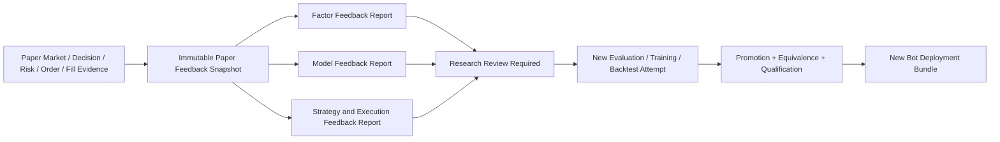

# Paper-to-Research Feedback Loop Guide

[简体中文](./research-feedback-loop.zh-CN.md)

Status: V1 Paper evidence, research feedback, review, and redeployment contract.

Related guides: [Monitoring and Alerting](./monitoring-and-alerting.md), [Trading Bot Runtime](./bot-runtime.md), [Strategy, Risk, and Execution](./strategy-risk-execution.md), and [Operations Dashboard](./operations-dashboard.md).

## Closed loop without self-modifying trading

V1 closes the workflow from Paper execution back to Factor, Model, Strategy, and execution research. It deliberately does not allow a live-style Paper result or Alert to rewrite the currently running Bot.



The loop is complete because Paper evidence can start a new research and qualification cycle. It is controlled because every result and User decision keeps an immutable identity and the active Deployment Bundle never changes in place.

## Paper Feedback Snapshot

A Paper Feedback Snapshot freezes one evaluation range for one exact Bot Deployment Bundle. It references:

- Trading Bot, Runtime Attempts, Worker, Components, Models, Feature Plan, Risk Policy, Execution Profile, Paper Account, and provider identities.
- Point-in-Time Instrument Universes, Decision Times, Decision Batches, availability, missingness, Warmup, skipped Decisions, and deadlines.
- Feature and Factor outputs, Forecast Signals, Strategy Targets, Risk Decisions, Approved Targets, and Execution Plans.
- Orders, acknowledgements, rejects, cancellations, partial and complete Fills, fees, slippage evidence, Positions, cash, and reconciliation.
- Market observations used for decisions, valuation, execution protection, and realized outcomes.
- Operational Events, Health Dimensions, Alerts, network or provider incidents, Worker restarts, and data-quality conditions.
- Exact observation start, end, realization cutoff, sample counts, missing observations, and completeness evidence.

The Snapshot references authoritative records rather than copying mutable screen values. A later report over a different range or revised market-data publication receives a different Snapshot identity.

## Factor feedback

A Factor-lens Paper Feedback Report uses the deployed Factor outputs and only realized Targets whose horizons have completed. Depending on Factor Scope and compatible Evaluation Lens, it may report:

- Time-series Pearson IC and Spearman Rank IC.
- Cross-sectional IC, Rank IC, breadth, quantile ordering, and neutralized behavior.
- Coverage, explicit missingness, turnover, decay, and stability.
- Results by subperiod, Instrument, Point-in-Time Universe, session, volatility, liquidity, or declared Market Regime.
- Differences from the exact promoted Factor Evaluation Reports.

The report does not retroactively change the earlier Factor Promotion Decision. It indicates evidence requiring review, not a universal `valid` or `invalid` property.

## Model feedback

A Model-lens Report separates prediction quality from Strategy profitability. According to the Forecast contract it may show:

- Score correlation, Rank IC, rolling IC and ICIR, and realized-target quantiles.
- Probability Brier Score, Log Loss, ROC AUC, calibration, and class coverage.
- Expected Value MAE, RMSE, mean bias, and correlation.
- Prediction distribution shift and compatible Feature-distribution drift diagnostics.
- Missing or non-finite output rejection, inference latency, Decision Deadline misses, and runner failures.
- Differences from the exact Forecast Evaluation Reports cited by the Deployment Qualification.

Feature drift or prediction drift is diagnostic evidence. It does not prove the Model became economically unprofitable and does not select a replacement Model.

## Strategy feedback

A Strategy-lens Report evaluates the complete Paper decision and account path in the Paper Account's native Valuation Currency:

- Return, drawdown, exposure, turnover, realized and unrealized PnL, and fees.
- Position concentration, cash utilization, Risk Approve, Constrain, and Reject outcomes.
- Decision coverage, skipped or late Decisions, stop behavior, and Unmanaged Positions.
- Like-for-like divergence from the exact Backtest and Validation evidence used for deployment.
- Attribution to market movement, Strategy Target changes, Risk constraints, costs, execution, and operational downtime where evidence permits.

ADAQ does not compare unrelated periods, currencies, Universes, or Execution Profiles as if the difference were Strategy decay. A divergence without compatible evidence remains Unknown or Insufficient Evidence.

## Execution feedback

An Execution-lens Report measures implementation rather than prediction quality:

- Order acknowledgement and cancellation latency.
- Rejection, partial-Fill, completion, replacement, and reconciliation rates.
- Requested versus executed quantity, price, fees, and adverse slippage.
- Local A-share Trade Observed, Quote Constrained, Bar Constrained, or Unavailable Fill Evidence State.
- Provider stream gaps, rate limits, stale quotes, recovery, and unresolved order state.
- Backtest or expected-cost assumptions versus Paper execution evidence when their semantics are compatible.

Poor execution can damage Strategy results without implying the underlying Factor or Model failed. The four feedback lenses remain separate so users can diagnose the layer that changed.

## Realization and sample sufficiency

Feedback is causal:

- A Forecast is evaluated only after its declared horizon is realized within the same valid segment.
- An unfinished Bar, future return, later Corporate Action knowledge, or post-cutoff correction cannot enter an earlier decision's available inputs.
- Each metric declares its minimum sample, coverage, and window requirements in the frozen feedback configuration.
- Before the horizon completes, the outcome is Not Yet Realized.
- After realization but below the declared threshold, the Report shows Insufficient Evidence instead of a directional conclusion.
- Missing or incompatible evidence remains explicit and cannot be imputed merely to produce a score.

Strong metrics over a small or overlapping sample never become automatic proof of improvement or future profitability.

## Market data and execution evidence stay separate

Paper Account Orders, Fills, positions, cash, fees, and reconciliation belong to the execution journal. They do not become OHLCV Bars, Market Trades, Quotes, or Canonical Market Data.

Newly received market observations may be retained in a new Source Market Dataset and processed into a new Canonical revision under the ordinary Data Quality workflow. Existing Market Data Snapshots, Reports, Runs, and Feedback Snapshots remain immutable and deletion-locked when referenced.

## Research Review Required

A frozen Alert Policy may raise Research Review Required when sufficient evidence crosses a declared drift, decay, divergence, or operational threshold. The Alert links the exact Paper Feedback Report and condition.

Acknowledgement records that a User saw the Alert. It does not resolve the evidence. A User creates an immutable Research Review Decision choosing one explicit outcome:

- No Change, with rationale and any future review boundary.
- Pause or Stop the affected Bot through its normal Lifecycle controls.
- Start a new Factor Evaluation Protocol or candidate definition.
- Start a new Model Training Protocol, evaluation, export, or qualification Attempt.
- Start a new Strategy Backtest, optimization, Validation, or logic-restructuring Attempt.
- Investigate data, execution, provider, or operational evidence before changing research logic.

The Decision cites the Reports reviewed and never modifies them.

## Redeployment path

A changed candidate returns through the normal gates:

```text
New Research Attempt
→ immutable evaluation evidence
→ User Promotion Decision
→ generated or authored Component Build Attempt
→ Component Equivalence and package validation
→ Backtest and Validation
→ Model Runtime and Deployment Qualification as applicable
→ new Bot Deployment Bundle
→ explicit Bot Start
```

There is no hot patch, mutable `latest` Component, automatic challenger switch, or in-place Model weight update. An existing Bot may continue, Pause, or Stop according to the User's explicit operational decision while research proceeds separately.

## Dashboard presentation

The Operations Dashboard shows Research Feedback as its own work and Alert category:

- Affected Bot, Bundle, Factor, Model, Strategy, or Execution layer.
- Report range, realization progress, sample sufficiency, Evidence State, and last update.
- Current Research Review Required Alert and acknowledgement state.
- Review Decision, linked new Attempts, and whether a new Bundle has qualified.

Feedback status never changes a Bot Lifecycle badge without a separately recorded Safety Action or User command.

## V1 acceptance checks

1. A Paper Feedback Snapshot reconstructs the exact deployed pipeline and time-bounded market, decision, Risk, order, Fill, account, and operational evidence.
2. Forecast horizons and sample thresholds prevent premature Factor or Model conclusions.
3. Factor, Model, Strategy, and Execution Reports remain diagnostically separate and link the comparable research evidence.
4. Paper account events never enter Canonical Market Data, and new market revisions never rewrite referenced Snapshots.
5. Research Review acknowledgement does not resolve the evidence or modify a Bot.
6. Every changed candidate passes new immutable Attempts, promotion, equivalence, validation, and qualification before a new Bundle exists.
7. No automatic retraining, Component replacement, challenger switch, or hot deployment path exists.
8. The full workflow and metric explanations are available in English (US) and Simplified Chinese.
