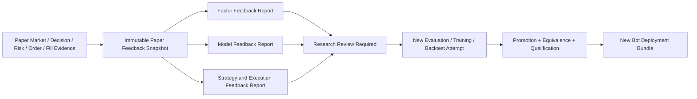

# Paper-to-Research 反馈闭环指南

[English](./research-feedback-loop.md)

状态：V1 Paper Evidence、Research Feedback、Review 与 Redeployment 契约。

相关指南：[实时监控与异常报警](./monitoring-and-alerting.zh-CN.md)、[Trading Bot 运行时](./bot-runtime.zh-CN.md)、[Strategy、Risk、Execution](./strategy-risk-execution.zh-CN.md) 与 [Operations Dashboard](./operations-dashboard.zh-CN.md)。

## 完整闭环，但不允许自我修改交易

V1 把 Paper Execution 反馈回 Factor、Model、Strategy 与 Execution Research，但不会允许一次 Live-style Paper Result 或 Alert 直接改写当前运行 Bot。



Paper Evidence 可以启动新的 Research 与 Qualification Cycle，因此闭环是完整的；每项 Result 与 User Decision 都有不可变 Identity，Active Deployment Bundle 永远不会原地修改，因此闭环也是受控的。

## Paper Feedback Snapshot

Paper Feedback Snapshot 为一个精确 Bot Deployment Bundle 冻结一个 Evaluation Range，并引用：

- Trading Bot、Runtime Attempt、Worker、Component、Model、Feature Plan、Risk Policy、Execution Profile、Paper Account 与 Provider Identity。
- Point-in-Time Instrument Universe、Decision Time、Decision Batch、Availability、Missingness、Warmup、Skipped Decision 与 Deadline。
- Feature/Factor Output、Forecast Signal、Strategy Target、Risk Decision、Approved Target 与 Execution Plan。
- Order、Acknowledgement、Reject、Cancel、Partial/Complete Fill、Fee、Slippage Evidence、Position、Cash 与 Reconciliation。
- 用于 Decision、Valuation、Execution Protection 与 Realized Outcome 的 Market Observation。
- Operational Event、Health Dimension、Alert、Network/Provider Incident、Worker Restart 与 Data-quality Condition。
- 精确 Observation Start/End、Realization Cutoff、Sample Count、Missing Observation 与 Completeness Evidence。

Snapshot 引用 Authoritative Record，而不是复制 Mutable Screen Value。不同 Range 或 Revised Market-data Publication 会产生不同 Snapshot Identity。

## Factor Feedback

Factor-lens Paper Feedback Report 使用已部署 Factor Output，并且只使用 Horizon 已完成的 Realized Target。根据 Factor Scope 与兼容 Evaluation Lens，可以报告：

- Time-series Pearson IC 与 Spearman Rank IC。
- Cross-sectional IC、Rank IC、Breadth、Quantile Ordering 与 Neutralized Behavior。
- Coverage、显式 Missingness、Turnover、Decay 与 Stability。
- 按 Subperiod、Instrument、Point-in-Time Universe、Session、Volatility、Liquidity 或声明 Market Regime 拆分的结果。
- 与精确 Promoted Factor Evaluation Report 的差异。

Report 不会追溯修改早期 Factor Promotion Decision，只表示需要 Review 的 Evidence，不产生通用 `valid` 或 `invalid` 属性。

## Model Feedback

Model-lens Report 把 Prediction Quality 与 Strategy Profitability 分开。根据 Forecast Contract，可以显示：

- Score Correlation、Rank IC、Rolling IC/ICIR 与 Realized-target Quantile。
- Probability Brier Score、Log Loss、ROC AUC、Calibration 与 Class Coverage。
- Expected Value MAE、RMSE、Mean Bias 与 Correlation。
- Prediction Distribution Shift 与兼容 Feature-distribution Drift Diagnostic。
- Missing/Non-finite Output Reject、Inference Latency、Decision Deadline Miss 与 Runner Failure。
- 与 Deployment Qualification 引用的精确 Forecast Evaluation Report 的差异。

Feature Drift 或 Prediction Drift 是诊断证据，不能证明 Model 已经在经济上失效，也不能自动选择 Replacement Model。

## Strategy Feedback

Strategy-lens Report 使用 Paper Account 的原生 Valuation Currency 评价完整 Paper Decision 与 Account Path：

- Return、Drawdown、Exposure、Turnover、Realized/Unrealized PnL 与 Fee。
- Position Concentration、Cash Utilization、Risk Approve/Constrain/Reject Outcome。
- Decision Coverage、Skipped/Late Decision、Stop Behavior 与 Unmanaged Position。
- 与部署时精确 Backtest/Validation Evidence 的 Like-for-like Divergence。
- 在 Evidence 允许时，对 Market Movement、Strategy Target Change、Risk Constraint、Cost、Execution 与 Operational Downtime 归因。

ADAQ 不会把无关 Period、Currency、Universe 或 Execution Profile 的差异描述成 Strategy Decay。没有兼容 Evidence 时，Divergence 保持 Unknown 或 Insufficient Evidence。

## Execution Feedback

Execution-lens Report 衡量实现，而不是 Prediction Quality：

- Order Acknowledgement 与 Cancellation Latency。
- Reject、Partial Fill、Completion、Replacement 与 Reconciliation Rate。
- Requested/Executed Quantity、Price、Fee 与 Adverse Slippage。
- A 股本地 Trade Observed、Quote Constrained、Bar Constrained 或 Unavailable Fill Evidence State。
- Provider Stream Gap、Rate Limit、Stale Quote、Recovery 与 Unresolved Order State。
- 语义兼容时，比较 Backtest/Expected-cost Assumption 与 Paper Execution Evidence。

较差 Execution 可能损害 Strategy Result，但不代表底层 Factor 或 Model 失败。四个 Feedback Lens 保持分离，帮助用户定位真正发生变化的层。

## Realization 与 Sample Sufficiency

Feedback 必须保持因果性：

- Forecast 只有在声明 Horizon 于同一有效 Segment 内实现后才能评估。
- Unfinished Bar、Future Return、后续 Corporate Action Knowledge 或 Post-cutoff Correction 不能进入更早 Decision 的 Available Input。
- 每个 Metric 在冻结 Feedback Configuration 中声明 Minimum Sample、Coverage 与 Window Requirement。
- Horizon 完成前，Outcome 为 Not Yet Realized。
- Realized 后仍低于声明 Threshold 时，Report 显示 Insufficient Evidence，不能生成方向性结论。
- Missing 或 Incompatible Evidence 保持显式，不能仅为生成 Score 而 Impute。

小样本或 Overlapping Sample 上的强 Metric 绝不能自动成为 Improvement 或 Future Profitability 证明。

## Market Data 与 Execution Evidence 保持分离

Paper Account Order、Fill、Position、Cash、Fee 与 Reconciliation 属于 Execution Journal，不能成为 OHLCV Bar、Market Trade、Quote 或 Canonical Market Data。

新接收 Market Observation 可以保存在新的 Source Market Dataset，并通过普通 Data Quality Workflow 生成新的 Canonical Revision。现有 Market Data Snapshot、Report、Run 与 Feedback Snapshot 保持不可变；被引用时禁止删除。

## Research Review Required

当充足 Evidence 穿过声明 Drift、Decay、Divergence 或 Operational Threshold 时，冻结 Alert Policy 可以创建 Research Review Required。Alert 链接精确 Paper Feedback Report 与 Condition。

Acknowledgement 只记录 User 已看到 Alert，不能解决 Evidence。User 创建不可变 Research Review Decision，并选择一个显式 Outcome：

- No Change，并记录理由与未来 Review Boundary。
- 通过正常 Lifecycle Control Pause 或 Stop 受影响 Bot。
- 启动新的 Factor Evaluation Protocol 或 Candidate Definition。
- 启动新的 Model Training Protocol、Evaluation、Export 或 Qualification Attempt。
- 启动新的 Strategy Backtest、Optimization、Validation 或 Logic-restructuring Attempt。
- 在修改 Research Logic 前调查 Data、Execution、Provider 或 Operational Evidence。

Decision 引用被 Review 的 Report，绝不能修改它们。

## Redeployment Path

Changed Candidate 返回普通 Gate：

```text
New Research Attempt
→ immutable evaluation evidence
→ User Promotion Decision
→ generated or authored Component Build Attempt
→ Component Equivalence and package validation
→ Backtest and Validation
→ Model Runtime and Deployment Qualification as applicable
→ new Bot Deployment Bundle
→ explicit Bot Start
```

不存在 Hot Patch、Mutable `latest` Component、Automatic Challenger Switch 或 In-place Model Weight Update。Research 进行时，Existing Bot 可以根据 User 显式 Operational Decision 继续、Pause 或 Stop。

## Dashboard 展示

Operations Dashboard 把 Research Feedback 作为独立 Work 与 Alert Category 展示：

- Affected Bot、Bundle、Factor、Model、Strategy 或 Execution Layer。
- Report Range、Realization Progress、Sample Sufficiency、Evidence State 与 Last Update。
- 当前 Research Review Required Alert 与 Acknowledgement State。
- Review Decision、关联 New Attempt，以及 New Bundle 是否已通过资格认证。

如果没有单独记录 Safety Action 或 User Command，Feedback Status 绝不能改变 Bot Lifecycle Badge。

## V1 验收检查

1. Paper Feedback Snapshot 可以重建精确已部署 Pipeline，以及有界 Market、Decision、Risk、Order、Fill、Account 与 Operational Evidence。
2. Forecast Horizon 与 Sample Threshold 防止过早 Factor/Model Conclusion。
3. Factor、Model、Strategy 与 Execution Report 保持诊断分离，并链接可比较 Research Evidence。
4. Paper Account Event 绝不能进入 Canonical Market Data，新的 Market Revision 也不能改写被引用 Snapshot。
5. Research Review Acknowledgement 不能解决 Evidence 或修改 Bot。
6. 每个 Changed Candidate 都经过新的 Immutable Attempt、Promotion、Equivalence、Validation 与 Qualification，之后才能创建 New Bundle。
7. 不存在 Automatic Retraining、Component Replacement、Challenger Switch 或 Hot Deployment Path。
8. 完整 Workflow 与 Metric Explanation 使用 English (US) 和简体中文提供。
