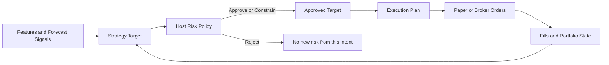

# Strategy, Risk, and Execution User Guide

[简体中文](./strategy-risk-execution.zh-CN.md)

Status: V1 user and evidence contract. This guide defines the behavior the completed V1 must expose; it does not claim that every described screen is already implemented.

Related guides: [Trading Bot Runtime](./bot-runtime.md) and [Paper Trading Accounts](./paper-trading-accounts.md).

## The mental model

ADAQ deliberately separates three questions:

1. **Strategy — what should the portfolio hold?**
2. **Risk — what is the system allowed to hold?**
3. **Execution — how should the approved change become orders?**



The Strategy never sends an order. Risk never invents a trade the Strategy did not request. Execution never changes the investment thesis.

## Responsibility map

| Concern | Owner | Meaning |
| --- | --- | --- |
| Signal filters, entry and exit logic | Strategy | Decides whether evidence supports exposure. |
| Top-N selection and portfolio optimization | Strategy | Converts forecasts into desired holdings. |
| Desired weights, cash reserve, and rebalance schedule | Strategy | Produces the pre-risk Strategy Target. |
| Strategy stop-loss, take-profit, or signal decay | Strategy | Changes the desired target because the investment logic changed. |
| Volatility target or strategy risk budget | Strategy | Expresses the Strategy's preferred risk, still subject to hard limits. |
| Available cash, maximum position, concentration, gross and net exposure | Host Risk | Enforces non-bypassable capital and exposure limits. |
| Maximum daily loss, drawdown, Freeze All, and kill switch | Host Risk | Protects the account even when the Strategy still wants risk. |
| Instrument status, stale prices, trading session, settlement, A-share T+1, and price limits | Host Risk | Rejects targets that cannot legally or safely be acted on now. |
| Rebalance threshold and order-size rounding | Execution | Avoids dust and creates venue-valid quantities. |
| Market or limit order, maker or taker policy, slicing, and sequencing | Execution | Chooses how to pursue the Approved Target. |
| Expected fees and slippage in Backtest | Execution | Defines the frozen simulation assumptions. |
| Actual order status, fees, slippage, and Fills in Paper Trading | Execution | Records what the broker or Paper venue actually produced. |

## The four recorded stages

### 1. Strategy Target

The Strategy Target is the complete desired allocation before host Risk. A Single-Instrument Strategy emits one Target Decision. A Portfolio Strategy emits every Instrument target weight plus the desired cash reserve for its exact Point-in-Time Instrument Universe.

The output is invalid if it contains non-finite values, unknown Instruments, duplicate Instruments, an incompatible universe, or omitted Portfolio members. Missing output never means hold, close, or zero.

### 2. Risk Decision

The host applies one exact Risk Policy and records one result:

- **Approve**: the Strategy Target is permitted unchanged.
- **Constrain**: the host produces a lower-risk target and records every changed field and reason.
- **Reject**: no risk-increasing order may be produced from that intent.

Constrained capital becomes cash. Risk does not redistribute it into another Instrument, because doing so would create investment intent the Strategy did not express. A separate emergency rule may reduce or close existing risk when the account is already in breach.

### 3. Approved Target

The Approved Target is the only target Execution may consume. The original Strategy Target remains visible beside it, together with the Risk Policy version, decision, reasons, and changed values.

### 4. Execution Plan

Execution compares the Approved Target with current Portfolio State and produces venue-valid order intentions. It applies rebalance thresholds, lot and price increments, minimum notional, available quantity, order policy, sequencing, fees, and slippage assumptions.

An Execution Plan is still not a Fill. Paper Trading or the broker may reject, partially fill, cancel, or fill it at a different price. Those outcomes update Portfolio State and remain visible as execution evidence.

## Common scenarios

### A Portfolio weight is constrained

The Strategy requests 25% in `AAA`, 15% in `BBB`, and 60% cash. The Risk Policy limits one Instrument to 10%.

```text
Strategy Target:  AAA 25%, BBB 15%, cash 60%
Risk Decision:    Constrain AAA because maxInstrumentWeight = 10%
Approved Target:  AAA 10%, BBB 15%, cash 75%
```

Risk does not assign the released 15% to `BBB`. That would create an unrequested position increase.

### A-share T+1 blocks a sale

An A-share Strategy buys shares today and later requests zero exposure. The market rule says the purchased quantity is not sellable until the next eligible Trading Date. Risk constrains the target to the minimum locked position, records the T+1 reason and eligible time, and Execution emits no invalid sell order for the locked quantity.

The Strategy Target remains zero, so the UI makes clear that the Strategy wanted to exit but the market rule prevented immediate execution.

### Strategy stop versus platform loss limit

A Strategy may set its target to zero after an 8% adverse move. That is investment logic. Separately, a host maximum-daily-loss rule may Freeze new risk across every Strategy even if their signals still request exposure. The first belongs to the Strategy; the second cannot be disabled by a Component.

### Rebalance intent versus dust control

A Strategy changes a weight from 10.00% to 10.03%. The Strategy has expressed a new target, but an Execution Profile with a 0.10% rebalance threshold emits no order. The unchanged position is an execution result, not a hidden Strategy hold.

## Configuring a Run

1. Select the Strategy Component and verify its Strategy Scope.
2. Bind the exact Instrument or Point-in-Time Instrument Universe, Feature Plan, and Forecast Signals.
3. Configure Strategy parameters, allocation logic, decision schedule, and strategy-level exit rules.
4. Select a host Risk Policy and inspect every hard limit before running.
5. Select the venue-appropriate Execution Profile and inspect order, fee, slippage, precision, and fill assumptions.
6. Freeze the configuration and run an ADAQ-native Backtest.
7. Inspect constrained and rejected decisions, not only return metrics.
8. Complete Validation and Deployment Qualification against the exact frozen policies.
9. Start Paper Trading only after the qualified Strategy, Risk Policy, and Execution Profile match the intended account and Venue.

Editing any Strategy parameter, Risk Policy, Execution Profile, universe, Feature Plan, or Component version creates a different configuration and requires new evidence.

## Backtest and Paper Trading

Backtest and Paper Trading freeze the same Strategy, Risk Policy, and Execution Profile identities, but their evidence is not falsely treated as identical:

- Backtest uses historical observations and simulated fills under declared fee and slippage assumptions.
- Paper Trading uses the Paper venue's live acknowledgements, rejections, partial fills, timing, and actual reported fees.
- A comparison report should show planned versus realized price, quantity, fee, latency, slippage, and unfilled exposure.

Historical success is not a guarantee, and successful Paper Trading does not grant Real Trading Qualification.

## Required user-visible evidence

For every decision time, the Dashboard and Run detail must make the following chain inspectable:

```text
Strategy Target
→ Risk Policy and Risk Decision
→ Approved Target
→ Execution Plan
→ Orders
→ Fills
→ resulting Portfolio State
```

The UI must show exact Component and policy versions, decision time, Instrument identities, original and approved values, machine-readable reasons with plain-language explanations, order status, Fill differences, and links to the frozen evidence. A user must never have to infer that Risk changed a target from the final order alone.

Every complex label requires an adjacent keyboard-, click-, and hover-accessible explanation linked to this guide or a more specific reference page.

## Fail-safe behavior

| Condition | Required behavior |
| --- | --- |
| Missing, late, or invalid Feature, Signal, or Strategy Target | Produce no synthetic value and add no new risk. Record a pause or rejection. |
| Stale market price, closed session, suspended Instrument, or unknown calendar | Block affected new risk and state the exact reason. |
| Model or Strategy runner crash or timeout | Pause prediction-driven new risk; never reuse a stale output as current. |
| Broker or network disconnection | Block new submissions and apply the frozen cancellation/freeze policy. |
| Risk limit breach | Permit only the recorded risk-preserving or risk-reducing response. |
| Recovery | Resume only from an evidence-safe boundary with refreshed Portfolio State and market evidence. |

## What this separation prevents

- A third-party Strategy bypassing account limits.
- Host Risk silently rewriting an investment thesis.
- Execution rounding being mistaken for Strategy behavior.
- Backtest costs being presented as actual Paper costs.
- Missing data being interpreted as zero exposure.
- Marketplace or Paper success being treated as permission to trade real funds.
