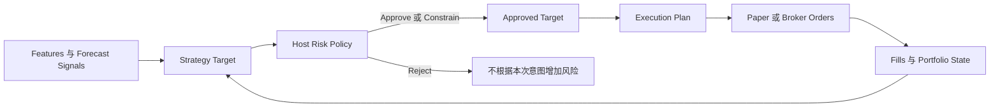

# Strategy、Risk 与 Execution 用户指南

[English](./strategy-risk-execution.md)

状态：V1 用户与证据契约。本文定义完整 V1 必须向用户提供的行为，但不表示当前界面已经实现所有描述内容。

相关指南：[Trading Bot 运行时](./bot-runtime.zh-CN.md) 与 [Paper Trading Account](./paper-trading-accounts.zh-CN.md)。

## 核心理解方式

ADAQ 刻意把三个问题分开：

1. **Strategy——组合应该持有什么？**
2. **Risk——系统允许持有什么？**
3. **Execution——如何把批准后的变化变成订单？**



Strategy 永远不直接发送订单；Risk 永远不创造 Strategy 没有要求的交易；Execution 永远不改变投资逻辑。

## 职责对照

| 事项 | 所有者 | 含义 |
| --- | --- | --- |
| 信号过滤、入场和退出逻辑 | Strategy | 判断证据是否支持持仓。 |
| Top-N 选择和组合优化 | Strategy | 把预测转换为期望持仓。 |
| 目标权重、现金保留和调仓时点 | Strategy | 产生风控前的 Strategy Target。 |
| 策略止损、止盈或信号衰减 | Strategy | 因投资逻辑变化而改变目标。 |
| 波动率目标或策略风险预算 | Strategy | 表达 Strategy 偏好的风险，仍受硬限制约束。 |
| 可用资金、最大仓位、集中度、总敞口和净敞口 | Host Risk | 执行不可绕过的资金和敞口限制。 |
| 单日最大亏损、最大回撤、Freeze All 和 Kill Switch | Host Risk | 即使 Strategy 仍要求持仓，也要保护账户。 |
| Instrument 状态、过期价格、交易时段、结算、A 股 T+1 和涨跌停 | Host Risk | 拒绝当前无法合法或安全执行的目标。 |
| 最小调仓阈值、数量和价格取整 | Execution | 避免碎单并生成 Venue 合法数量。 |
| 市价/限价、Maker/Taker、拆单和顺序 | Execution | 决定如何追踪 Approved Target。 |
| Backtest 中的预期手续费和滑点 | Execution | 定义冻结的模拟假设。 |
| Paper Trading 中的实际订单状态、费用、滑点和 Fill | Execution | 记录 Broker 或 Paper Venue 实际产生的结果。 |

## 四个必须记录的阶段

### 1. Strategy Target

Strategy Target 是 Host Risk 处理前的完整期望配置。Single-Instrument Strategy 输出一个 Target Decision；Portfolio Strategy 针对精确 Point-in-Time Instrument Universe 输出每个 Instrument 的目标权重及现金保留。

如果输出包含非有限值、未知或重复 Instrument、不匹配的 Universe，或者遗漏 Portfolio 成员，则输出无效。缺失输出绝不代表持有、平仓或零仓位。

### 2. Risk Decision

Host 应用一个精确的 Risk Policy，并记录以下结果之一：

- **Approve**：Strategy Target 原样获准。
- **Constrain**：Host 产生风险更低的目标，并记录每个变化字段和原因。
- **Reject**：不得根据本次意图生成任何增加风险的订单。

被约束后释放的资金回到现金。Risk 不会自动把它分配给另一个 Instrument，因为这会创造 Strategy 没有表达的投资意图。若账户已经违反硬限制，独立的紧急规则可以降低或关闭现有风险。

### 3. Approved Target

只有 Approved Target 可以进入 Execution。原始 Strategy Target 必须同时保留并展示，旁边显示 Risk Policy 版本、Decision、原因和被修改的数值。

### 4. Execution Plan

Execution 比较 Approved Target 与当前 Portfolio State，再生成 Venue 合法的订单意图。它应用最小调仓阈值、价格和数量步长、最小名义金额、可卖数量、订单策略、下单顺序、手续费及滑点假设。

Execution Plan 仍不等于 Fill。Paper Trading 或 Broker 可能拒单、部分成交、撤单，或者以不同价格成交。这些结果会更新 Portfolio State，并作为执行证据保留。

## 常见场景

### Portfolio 权重被约束

Strategy 希望配置 `AAA` 25%、`BBB` 15%、现金 60%，但 Risk Policy 规定单个 Instrument 最多 10%。

```text
Strategy Target:  AAA 25%, BBB 15%, cash 60%
Risk Decision:    Constrain AAA，因为 maxInstrumentWeight = 10%
Approved Target:  AAA 10%, BBB 15%, cash 75%
```

Risk 不会把释放的 15% 自动增加到 `BBB`，因为这会创造未经 Strategy 请求的风险。

### A 股 T+1 阻止卖出

A 股 Strategy 当天买入后又要求把目标降为零，但当天买入数量在下一个合格 Trading Date 前不可卖。Risk 把目标约束为最低锁定持仓，记录 T+1 原因和下一可卖时间；Execution 不会为锁定数量生成无效卖单。

Strategy Target 仍保留为零，因此界面会清楚说明：Strategy 希望退出，但市场规则阻止了立即执行。

### Strategy 止损与平台亏损限制

Strategy 可以在价格逆向变动 8% 后把目标设为零，这是投资逻辑。Host 的单日最大亏损规则则可以冻结全部 Strategy 的新增风险，即使它们的 Signals 仍要求持仓。前者属于 Strategy，后者不能被 Component 关闭。

### 调仓意图与碎单控制

Strategy 把权重从 10.00% 改为 10.03%，已经表达了新目标；但 Execution Profile 的最小调仓阈值为 0.10%，因此不会生成订单。持仓不变是 Execution 结果，不是隐藏的 Strategy hold。

## 配置一次 Run

1. 选择 Strategy Component，并确认其 Strategy Scope。
2. 绑定精确 Instrument 或 Point-in-Time Instrument Universe、Feature Plan 与 Forecast Signals。
3. 配置 Strategy 参数、资金分配逻辑、决策时点和策略级退出规则。
4. 选择 Host Risk Policy，并在运行前检查全部硬限制。
5. 选择适合 Venue 的 Execution Profile，并检查订单方式、费用、滑点、精度和成交假设。
6. 冻结配置并执行 ADAQ-native Backtest。
7. 检查 Constrain 和 Reject 记录，而不只查看收益指标。
8. 使用完全相同的冻结 Policy 完成 Validation 和 Deployment Qualification。
9. 确认已通过资格的 Strategy、Risk Policy、Execution Profile 与目标账户和 Venue 一致后，才启动 Paper Trading。

修改任何 Strategy 参数、Risk Policy、Execution Profile、Universe、Feature Plan 或 Component 版本，都会形成不同配置并需要新证据。

## Backtest 与 Paper Trading

Backtest 和 Paper Trading 冻结相同的 Strategy、Risk Policy 与 Execution Profile 身份，但不能把两者的证据错误地视为完全相同：

- Backtest 使用历史观察和声明的手续费、滑点假设来模拟 Fill。
- Paper Trading 使用 Paper Venue 的实时确认、拒单、部分成交、时间和实际报告费用。
- 对比报告应展示计划与实际价格、数量、费用、延迟、滑点和未成交敞口。

历史成功不构成保证；Paper Trading 成功也不会自动获得 Real Trading Qualification。

## 用户必须能看到的证据

对于每个决策时点，Dashboard 与 Run 详情必须可以检查以下完整链路：

```text
Strategy Target
→ Risk Policy 与 Risk Decision
→ Approved Target
→ Execution Plan
→ Orders
→ Fills
→ 最终 Portfolio State
```

界面必须显示精确 Component 和 Policy 版本、决策时间、Instrument 身份、原始与批准值、机器可读原因及通俗解释、订单状态、Fill 差异和冻结证据链接。用户绝不能只能从最终订单猜测 Risk 是否修改了目标。

每个复杂标签旁边都必须提供支持键盘、点击和悬停的信息说明，并链接本文或更具体的参考文档。

## 故障安全行为

| 条件 | 必须执行的行为 |
| --- | --- |
| Feature、Signal 或 Strategy Target 缺失、过期或无效 | 不生成合成值、不增加风险，并记录 Pause 或 Reject。 |
| 市场价格过期、闭市、Instrument 暂停或 Calendar 未知 | 阻止受影响的新增风险，并显示精确原因。 |
| Model 或 Strategy Runner 崩溃或超时 | 暂停预测驱动的新增风险；绝不把旧输出当作当前输出。 |
| Broker 或网络断开 | 阻止新提交，并执行冻结的撤单或 Freeze Policy。 |
| 违反 Risk Limit | 只允许已记录的风险维持或降低行为。 |
| 恢复 | 只有在刷新 Portfolio State 和市场证据后，才从证据安全边界恢复。 |

## 这套分层避免的问题

- 第三方 Strategy 绕过账户限制。
- Host Risk 静默改写投资逻辑。
- Execution 取整被误认为 Strategy 行为。
- Backtest 成本被展示为实际 Paper 成本。
- 缺失数据被解释成零仓位。
- Marketplace 或 Paper 成功被误认为真实资金交易许可。
