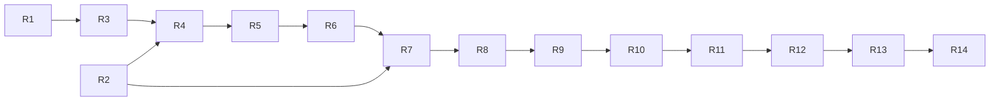

# ADAQ V1 Completion Recovery Map

[简体中文](./v1-completion-recovery-map.zh-CN.md)

Status: approved planning baseline; [GitHub recovery map #129](https://github.com/tonywxx/adaq/issues/129) and its child graph are published; implementation has not started.

Reviewed: 2026-08-22 at `19af7a51b309017c437c5bf28e5f802550e3633c`.

## Recovery objective

Finish one honest V1 product path from OKX Spot data through research, qualified deployment, OKX Demo Paper execution, supervised Bots, Operations, feedback, and human-reviewed readiness. China A-share and U.S. equity support are Post-V1 Market Expansion under [ADR 0090](./adr/0090-rebaseline-v1-to-okx-spot-end-to-end.md).

This map replaces issue closure and milestone labels as the canonical statement of remaining V1 work. Historical issues, including #105 and #120–#128, remain closed as evidence of delivered foundations or partial cores; they are not reopened and do not prove current-head product completion.

## Fixed boundaries

- V1 market data is OKX Spot.
- V1 execution is OKX Demo Trading only. Live endpoints, real credentials, and real orders are prohibited.
- Existing A-share and U.S. equity code is retained but excluded from default V1 build, runtime, navigation, acceptance, and readiness claims.
- Shared domain contracts remain asset-neutral; provider-specific behavior stays explicit at adapters and product surfaces.
- Request payload `user_id` is never authority. Desktop capabilities derive User identity from Host-verified authentication.
- Every operation retains typed lifecycle and immutable evidence; uncertainty and missing prerequisites fail closed.
- A child is complete only with current-head implementation, automated checks, required desktop/manual evidence, an English GitHub evidence comment, and issue closure.
- The recovery map remains open through R14. Only the User or Release Owner approves final readiness.

## Completion legend

- **Accepted foundation** — implemented and accepted at its declared boundary; still subject to downstream integration.
- **Reusable core** — useful contracts or engine code exist, but the product workflow is incomplete.
- **Partial** — only part of the required product path or evidence exists.
- **Missing** — no complete current-head product capability or acceptance evidence exists.
- **Deferred** — retained for Post-V1 Market Expansion and not a V1 gate.

## Current-head inventory

| Area | Assessment | What exists | What remains for OKX V1 |
| --- | --- | --- | --- |
| M9 Data Foundation | Partial | OKX connector/pipeline, evidence contracts, Markets and Data Foundation surfaces | Isolate equity dependencies; run the visible OKX acquisition → Source → Canonical → Quality → Snapshot → Universe journey with cancellation, retry, restart, and blocker evidence |
| M10 Features | Accepted foundation | Feature plans, fitting, materialization, immutable datasets, Host context integration | Re-run current-head OKX Context freeze and product handoff evidence |
| M11 Factors | Accepted foundation with product remediation | Factor research, evaluation, families/trials, promotion, context integration | Remove opaque handoff friction and record the current-head OKX product journey |
| M12 Models/Python | Accepted foundation | Managed Python research, Qlib Ridge tutorial, model evidence and Context integration | Re-run current-head model handoff; keep the A-share fixture explicitly offline and non-product |
| M13 Strategy/Backtest | Reusable core | Single-instrument and portfolio backtest contracts, including `adaq-backtest-core` portfolio support | Deliver the User-owned Strategy/Portfolio desktop workflow and OKX product acceptance |
| M14 Component Qualification | Reusable core | Build, conformance, equivalence, qualification, packaging/import foundations | Complete Artifact-to-Component generation, trust/equivalence evidence, import, and GUI acceptance |
| M15 Paper Trading | Reusable core | `adaq-paper-trading-core` ledger/risk concepts | Integrate only OKX Demo account, reconciliation, Risk/OMS, order/fill journal, uncertainty, and secure credentials into the product |
| M16 Bots | Reusable core | `adaq-bot-runtime` fail-closed contracts | Ship the signed worker Sidecar, Host supervisor, deployment/control UI, clocks, crash/restart/reconciliation evidence |
| M17 Operations | Partial | Operational Store, events, health, alerts, and dashboard foundations | Connect real Data/Paper/Bot signals, notifications, safety actions, drill-down, recovery, localization, and acceptance |
| M18 Feedback/Readiness | Partial | Paper feedback contracts and Tauri commands | Repair User authority, expose the review loop, harden/package, execute failure matrix, and record scoped readiness assertions |
| A-share/U.S. equity | Deferred | Existing connectors, UI, tests, and generic contracts are retained | Separate post-V1 source qualification and product planning; no V1 completion work |

## Known recovery blockers

1. The default Rust workspace test currently loads an A-share native dependency and can fail on missing `libcurl-impersonate.4.dylib`. This contradicts the earlier data-library decision to harvest selected logic without a direct runtime dependency.
2. The U.S. equity path implements Yahoo acquisition while product command names still imply Alpaca, so provider authority is ambiguous.
3. Paper feedback command inputs carry caller-supplied `user_id` without deriving authority from `AuthState`, contrary to ADR 0085.
4. M13/M14 core modules and M15/M16 workspace crates are not proof of a Tauri/React product workflow.
5. Strategy and Operations navigation still describes downstream capabilities as planned, while some backend cores already exist.
6. Current-head automated evidence is not fully green: frontend tests/build/lint and Rust check pass, but the full Rust test baseline and the latest remote macOS jobs require recovery.
7. Candidate tracked session artifacts must be classified and removed only if confirmed accidental; unrelated legitimate files must remain untouched.

## Recovery children

Each child below is one independently executable GitHub issue. Implement each in a separate `$implement <issue>` session.

| Child | Issue | Child | Issue |
| --- | --- | --- | --- |
| R1 | [#140](https://github.com/tonywxx/adaq/issues/140) | R8 | [#139](https://github.com/tonywxx/adaq/issues/139) |
| R2 | [#136](https://github.com/tonywxx/adaq/issues/136) | R9 | [#137](https://github.com/tonywxx/adaq/issues/137) |
| R3 | [#131](https://github.com/tonywxx/adaq/issues/131) | R10 | [#143](https://github.com/tonywxx/adaq/issues/143) |
| R4 | [#132](https://github.com/tonywxx/adaq/issues/132) | R11 | [#142](https://github.com/tonywxx/adaq/issues/142) |
| R5 | [#134](https://github.com/tonywxx/adaq/issues/134) | R12 | [#138](https://github.com/tonywxx/adaq/issues/138) |
| R6 | [#130](https://github.com/tonywxx/adaq/issues/130) | R13 | [#135](https://github.com/tonywxx/adaq/issues/135) |
| R7 | [#133](https://github.com/tonywxx/adaq/issues/133) | R14 | [#141](https://github.com/tonywxx/adaq/issues/141) |

### R1 — Isolate deferred equity market paths from OKX-only V1

**Problem:** A-share and U.S. dependencies, runtime routes, and product labels can break the OKX build or imply unsupported V1 capability.

**Solution:** Preserve the code while excluding deferred paths from default V1 build/runtime/navigation/readiness. Align dependency ownership with the accepted data-library audit and classify suspected session artifacts.

**Acceptance criteria:**

- Default supported-platform builds and tests do not require A-share or U.S. provider/native libraries.
- Default navigation and capability reporting expose only supported OKX V1 paths; deferred code remains recoverable in source/history.
- Provider names and command authority are truthful; no Yahoo behavior is labeled Alpaca.
- Suspected session artifacts are inspected and only confirmed accidental files are removed.
- A documented extension boundary explains how deferred markets can return without changing shared domain semantics.

**Out of scope:** Selecting new equity data sources, completing equity connectors, or deleting reusable equity code.

### R2 — Complete Host-derived User authority across Desktop capabilities

**Problem:** Some Desktop commands, notably Paper Feedback, accept caller-supplied User identity as authority.

**Solution:** Route every affected capability through Host-verified authentication and authorize stored evidence by the derived User.

**Acceptance criteria:**

- A current command audit identifies every payload or handler that can select User-owned data.
- Affected commands derive User identity from `AuthState`; payload IDs are references only or are removed.
- Cross-user read/write attempts fail closed with typed, redacted errors.
- Restart and unauthenticated behavior is covered without weakening existing local ownership contracts.

**Out of scope:** New identity providers, cloud synchronization, or multi-user collaboration.

### R3 — Restore the current-head verification baseline

**Problem:** V1 planning cannot rely on a baseline with a failing full Rust test run or unresolved remote jobs.

**Solution:** Remove OKX-irrelevant baseline failures, run the declared checks from a clean current head, and retain exact evidence.

**Acceptance criteria:**

- Frontend tests, build, and lint pass.
- `cargo check --workspace` and `cargo test --workspace` pass without deferred-market native libraries.
- Component example and Factor integration jobs pass on the required CI platforms.
- The evidence records commit, commands, platform, and any explicitly accepted limitations.

**Out of scope:** M13–M18 product implementation or equity provider qualification.

### R4 — Complete OKX Data Foundation and Research Context product-run gate

**Problem:** Automated contracts exist, but the visible OKX acquisition and research handoff have not been accepted end to end.

**Solution:** Complete the Data Foundation operation/recovery surface and exercise Host-owned Context through Features, Factors, and Models.

**Acceptance criteria:**

- A User can acquire OKX Spot data and inspect Source, Canonical, Quality, Snapshot, Universe, operation history, and provenance.
- Cancel, retry, restart, degraded prerequisites, and incompatible/stale Context retain evidence and fail closed.
- Features, Factors, and Models select and freeze the same visible Host-owned OKX Context without copied opaque protocol data.
- The journey passes in `en-US` and `zh-CN` with current-head automated and manual evidence.

**Out of scope:** Equity acquisition or Strategy implementation.

### R5 — Deliver M13 Strategy and Portfolio Backtest product workflow

**Problem:** Backtest cores exist without the complete User-owned Strategy project, portfolio, selection, and final-evaluation workflow.

**Solution:** Connect the existing engines and evidence contracts into Strategy Lab using the frozen OKX Research Context.

**Acceptance criteria:**

- Users can create/revise a Strategy, bind eligible signals/components, configure single-instrument or portfolio scope, and run retained attempts.
- Selection and Final Evaluation windows are separated and immutable; causal availability, costs, constraints, and provenance are visible.
- Cancellation, failure, retry, restart, and invalid/mixed Context fail closed without overwriting evidence.
- The OKX workflow passes automated tests and bilingual desktop acceptance.

**Out of scope:** Component export/qualification, Paper deployment, or optimization promises.

### R6 — Deliver M14 Component Generation and Qualification workflow

**Problem:** Qualification cores exist, but research artifacts cannot yet complete a trusted product generation/import journey.

**Solution:** Connect eligible Factor, Model, and Strategy artifacts to generation, build, conformance, equivalence, signed package evidence, and import.

**Acceptance criteria:**

- Only eligible immutable artifacts and supported parameter combinations can generate candidates.
- Build, conformance, equivalence, identity, provenance, and package verification evidence is retained and inspectable.
- Failed or incompatible packages cannot be imported or deployed; retry creates new evidence.
- Qualified Components import through the existing trust boundary on supported platforms with bilingual GUI evidence.

**Out of scope:** Marketplace infrastructure, arbitrary Python deployment, or Paper execution.

### R7 — Integrate OKX Demo Paper Account, Risk, OMS, and execution

**Problem:** Paper ledger/risk contracts are not an operable, secure OKX Demo product path.

**Solution:** Integrate the OKX Demo adapter, credentials, reconciliation, reservations, Host Risk/OMS, and normalized orders/fills under one USDT Paper account.

**Acceptance criteria:**

- The only V1 Paper funding target is 1,000,000 USDT and cannot become a Live account.
- Credentials stay in OS secret storage and never enter SQLite, logs, Components, workers, or frontend state.
- Connection test, account snapshot, reconciliation, reservations, venue validation, partial fills, cancels, and provider evidence are inspectable.
- Timeout/uncertain outcome, disconnect, credential rotation, restart, and reconciliation fail closed without duplicate orders.
- Automated and bilingual desktop acceptance uses OKX Demo only.

**Out of scope:** A-share/U.S. Paper adapters, margin, shorting, or Real Trading.

### R8 — Deliver the OKX Paper Workspace and recovery journey

**Problem:** Backend Paper capability is not a coherent User workflow.

**Solution:** Deliver immediate-paint account, order, fill, risk, reconciliation, and recovery surfaces around R7.

**Acceptance criteria:**

- Users can inspect account freshness, balances, reservations, positions, orders, fills, risk decisions, and reconciliation evidence.
- Pending work is shown in the owning control and does not block navigation.
- Pause/block/retry/reconcile actions require appropriate confirmation and expose typed outcomes.
- Empty, loading, degraded, disconnected, uncertain, and restart states pass bilingual desktop acceptance.

**Out of scope:** Bot automation, multi-account aggregation, or equity account UI.

### R9 — Deliver the signed Bot Worker Sidecar and Host Supervisor

**Problem:** Bot runtime contracts exist without the distributable worker and supervising Host process boundary.

**Solution:** Ship one signed prebuilt `adaq-bot-worker` Sidecar per active Bot with bounded IPC, clocks, deadlines, health, and fail-closed supervision.

**Acceptance criteria:**

- Worker identity/signature is verified before launch and packaged on supported platforms.
- Workers receive immutable inputs and targets but never credentials or Provider Order APIs.
- Closed-bar/scheduled clocks, deadlines, heartbeat, resource limits, and stale-target rejection are deterministic and evidenced.
- Crash, hang, malformed output, Host restart, and worker replacement enter explicit fail-closed lifecycle states.

**Out of scope:** Bot deployment UI, cloud workers, generated executables, or Real Trading.

### R10 — Deliver Bot deployment, control, and recovery workflows

**Problem:** Users cannot deploy qualified Bundles to OKX Paper or safely control and recover running Bots.

**Solution:** Connect qualified immutable Bundles, the Host supervisor, OKX Paper account, lifecycle controls, and retained Runtime Attempts.

**Acceptance criteria:**

- Only qualified immutable Bundles deploy to an authorized OKX Paper account.
- Start, Pause, Resume, Stop and Keep Position, and separately confirmed Stop and Flatten have explicit authority and evidence.
- Only Running can increase risk; restart/reconcile/retry never replays stale targets or duplicates orders.
- Bot status, decision, order, and recovery evidence is inspectable in both locales.

**Out of scope:** Live deployment, cloud control, automatic hot patching, or unreviewed strategy switching.

### R11 — Complete Operations integration, alerts, and notifications

**Problem:** Operations foundations are not fully wired to real Data, Paper, Bot, and Feedback failures or User notifications.

**Solution:** Project append-only operational evidence into health, alerts, safety actions, notifications, and drill-down views.

**Acceptance criteria:**

- Data, worker, model, account, Risk/OMS, adapter, local-system, and feedback health are independently visible.
- Typed alerts support Active/Acknowledged/Resolved lifecycle, debounce/hysteresis, redaction, and retained evidence.
- Required unhealthy/unknown states trigger their frozen fail-closed safety actions.
- Notification Center, critical banner, OS notifications, and drill-down work in both locales without giving frontend state authority.

**Out of scope:** Cloud observability, telemetry collection beyond declared local bounds, or automated research changes.

### R12 — Deliver Paper Feedback and the human Research Review loop

**Problem:** Feedback contracts are not a secure, visible path from realized OKX Paper evidence back to a human research decision.

**Solution:** Bind immutable feedback snapshots/reports to Host-derived User authority and expose review decisions that create new research attempts/bundles.

**Acceptance criteria:**

- Factor, Model, Strategy, and Execution feedback bind exact deployment, market, account, fills, horizon, and evidence lineage.
- Sample sufficiency and realized-horizon gates prevent premature conclusions.
- Research Review Required alerts and User decisions are visible, immutable, and User-authorized.
- A decision may create a new Attempt or Bundle but never retrains, switches, or hot-patches a running deployment automatically.

**Out of scope:** Autonomous optimization, online learning, or cross-user review.

### R13 — Harden and package OKX-only V1

**Problem:** The integrated journey lacks one release-level fault, accessibility, performance, retention, and packaging gate.

**Solution:** Exercise the supported-platform/locale matrix, fix release blockers, and retain current-head operational evidence.

**Acceptance criteria:**

- Missing data, provider disconnect, clock skew, worker crash, uncertain order state, credential rotation, and restart reconciliation are exercised and retained.
- Accessibility, immediate-paint/loading behavior, performance budgets, retention/diagnostic controls, and bilingual user documentation pass review.
- Signed packaging includes the verified worker and excludes deferred native dependencies and Live authority.
- Release CI passes on every supported V1 platform at the reviewed commit.

**Out of scope:** New features, equity support, public APIs, or Real Trading.

### R14 — Record and approve OKX-scoped V1 Readiness Assertions

**Problem:** Passing implementation checks does not itself authorize a V1 readiness claim.

**Solution:** Assemble scoped, reviewable assertions for the OKX journey and each required failure/recovery capability.

**Acceptance criteria:**

- Each assertion binds capability, OKX market/data context, platform, locale, reviewed commit, automated/manual evidence, limitations, reviewer, and decision.
- No assertion relies only on issue closure, historical comments, or a global green flag.
- All No-Live, Host authority, evidence immutability, and fail-closed invariants are explicitly reviewed.
- The User or Release Owner records the final approval; the implementation agent only prepares evidence.
- The recovery parent closes only after every child and required assertion is complete.

**Out of scope:** Self-approval by an implementation agent or readiness claims for deferred markets.

## Dependency graph and frontier

The initial executable frontier is R1 ([#140](https://github.com/tonywxx/adaq/issues/140)) and R2 ([#136](https://github.com/tonywxx/adaq/issues/136)). They are independent and may be implemented in separate sessions. Native GitHub sub-issue links and `blocked_by` edges match this graph.

## Closure evidence

For every child, the final English issue comment must map each acceptance criterion to concrete evidence, list exact verification commands and results, identify the reviewed commit/platform/locale, and disclose skipped or unavailable checks. Historical evidence may support a criterion only when current-head verification proves it still holds.
