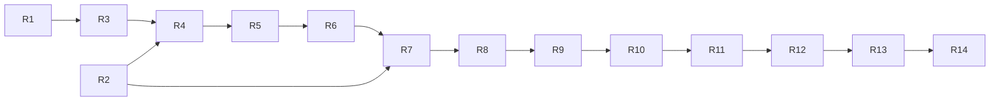

# ADAQ V1 完成度恢复图

[English](./v1-completion-recovery-map.md)

状态：已确认的规划基线；[GitHub Recovery Map #129](https://github.com/tonywxx/adaq/issues/129) 及其 Child Graph 已发布；实现尚未开始。

审查版本：2026-08-22，`19af7a51b309017c437c5bf28e5f802550e3633c`。

## 恢复目标

完成一条真实可用的 V1 产品路径：从 OKX Spot 数据，经研究、合格部署、OKX Demo Paper 执行、受监督 Bot、Operations、Feedback，直到人工复核的 Readiness。根据 [ADR 0090](./adr/0090-rebaseline-v1-to-okx-spot-end-to-end.md)，中国 A 股和美国股票属于 **V1 后市场扩展**。

本恢复图取代“Issue 已关闭”或“Milestone 标签”成为 V1 剩余工作的规范来源。包括 #105、#120–#128 在内的历史 Issue 保持关闭，作为已交付 Foundation 或 Partial Core 的证据；不重新打开，也不代表当前 HEAD 的产品已完成。

## 固定边界

- V1 市场数据仅为 OKX Spot。
- V1 执行仅为 OKX Demo Trading；禁止 Live Endpoint、真实交易凭据和真实订单。
- 保留现有 A 股与美股代码，但将其排除在默认 V1 Build、Runtime、Navigation、Acceptance 和 Readiness 声明之外。
- 共享 Domain Contract 保持 Asset-neutral；Provider 差异在 Adapter 和产品界面显式表达。
- 请求 Payload 的 `user_id` 永远不是 Authority；Desktop Capability 必须从 Host 已验证认证状态派生 User Identity。
- 每个 Operation 保留 Typed Lifecycle 与不可变 Evidence；不确定结果和缺失前置条件必须 Fail-closed。
- Child 只有在当前 HEAD 实现、自动检查、必要 Desktop/Manual Evidence、英文 GitHub Evidence Comment 和 Issue Closure 全部完成后才算完成。
- Recovery Map 一直保持 Open 到 R14；最终 Readiness 只能由 User 或 Release Owner 批准。

## 完成度图例

- **Accepted foundation**：已在声明边界内实现并验收，但仍需下游集成。
- **Reusable core**：已有可复用 Contract 或 Engine Code，但产品 Workflow 不完整。
- **Partial**：仅完成所需产品路径或证据的一部分。
- **Missing**：没有完整的当前 HEAD 产品能力或验收证据。
- **Deferred**：保留给 V1 后市场扩展，不是 V1 Gate。

## 当前 HEAD 清单

| 区域 | 评估 | 已有内容 | OKX V1 尚需完成 |
| --- | --- | --- | --- |
| M9 Data Foundation | Partial | OKX Connector/Pipeline、Evidence Contract、Markets 与 Data Foundation 界面 | 隔离股票依赖；完成可见的 OKX Acquisition → Source → Canonical → Quality → Snapshot → Universe 流程及 Cancel、Retry、Restart、Blocker 证据 |
| M10 Features | Accepted foundation | Feature Plan、Fitting、Materialization、不可变 Dataset、Host Context 集成 | 重新记录当前 HEAD 的 OKX Context Freeze 与产品 Handoff 证据 |
| M11 Factors | Accepted foundation，需产品修复 | Factor Research、Evaluation、Family/Trial、Promotion、Context 集成 | 消除 Opaque Handoff 阻力并记录当前 HEAD 的 OKX 产品流程 |
| M12 Models/Python | Accepted foundation | Managed Python Research、Qlib Ridge Tutorial、Model Evidence 与 Context 集成 | 重跑当前 HEAD Model Handoff；明确 A 股 Fixture 仅为离线测试数据，不是产品支持 |
| M13 Strategy/Backtest | Reusable core | Single-instrument 与 Portfolio Backtest Contract，包括 `adaq-backtest-core` Portfolio 支持 | 交付 User-owned Strategy/Portfolio Desktop Workflow 与 OKX 产品验收 |
| M14 Component Qualification | Reusable core | Build、Conformance、Equivalence、Qualification、Packaging/Import Foundation | 完成 Artifact-to-Component Generation、Trust/Equivalence Evidence、Import 与 GUI 验收 |
| M15 Paper Trading | Reusable core | `adaq-paper-trading-core` Ledger/Risk Concept | 把 OKX Demo Account、Reconciliation、Risk/OMS、Order/Fill Journal、Uncertainty 与安全 Credential 集成进产品 |
| M16 Bots | Reusable core | `adaq-bot-runtime` Fail-closed Contract | 交付签名 Worker Sidecar、Host Supervisor、Deployment/Control UI、Clock、Crash/Restart/Reconciliation Evidence |
| M17 Operations | Partial | Operational Store、Event、Health、Alert 与 Dashboard Foundation | 接入真实 Data/Paper/Bot Signal、Notification、Safety Action、Drill-down、Recovery、Localization 与验收 |
| M18 Feedback/Readiness | Partial | Paper Feedback Contract 与 Tauri Command | 修复 User Authority、提供 Review Loop、Hardening/Packaging、执行 Failure Matrix、记录 Scoped Readiness Assertion |
| A 股/美股 | Deferred | 保留现有 Connector、UI、Test 与 Generic Contract | 单独进行 V1 后 Source Qualification 与产品规划；不属于 V1 完成工作 |

## 已知恢复阻塞

1. 默认 Rust Workspace Test 当前会加载 A 股 Native Dependency，并可能因缺少 `libcurl-impersonate.4.dylib` 失败；这与此前“只提取必要逻辑、不保留直接 Runtime Dependency”的 Data Library 决策冲突。
2. 美股路径实现 Yahoo Acquisition，但产品 Command Name 仍暗示 Alpaca，Provider Authority 不清晰。
3. Paper Feedback Command Input 携带调用方提供的 `user_id`，未从 `AuthState` 派生 Authority，违反 ADR 0085。
4. M13/M14 Core Module 与 M15/M16 Workspace Crate 不能证明 Tauri/React 产品 Workflow 已完成。
5. Strategy 与 Operations Navigation 仍把下游能力标记为 Planned，而部分 Backend Core 已存在。
6. 当前 HEAD 自动证据并非全绿：Frontend Test/Build/Lint 与 Rust Check 通过，但完整 Rust Test Baseline 和最新 Remote macOS Job 仍需恢复。
7. 候选 Tracked Session Artifact 必须逐一分类，仅删除确认的意外文件；不得触碰无关合法文件。

## Recovery Children

以下每个 Child 都已发布为一个可独立执行的 GitHub Issue。每个 Child 使用独立的 `$implement <issue>` Session。

| Child | Issue | Child | Issue |
| --- | --- | --- | --- |
| R1 | [#140](https://github.com/tonywxx/adaq/issues/140) | R8 | [#139](https://github.com/tonywxx/adaq/issues/139) |
| R2 | [#136](https://github.com/tonywxx/adaq/issues/136) | R9 | [#137](https://github.com/tonywxx/adaq/issues/137) |
| R3 | [#131](https://github.com/tonywxx/adaq/issues/131) | R10 | [#143](https://github.com/tonywxx/adaq/issues/143) |
| R4 | [#132](https://github.com/tonywxx/adaq/issues/132) | R11 | [#142](https://github.com/tonywxx/adaq/issues/142) |
| R5 | [#134](https://github.com/tonywxx/adaq/issues/134) | R12 | [#138](https://github.com/tonywxx/adaq/issues/138) |
| R6 | [#130](https://github.com/tonywxx/adaq/issues/130) | R13 | [#135](https://github.com/tonywxx/adaq/issues/135) |
| R7 | [#133](https://github.com/tonywxx/adaq/issues/133) | R14 | [#141](https://github.com/tonywxx/adaq/issues/141) |

### R1 — 从 OKX-only V1 隔离延后的股票市场路径

**问题：** A 股和美股依赖、Runtime Route 与产品标签可能破坏 OKX Build，或暗示 V1 支持尚未合格的市场。

**方案：** 保留代码，同时从默认 V1 Build/Runtime/Navigation/Readiness 排除 Deferred Path；让依赖 Ownership 与已接受的 Data Library Audit 一致，并分类可疑 Session Artifact。

**验收标准：** 默认受支持平台 Build/Test 不要求股票 Provider/Native Library；默认 Navigation/Capability Reporting 只暴露已支持的 OKX V1 路径；不得用 Alpaca 名称包装 Yahoo 行为；只删除确认的意外 Artifact；记录 Deferred Market 回归时不改变共享 Domain Semantics 的扩展边界。

**范围外：** 选择新股票数据源、完成股票 Connector、删除可复用股票代码。

### R2 — 补齐 Desktop Capability 的 Host-derived User Authority

**问题：** Paper Feedback 等 Desktop Command 把调用方提供的 User Identity 当作 Authority。

**方案：** 所有受影响 Capability 通过 Host 已验证认证状态授权，并使用派生 User 访问 Evidence。

**验收标准：** 审计所有可选择 User-owned Data 的 Payload/Handler；受影响 Command 从 `AuthState` 派生 User；Cross-user Read/Write 以 Typed、Redacted Error Fail-closed；覆盖 Restart 与 Unauthenticated 行为且不削弱本地 Ownership Contract。

**范围外：** 新 Identity Provider、Cloud Sync、多用户协作。

### R3 — 恢复当前 HEAD 验证基线

**问题：** 完整 Rust Test 失败或 Remote Job 未解决时，V1 规划没有可信 Baseline。

**方案：** 消除与 OKX 无关的 Baseline Failure，从 Clean Current Head 运行声明的检查并保留精确证据。

**验收标准：** Frontend Test/Build/Lint 通过；`cargo check --workspace` 与 `cargo test --workspace` 无需 Deferred-market Native Library 即通过；Component Example 和 Factor Integration Job 在所需 CI Platform 通过；证据记录 Commit、Command、Platform 与明确限制。

**范围外：** M13–M18 产品实现或股票 Provider Qualification。

### R4 — 完成 OKX Data Foundation 与 Research Context 产品运行 Gate

**问题：** 自动 Contract 已存在，但可见的 OKX Acquisition 与 Research Handoff 尚未端到端验收。

**方案：** 完成 Data Foundation Operation/Recovery 界面，并让 Host-owned Context 贯穿 Features、Factors、Models。

**验收标准：** User 可获取 OKX Spot 数据并检查 Source、Canonical、Quality、Snapshot、Universe、Operation History 与 Provenance；Cancel/Retry/Restart、Degraded Prerequisite、Incompatible/Stale Context 保留证据并 Fail-closed；三个 Research Workspace 使用同一个可见、冻结的 Host-owned OKX Context；`en-US` 与 `zh-CN` 当前 HEAD 自动和人工证据通过。

**范围外：** 股票 Acquisition 或 Strategy 实现。

### R5 — 交付 M13 Strategy 与 Portfolio Backtest 产品 Workflow

**问题：** Backtest Core 已存在，但 User-owned Strategy Project、Portfolio、Selection 与 Final Evaluation Workflow 不完整。

**方案：** 使用冻结的 OKX Research Context，把现有 Engine 与 Evidence Contract 接入 Strategy Lab。

**验收标准：** 可创建/修订 Strategy，绑定合格 Signal/Component，配置 Single-instrument 或 Portfolio Scope 并运行 Retained Attempt；Selection 与 Final Evaluation Window 分离且不可变，Causal Availability、Cost、Constraint、Provenance 可见；Cancel/Failure/Retry/Restart 与 Invalid/Mixed Context Fail-closed 且不覆盖证据；OKX Workflow 通过自动和双语 Desktop Acceptance。

**范围外：** Component Export/Qualification、Paper Deployment、收益优化承诺。

### R6 — 交付 M14 Component Generation 与 Qualification Workflow

**问题：** Qualification Core 已存在，但 Research Artifact 尚不能完成可信产品 Generation/Import Journey。

**方案：** 把合格 Factor、Model、Strategy Artifact 接到 Generation、Build、Conformance、Equivalence、签名 Package Evidence 与 Import。

**验收标准：** 只有合格不可变 Artifact 与受支持 Parameter Combination 可生成 Candidate；保留并展示 Build、Conformance、Equivalence、Identity、Provenance、Package Verification Evidence；失败或不兼容 Package 不得 Import/Deploy，Retry 生成新 Evidence；Qualified Component 在受支持平台通过现有 Trust Boundary Import，并有双语 GUI 证据。

**范围外：** Marketplace、任意 Python Deployment、Paper Execution。

### R7 — 集成 OKX Demo Paper Account、Risk、OMS 与 Execution

**问题：** Paper Ledger/Risk Contract 尚不是可操作、安全的 OKX Demo 产品路径。

**方案：** 在一个 USDT Paper Account 下集成 OKX Demo Adapter、Credential、Reconciliation、Reservation、Host Risk/OMS 与规范化 Order/Fill。

**验收标准：** 唯一 V1 Paper Funding Target 为 1,000,000 USDT，且不能转成 Live Account；Credential 只在 OS Secret Storage，不进入 SQLite、Log、Component、Worker 或 Frontend State；Connection Test、Account Snapshot、Reconciliation、Reservation、Venue Validation、Partial Fill、Cancel 与 Provider Evidence 可检查；Timeout/Uncertain Outcome、Disconnect、Credential Rotation、Restart、Reconciliation Fail-closed 且不重复下单；自动和双语 Desktop Acceptance 只使用 OKX Demo。

**范围外：** A 股/美股 Paper Adapter、Margin、Shorting、Real Trading。

### R8 — 交付 OKX Paper Workspace 与 Recovery Journey

**问题：** Backend Paper Capability 尚未形成连贯 User Workflow。

**方案：** 围绕 R7 交付 Immediate-paint Account、Order、Fill、Risk、Reconciliation 与 Recovery Surface。

**验收标准：** 可检查 Account Freshness、Balance、Reservation、Position、Order、Fill、Risk Decision 与 Reconciliation Evidence；Pending 状态归属发起 Control 且不阻塞 Navigation；Pause/Block/Retry/Reconcile Action 有适当确认与 Typed Outcome；Empty/Loading/Degraded/Disconnected/Uncertain/Restart State 通过双语 Desktop Acceptance。

**范围外：** Bot Automation、Multi-account Aggregation、股票 Account UI。

### R9 — 交付签名 Bot Worker Sidecar 与 Host Supervisor

**问题：** Bot Runtime Contract 已存在，但缺少可分发 Worker 和 Host 监督进程边界。

**方案：** 每个 Active Bot 运行一个签名、预编译的 `adaq-bot-worker` Sidecar，使用有界 IPC、Clock、Deadline、Health 与 Fail-closed Supervision。

**验收标准：** Launch 前验证 Worker Identity/Signature，并在受支持平台打包；Worker 只接收不可变 Input/Target，不接触 Credential 或 Provider Order API；Closed-bar/Scheduled Clock、Deadline、Heartbeat、Resource Limit、Stale-target Rejection 确定且有证据；Crash/Hang/Malformed Output、Host Restart、Worker Replacement 进入显式 Fail-closed Lifecycle。

**范围外：** Bot Deployment UI、Cloud Worker、生成 Executable、Real Trading。

### R10 — 交付 Bot Deployment、Control 与 Recovery Workflow

**问题：** User 不能把 Qualified Bundle 部署到 OKX Paper，也不能安全控制和恢复 Bot。

**方案：** 连接 Qualified Immutable Bundle、Host Supervisor、OKX Paper Account、Lifecycle Control 与 Retained Runtime Attempt。

**验收标准：** 只有 Qualified Immutable Bundle 可部署到已授权 OKX Paper Account；Start、Pause、Resume、Stop and Keep Position 与单独确认的 Stop and Flatten 有明确 Authority/Evidence；只有 Running 可增加风险，Restart/Reconcile/Retry 不重放 Stale Target 或重复订单；两种 Locale 都可检查 Bot Status、Decision、Order 与 Recovery Evidence。

**范围外：** Live Deployment、Cloud Control、自动 Hot Patch、未经复核的 Strategy Switching。

### R11 — 完成 Operations Integration、Alert 与 Notification

**问题：** Operations Foundation 尚未完整接入真实 Data、Paper、Bot、Feedback Failure 或 User Notification。

**方案：** 把 Append-only Operational Evidence 投影为 Health、Alert、Safety Action、Notification 与 Drill-down View。

**验收标准：** Data、Worker、Model、Account、Risk/OMS、Adapter、Local System、Feedback Health 独立可见；Typed Alert 支持 Active/Acknowledged/Resolved Lifecycle、Debounce/Hysteresis、Redaction 与 Retained Evidence；必要 Unhealthy/Unknown State 触发冻结的 Fail-closed Safety Action；Notification Center、Critical Banner、OS Notification、Drill-down 双语可用，且 Frontend State 不获得 Authority。

**范围外：** Cloud Observability、超出声明本地边界的 Telemetry、自动 Research Change。

### R12 — 交付 Paper Feedback 与人工 Research Review Loop

**问题：** Feedback Contract 尚未形成从真实 OKX Paper Evidence 回到人工研究决策的安全可见路径。

**方案：** 用 Host-derived User Authority 绑定不可变 Feedback Snapshot/Report，并提供创建新 Research Attempt/Bundle 的 Review Decision。

**验收标准：** Factor、Model、Strategy、Execution Feedback 绑定精确 Deployment、Market、Account、Fill、Horizon 与 Evidence Lineage；Sample Sufficiency 与 Realized-horizon Gate 防止过早结论；Research Review Required Alert 与 User Decision 可见、不可变且已授权；Decision 可创建新 Attempt/Bundle，但不得自动 Retrain、Switch 或 Hot-patch Running Deployment。

**范围外：** Autonomous Optimization、Online Learning、Cross-user Review。

### R13 — Hardening 并打包 OKX-only V1

**问题：** 集成 Journey 缺少统一 Release-level Fault、Accessibility、Performance、Retention 与 Packaging Gate。

**方案：** 执行受支持 Platform/Locale Matrix，修复 Release Blocker，并保留当前 HEAD Operational Evidence。

**验收标准：** 覆盖并保留 Missing Data、Provider Disconnect、Clock Skew、Worker Crash、Uncertain Order State、Credential Rotation、Restart Reconciliation；Accessibility、Immediate-paint/Loading、Performance Budget、Retention/Diagnostic Control 与双语用户文档通过审查；签名 Package 包含已验证 Worker，不含 Deferred Native Dependency 或 Live Authority；Release CI 在 Reviewed Commit 的所有 V1 受支持平台通过。

**范围外：** 新功能、股票支持、Public API、Real Trading。

### R14 — 记录并批准 OKX-scoped V1 Readiness Assertion

**问题：** 实现检查通过本身不能授权 V1 Readiness 声明。

**方案：** 为 OKX Journey 和每个必要 Failure/Recovery Capability 组装 Scoped、Reviewable Assertion。

**验收标准：** 每条 Assertion 绑定 Capability、OKX Market/Data Context、Platform、Locale、Reviewed Commit、Automated/Manual Evidence、Limitation、Reviewer、Decision；不得只依赖 Issue Closure、Historical Comment 或 Global Green Flag；显式审查 No-Live、Host Authority、Evidence Immutability、Fail-closed Invariant；Implementation Agent 只准备 Evidence，User 或 Release Owner 记录最终 Approval；所有 Child 与必要 Assertion 完成后才关闭 Recovery Parent。

**范围外：** Implementation Agent 自行批准，或为 Deferred Market 声明 Readiness。

## 依赖图与 Frontier

初始可执行 Frontier 是 R1（[#140](https://github.com/tonywxx/adaq/issues/140)）与 R2（[#136](https://github.com/tonywxx/adaq/issues/136)），两者相互独立，可在不同 Session 实现。GitHub Native Sub-issue 与 `blocked_by` Edge 已与此图完全一致。

## Closure Evidence

每个 Child 的最终英文 Issue Comment 必须把每条 Acceptance Criterion 映射到具体 Evidence，列出精确 Verification Command/Result，标记 Reviewed Commit/Platform/Locale，并披露跳过或不可用的检查。历史证据只有在当前 HEAD Verification 证明仍成立时才能支持 Criterion。
