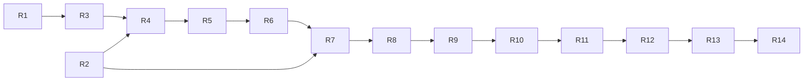

# ADAQ V1 Readiness Inventory

Status: current-head inventory for the OKX-only V1 recovery.

Date: 2026-08-22

Reviewed commit: `19af7a51b309017c437c5bf28e5f802550e3633c`

## Decision

Under [ADR 0090](./adr/0090-rebaseline-v1-to-okx-spot-end-to-end.md), V1 is the complete OKX Spot → OKX Demo Paper workflow. China A-share and U.S. equity support are Post-V1 Market Expansion. Existing equity code and generic contracts remain, but they are excluded from default V1 build/runtime/navigation/readiness and must not break the supported OKX product.

The [V1 Completion Recovery Map](./v1-completion-recovery-map.md) is the canonical remaining-work plan. V1 is ready only through scoped `Readiness Assertion` records approved by the User or Release Owner. Code, a closed issue, or a passing unit test alone does not make a product capability ready.

Real Trading, a public Unified Data/Trading API, cloud Bot control, Marketplace infrastructure, and the other exclusions in the roadmap remain post-V1.

## Completion legend

- **Accepted foundation** — implemented and accepted at its declared boundary; still subject to downstream integration.
- **Reusable core** — useful contracts or engine code exist, but the User-owned product workflow is incomplete.
- **Partial** — only part of the required product path or evidence exists.
- **Missing** — no complete current-head product capability or acceptance evidence exists.
- **Deferred** — retained for Post-V1 Market Expansion and not a V1 gate.

## Milestone inventory

| Milestone | OKX V1 scope | Current assessment | Remaining gate |
| --- | --- | --- | --- |
| M9 | OKX acquisition, Source/Canonical/Quality/Snapshot/Universe, Data Foundation workspace | Partial | R1 isolates equity dependencies; R3 restores the baseline; R4 completes visible operation/recovery and product-run evidence |
| M10 | Host Feature Engine and immutable Feature Datasets | Accepted foundation | R4 re-verifies the current-head OKX Context freeze and handoff |
| M11 | Factor research, evaluation, promotion | Accepted foundation with product remediation | R4 removes product-level opaque handoff and records the OKX journey |
| M12 | Managed Python research and Qlib-first Model Lab | Accepted foundation | R4 re-verifies Model Context; the offline A-share fixture remains test data, not market support |
| M13 | Strategy Projects and Single-Instrument/Portfolio Backtest | Reusable core | R5 delivers and accepts the User-owned product workflow |
| M14 | Component generation, conformance, equivalence, package/import | Reusable core | R6 completes trusted generation and qualification across product surfaces |
| M15 | OKX Demo Paper account, Risk/OMS, orders/fills, reconciliation | Reusable core | R7 integrates the secure adapter/execution path; R8 delivers the Paper workspace/recovery journey |
| M16 | Signed worker, Host supervisor, Bot deployment/control/recovery | Reusable core | R9 ships the Sidecar/supervisor; R10 completes product workflows |
| M17 | Health, events, alerts, safety actions, notifications, Operations Dashboard | Partial | R11 connects real signals, recovery, notification, drill-down, localization, and acceptance |
| M18 | Paper feedback, human review, hardening, packaging, readiness | Partial | R2 repairs User authority; R12 completes feedback; R13 hardens/packages; R14 records readiness |
| Equity expansion | A-share and U.S. equity data/Paper/product readiness | Deferred | Separate post-V1 source qualification and planning |

Closed historical issues, including #105 and #120–#128, remain evidence of delivered foundations or partial cores. They are not reopened and do not satisfy the remaining product gates without current-head verification.

## Current verification snapshot

The planning audit observed:

- Frontend: 38 suites and 121 tests passed; production build and lint passed.
- Rust: `cargo check --workspace` passed.
- Focused Paper/Bot tests: 9 tests passed.
- Full Rust workspace tests: failed because an A-share dependency attempted to load `libcurl-impersonate.4.dylib`.
- Latest inspected GitHub Actions run: macOS Component-example and Factor-integration jobs failed; remote completion was not established.

These results establish a partial diagnostic snapshot, not R3 completion. R3 must rerun the declared checks at its reviewed commit after deferred-market isolation and retain exact local/remote evidence.

## Product blockers

### Deferred-market isolation

The default product currently retains direct A-share dependency/runtime coupling and ambiguous U.S. provider naming. R1 must preserve reusable code while ensuring deferred markets cannot break the OKX build or appear supported.

### Host-derived User authority

Paper Feedback command inputs currently carry caller-supplied `user_id` without deriving authority from authenticated Host state. R2 must complete ADR 0085 across affected Desktop capabilities before downstream Paper/Feedback acceptance.

### Product integration, not core invention

M13/M14 contain substantial reusable cores, and M15/M16 contain workspace crates, but the desktop journeys, recovery states, packaging boundaries, and current-head acceptance evidence are incomplete. Recovery work should connect and verify existing contracts before adding new abstractions.

### Honest product navigation

Strategy and Operations surfaces still describe some capabilities as planned while backend cores exist. Product status must reflect supported User workflows, not crate presence.

## Required OKX V1 journey

| Journey | Current status | Recovery owner |
| --- | --- | --- |
| Acquire and inspect OKX evidence | Partial | R1, R3, R4 |
| Define, materialize, and inspect Features | Foundation accepted; product rerun pending | R4 |
| Research and promote Factors | Foundation accepted; product rerun pending | R4 |
| Train and evaluate Qlib-first Models | Foundation accepted; product rerun pending | R4 |
| Build and backtest Strategies | Core only | R5 |
| Generate/import qualified Components | Core only | R6 |
| Operate an OKX Demo Paper account | Core only | R7, R8 |
| Deploy and recover supervised Bots | Core only | R9, R10 |
| Monitor health, alerts, and safety actions | Partial | R11 |
| Review immutable Paper feedback | Partial | R2, R12 |
| Harden and package supported V1 | Missing | R13 |
| Approve scoped readiness | Missing | R14 |
| Real-money trading | Post-V1 | No V1 action |

## Required V1 acceptance set

The release set must include scoped assertions for:

- The complete OKX Crypto Paper journey.
- Missing data.
- Provider disconnect.
- Clock skew.
- Worker crash or hang.
- Uncertain order state.
- Credential rotation.
- Restart reconciliation.

Each assertion binds the capability, OKX market/data context, platform, locale, reviewed commit, automated/manual evidence, limitations, reviewer, and decision. Supported platform and both `en-US` and `zh-CN` coverage must be explicit. A global green flag is insufficient.

## Execution order

Follow R1–R14 and the exact dependency graph in the recovery map:

The initial executable frontier is R1 and R2. Each child runs in an independent `$implement <issue>` session and closes only after criterion-level evidence is recorded in English. The recovery parent remains open through R14.

## Sources

- `CONTEXT.md`
- `docs/v1-roadmap.md`
- `docs/v1-completion-recovery-map.md`
- `docs/m9-m12-current-head-gap-inventory.md`
- `docs/workflow-navigation.md`
- ADRs 0084–0090
- Current repository and GitHub issue/action audit at `19af7a51b309017c437c5bf28e5f802550e3633c`
