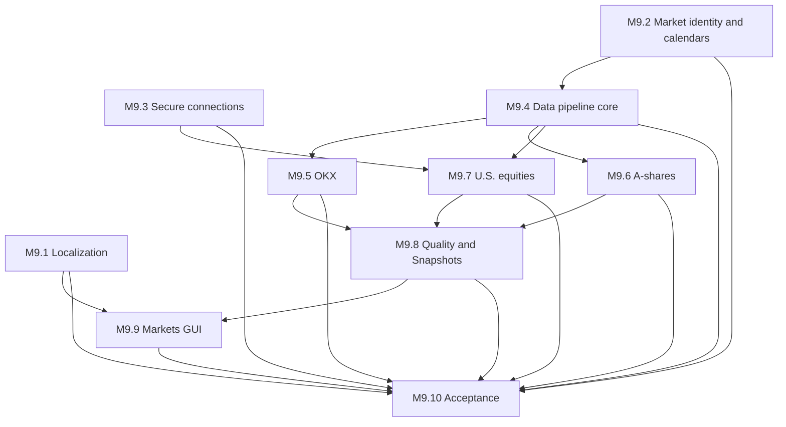
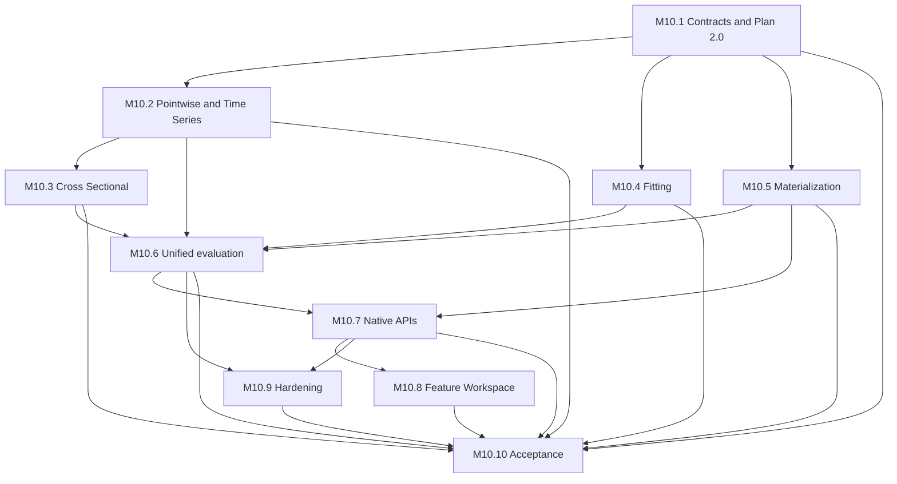
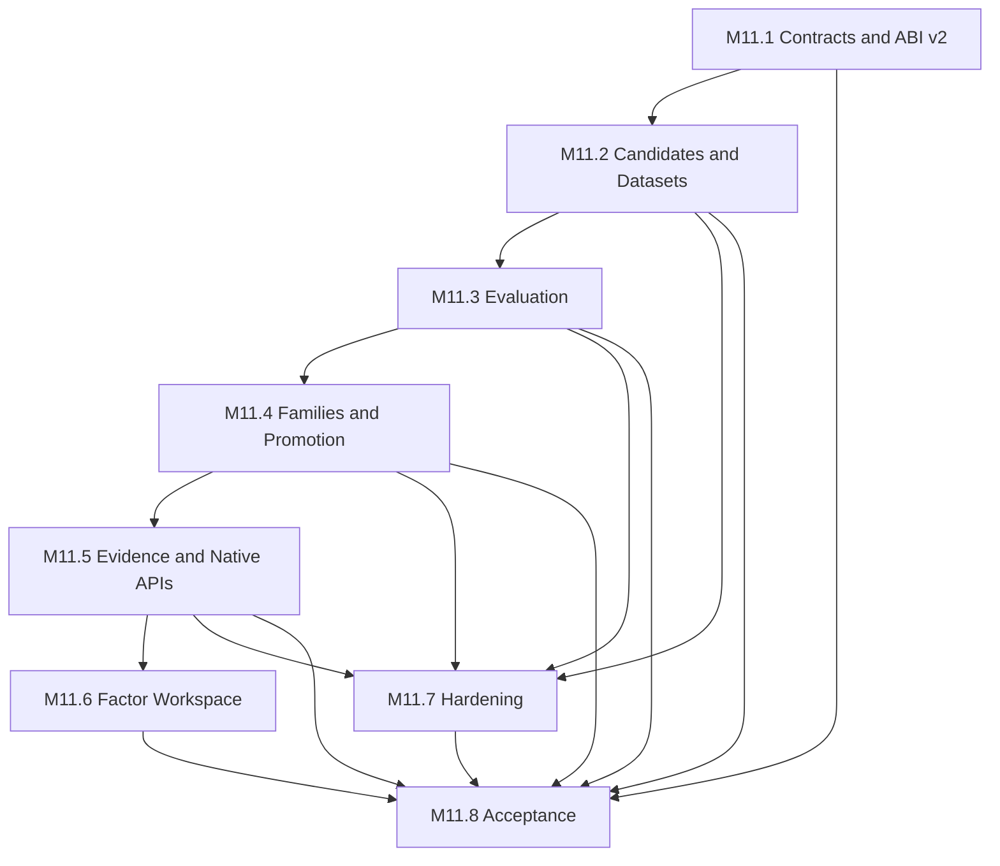
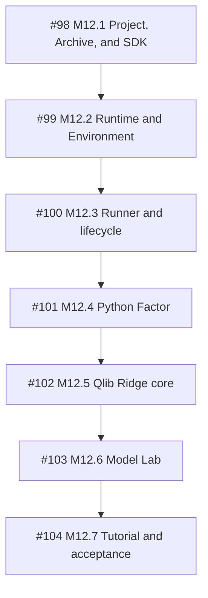

# ADAQ V1 Delivery Roadmap after M10

[简体中文](./v1-roadmap.zh-CN.md)

Status: accepted V1 architecture and dependency-ordered delivery baseline. M1 through M10 are the implemented research, multi-market, and Feature Engineering foundation; every milestone from M11 through M18 is required before the expanded V1 is declared usable.

This roadmap implements the complete research-to-Paper feedback system. It is not a reduced demonstration loop. Real-money order submission remains a separately qualified post-V1 capability.

## V1 outcome

A V1 user can acquire and inspect crypto, China A-share, and U.S. equity data; produce immutable quality-controlled research evidence; compute Features; research and promote time-series or cross-sectional Factors; train and evaluate Qlib-first Models; build and backtest single-instrument or portfolio Strategies; generate, compile, verify, and import qualified Components; deploy immutable Bundles to supervised Paper Trading Bots; monitor accounts, health, alerts, and research work in a bilingual GUI; and feed realized Paper evidence back into human-reviewed research without mutating a running deployment.

V1 execution uses only:

- OKX Demo Trading for Crypto Spot.
- Alpaca Paper for U.S. equities.
- The ADAQ-owned A-share Ordinary Securities Account simulator for China A-shares.

No V1 path accepts a Live endpoint or Real Trading credential.

## Product names and ownership

| Concern | V1 owner | Naming decision |
| --- | --- | --- |
| Acquisition, canonicalization, quality, revisions, publication | Host data pipeline | `adaq-data-pipeline`; do not create a narrow `adaq-data-cleaning` product |
| Technical indicators and arbitrary derived Features | Host Feature Engine | `adaq-feature-engine`; `adaq-indicator-engine` remains a reusable subengine |
| Factor research | Factor Lab plus Factor Components | One Factor product with Time-Series and Cross-Sectional scopes |
| Model research | Model Lab | Qlib-first, with ADAQ Native optional; inference deployment remains engine-neutral |
| Strategy research | Strategy Lab plus Strategy Components | One Strategy product with Single-Instrument and Portfolio scopes |
| Package generation | Component Generation and Qualification | Factor, Model, and Strategy use the existing SDK/CLI/package trust boundary |
| Paper accounts and execution | Host Paper Trading Core | `adaq-paper-trading-core` with OKX, Alpaca, and A-share Adapters |
| Bot evaluation | Supervised child process | One prebuilt `adaq-bot-worker` Sidecar per active Bot; no generated Bot executable |
| Operations | Host Monitoring Engine and GUI | Tauri/React Operations Dashboard, not a TUI |

ADAQ does not publish a speculative Unified Data API or Unified Trading API in V1. The internal contracts are asset-neutral where evidence proves a common semantic boundary, while provider differences remain explicit in Connectors and Adapters.

## Dependency chain

```mermaid
flowchart LR
    M8["M8: Model research foundation"] --> M9["M9: Multi-market data and platform foundation"]
    M9 --> M10["M10: Feature Engineering"]
    M10 --> M11["M11: Factor Research"]
    M11 --> M12["M12: Python Research SDK and Qlib-first Model Lab"]
    M12 --> M13["M13: Strategy and Portfolio Backtest"]
    M13 --> M14["M14: Component Generation and Qualification"]
    M14 --> M15["M15: Secure Paper Trading"]
    M15 --> M16["M16: Trading Bot Runtime"]
    M16 --> M17["M17: Monitoring and Operations Dashboard"]
    M17 --> M18["M18: Feedback, hardening, and V1 acceptance"]
    M18 -. "separate post-V1 qualification" .-> LIVE["Real Trading"]
```

Later implementation may prepare an independent slice in parallel only when its declared dependencies are already stable. A milestone is not complete merely because the next milestone can be prototyped.

## Milestones

### M9 — Multi-market data and platform foundation

Deliver the final V1 data trust boundary for OKX Spot, China A-shares through `akshare-rs`, and U.S. equities through Alpaca Market Data Basic. Add venue-aware Instrument, calendar, and session semantics; the Source → Canonical → Snapshot pipeline; append-only revisions; Data Quality Reports; Point-in-Time Instrument Universes; secure Provider Connection Profiles; `en-US` and `zh-CN` GUI localization; and the basic three-market workspaces.

Completion gate: all three providers produce inspectable Source and Canonical evidence and immutable Snapshots with provider capability, calendar, quality, gap, quarantine, and revision provenance; the GUI can inspect each market in both locales; no credential enters SQLite, logs, Components, or frontend state.

### M10 — Feature Engineering

Deliver `adaq-feature-engine` as the host owner of point-in-time Feature definitions, frozen Feature Plans, exact availability, warmup, missing-input behavior, transformations, and immutable Feature evidence. Reuse `adaq-indicator-engine` for technical indicators while allowing non-indicator Features such as returns, volatility, liquidity, calendar, cross-sectional ranks, and provenance-bound corporate-action transformations.

Completion gate: identical Snapshot, Plan, engine identities, parameters, and seed produce identical Feature evidence across chunking; every value is causal, scope-correct, finite or explicitly unavailable, and no transformation mutates Canonical Market Data.

### M11 — Factor Research and Promotion

Deliver one Factor Lab with explicit Time-Series and Cross-Sectional scopes, point-in-time Universe binding, scope-correct evaluation, neutralization and robustness controls, IC and Rank IC, turnover, decay, stability, regime, and cost-aware diagnostics. Promotion Decisions distinguish Candidate, Rejected, Research Validated, and Component Eligible evidence without calling a high historical score a guarantee.

Completion gate: promoted Factors bind exact Feature, Snapshot, Universe, evaluation protocol, report, and decision evidence and can be selected by Model research; failed or incomplete studies remain inspectable and cannot enter the promoted library.

The accepted bilingual [M11 Factor Research architecture](./m11-factor-research.md) and [manual acceptance guide](./m11-manual-acceptance.md) define the completed Native-only Research Engine boundary, Factor ABI v2, immutable Dataset-first evaluation, Research Family lineage, User-owned promotion, `/factors` workspace, and eight delivered slices published under [parent issue #88](https://github.com/tonywxx/adaq/issues/88).

### M12 — Python Research SDK and Qlib-first Model Lab (Accepted)

M12 delivered the shared Python Research SDK with one explicit `create_project()` entry point and typed Factor, Model, and Strategy lifecycles, the fixed source-visible Project Layout and inert import/export validation, portable Input Slots, ADAQ-managed Python Runtime and locked environments, explicit Sync Environment, Project/Revision/Attempt lifecycle, trusted child-process Research Runner, versioned loopback protocol, Host-validated atomic result publication, cancellation and restart recovery, bounded resources, Host-owned finite parameter Grids, Repeatability Reports, and Python Factor Candidate integration through the existing M11 Dataset, evaluation, Research Family, and Promotion evidence. It also delivered controlled Model training with the Qlib Ridge Adapter over Host-fed Train, Validation, and feature-only Test partitions, one Forecast per Project, and a canonical data-only Linear Model Artifact; ADAQ Native remains an optional future Research Engine. Support Single-Instrument and Cross-Sectional Model scopes, immutable Experiments, separated Selection and Final Evaluation windows, Point-in-Time Training Universes, Feature and Factor selection, seeds, environments, artifacts, metrics, diagnostics, and Forecast Signal Datasets.

Keep WASI Model Component, controlled ONNX, and Local Qlib Paper as distinct truthful Deployment Profiles. M12 freezes only the canonical Linear Model Artifact and its explicit eligibility contract; M14 implements the first Artifact-to-WASI Exporter. ONNX and Local Qlib require later registered Adapters and demonstrated need; an Artifact without an eligible Exporter and equivalence remains Research Only rather than receiving a false portable profile.

Completion gate: the Apache-2.0 `py-factor-cross-sectional-momentum` and `py-model-qlib-ridge-return` Projects run without network data or extra wheels against the immutable 12-Instrument × 180-session `python-tutorial-a-share@1` fixture, fixed Train/Purge/Selection/Embargo/Final windows, managed environments, Host-owned Grids, explicit User Decisions, and existing evidence contracts on every supported platform. Golden Factor evidence is exact; the Ridge experiment publishes and reloads a pickle-free Linear Model Artifact under its strict finite tolerance and remains eligible only for the explicit WASI export path without weakening M8 Forecast Signal contracts.

The consolidated bilingual M12 implementation and verification record is the [M12 Python Research and Model Lab architecture](./m12-python-research-and-model-lab.md) plus its [manual acceptance guide](./m12-python-research-manual-acceptance.md). Criterion-level evidence is recorded under parent issue [#97](https://github.com/tonywxx/adaq/issues/97) and child issues #98–#104.

### M13 — Strategy and Portfolio Backtest

Deliver Single-Instrument and Portfolio Strategy construction over promoted Factors and qualified Model Signals. Freeze the Strategy Target → Host Risk → Approved Target → Execution Plan boundary, capital allocation, position limits, rebalancing, stop rules, costs, liquidity, settlement, calendars, and provider-specific market constraints. Extend immutable Backtest and Validation evidence with portfolio performance, risk, attribution, turnover, capacity, and like-for-like optimization comparisons.

Completion gate: the Apache-2.0 `py-strategy-top-n-forecast` Project uses its fixed Host-owned Grid and finite Portable Strategy operation catalog to combine the M12 tutorial Factor and Forecast Signals, deterministically select Top-N, and produce an exact Golden Long-only Portfolio Target whose nonnegative Decimal weights plus Cash Reserve equal one; missing required input pauses before invocation. A Strategy cannot emit orders, bypass hard Risk, mix accounts or currencies, or claim a result without exact Snapshot, Feature, Model, Risk, Execution, and evaluation provenance.

### M14 — Component Generation and Qualification

Deliver the user-controlled workflow that feeds eligible canonical Factor or Strategy Definitions and supported Model Artifacts into fixed Rust SDK Generators, builds them, verifies package and runtime conformance for every allowed portable parameter combination, runs numerical or behavioral equivalence against the source research evidence, assigns immutable identity and version, packages Python-free `.adaq` Components, and imports them into the Component Library.

The first Model exporter converts only `adaq:linear-model@1` to a WASI Model Component. ONNX and Local Qlib Paper remain explicit future Deployment Profiles rather than fake portable Components; Marketplace publication is not part of V1, and the documented future publishing gates remain separate from local deployment qualification.

Completion gate: no generated package is imported as qualified unless build, numeric-boundary validation, conformance, provenance, equivalence, resource, and trust gates pass; failures retain evidence and never overwrite an existing Package identity/version.

### M15 — Secure Paper Trading Accounts and Execution

Deliver `adaq-paper-trading-core`, `adaq-okx-paper`, `adaq-alpaca-paper`, and `adaq-a-share-paper`; Provider Connection tests; account snapshots and reconciliation; capital reservations; host Risk and OMS; provider-normalized order and Fill journals; and the A-share event-driven Fill Engine for an Ordinary Securities Account only.

Create the three independent funding targets: CNY 1,000,000, USD 1,000,000, and USDT 1,000,000. External account snapshots remain authoritative when they differ. No cross-account or cross-currency capital is invented.

Completion gate: each account can reconcile, accept venue-valid Paper orders through Host Risk and OMS, preserve partial Fills and provider evidence, recover from uncertain outcomes, and fail closed without creating a Real order.

### M16 — Trading Bot Runtime

Deliver immutable Bot Deployment Bundles, the Host Bot Supervisor, one signed prebuilt Rust `adaq-bot-worker` Sidecar per active Bot, the separately supervised Local Qlib runner, causal Closed-Bar and scheduled cross-sectional decision clocks, decision deadlines, heartbeats, resource limits, and the explicit fail-closed lifecycle.

Completion gate: only Running may authorize new risk; Workers and Python never receive credentials or order APIs; Pause, Resume, Stop and Keep Position, separately confirmed Stop and Flatten, crash recovery, reconciliation, and Retry produce complete Runtime Attempt evidence with no stale-target replay.

### M17 — Monitoring, Alerts, and Operations Dashboard

Deliver multidimensional Health, append-only Operational Events, typed Alerts with Active/Acknowledged/Resolved lifecycle, debounce and hysteresis, safety actions, Notification Center, Critical banner, OS notifications, Bot/account/research drill-down, and the GUI home Operations Dashboard. Complete global status without summing CNY, USD, and USDT and without letting frontend cache grant trading authority.

Completion gate: data, Worker, Model, account, Risk/OMS, Adapter, local-system, and feedback failures are independently visible and trigger their frozen fail-closed actions; the Dashboard paints immediately, loads cards independently, and works in both V1 locales.

### M18 — Paper feedback, operational hardening, and V1 acceptance

Deliver immutable Paper Feedback Snapshots and Factor, Model, Strategy, and Execution Feedback Reports; sample-sufficiency and realized-horizon gates; Research Review Required Alerts; explicit User Review Decisions; and new-attempt/new-Bundle promotion paths. Add fault injection, restart and reconciliation drills, retention and diagnostics controls, full bilingual user documentation, accessibility review, performance budgets, release packaging, and supported-platform acceptance.

Completion gate: the complete three-market workflow passes automated and reviewed acceptance on supported platforms; fault and recovery evidence is retained; no drift response retrains, switches a challenger, or hot-patches a running Bundle automatically; every V1 security and no-Live invariant is verified.

## Traceability to the requested workflow

| Requested step | V1 delivery |
| --- | --- |
| 1. Acquire raw data | M9 Connectors, Source Market Datasets, Provider Capability Snapshots |
| 2. Clean and preprocess data | M9 lossless Canonicalization, quarantine, gaps, quality reports; M10 research transformations |
| 3. Compute indicators and Features | M10 `adaq-feature-engine` with `adaq-indicator-engine` as a subengine |
| 4. Research, evaluate, and save Factors | M11 Factor Lab; M14 Component generation and import |
| 5. Train and evaluate Models | M12 Python Research SDK and Qlib-first Model Lab; M14 portable or Local Qlib qualification |
| 6. Build and backtest Strategies | M13 Strategy/Portfolio Backtest; M14 Component generation and import |
| 7. Deploy Trading Bots | M16 Supervisor plus per-Bot worker, over M15 Paper accounts |
| 8. Monitor and alert | M17 Health, events, alerts, safety actions, notifications |
| 9. Global Dashboard and market views | M9 three-market workspaces; M17 Operations Dashboard |
| 10. Real Trading | Deliberately post-V1; M18 produces Paper and operational qualification evidence but grants no Live authority |
| Feedback closure | M18 immutable Paper feedback and human-reviewed new research Attempts |

## M9 executable delivery map

M9 is published as [parent issue #66](https://github.com/tonywxx/adaq/issues/66) with ten independently evidenced child slices:

1. **[M9.1 — GUI localization foundation](https://github.com/tonywxx/adaq/issues/67):** initialize `i18next` and `react-i18next` before first paint; implement System, English (US), and 简体中文 settings, persistence, parity tests, `Intl` formatting, and English fallback.
2. **[M9.2 — Market identity, Venue time, and calendar contracts](https://github.com/tonywxx/adaq/issues/68):** define asset-neutral Instrument/Venue identity, `Asia/Shanghai`, `America/New_York`, UTC storage, Trading Dates, Sessions, Phases, Calendar Snapshots, Bar alignment, and scheduled-closure versus gap semantics.
3. **[M9.3 — Provider Connection Profiles and OS secret storage](https://github.com/tonywxx/adaq/issues/69):** implement User/device scoping, Secret References, fixed Paper/Demo endpoints, redaction, rotation/deletion, and read-only Alpaca Paper and OKX Demo Connection Tests.
4. **[M9.4 — `adaq-data-pipeline` core](https://github.com/tonywxx/adaq/issues/70):** implement immutable Source and Canonical datasets, lossless normalization, quarantine, gaps, quality reports, append-only revisions, content addressing, publication, and existing Snapshot integration.
5. **[M9.5 — OKX Spot data path](https://github.com/tonywxx/adaq/issues/71):** full recorded Spot Instrument Universe, maximum retrievable one-minute Closed-Bar history, resumable updates, daily/status Instrument Master evidence, deterministic higher intervals, and selected realtime ticker/trade/Level 2 inputs.
6. **[M9.6 — China A-share data path](https://github.com/tonywxx/adaq/issues/72):** `akshare-rs` connector with actual upstream provenance, Ordinary Equity Instrument Master, unadjusted Bars, corporate actions as separate evidence, China calendar/session rules, and evidence-graded provider coverage.
7. **[M9.7 — U.S. equity data path](https://github.com/tonywxx/adaq/issues/73):** Alpaca Market Data Basic connector with authenticated access, IEX-only realtime disclosure, history/delay/rate/stream limits, U.S. calendar/session rules, and optional `yfinance-rs` evidence that never silently repairs Canonical data.
8. **[M9.8 — Multi-market quality and Snapshot publication](https://github.com/tonywxx/adaq/issues/74):** Point-in-Time Universes, Observed/Reconstructed/Unknown evidence, deterministic higher-interval derivation, revisions, deletion locks, quality inspection, and research-compatible immutable Snapshots across all three markets.
9. **[M9.9 — Unified Markets GUI](https://github.com/tonywxx/adaq/issues/75):** move the current Crypto dashboard to `/markets/crypto`; add `/markets`, `/markets/a-shares`, and `/markets/us-equities`; preserve one asset-neutral per-user Watchlist; show session, ticker, Bid/Ask, volume, Kline, provider, freshness, quality, rule summary, and workflow links.
10. **[M9.10 — Bilingual, cross-platform acceptance](https://github.com/tonywxx/adaq/issues/76):** publish English and Simplified Chinese setup/manual acceptance, run automated gates, retain provider-fixture and optional real-credential evidence, verify secret redaction, and prove no Paper connection submits an order during M9.

Dependency frontier:

M10 stops at finalized immutable Feature Datasets and the equivalent Feature Engine; Factor research begins in M11.

The initial executable frontier is #67, #68, and #69. They have no open blockers and may proceed independently; all later children carry native GitHub `blocked_by` edges matching the diagram.

## M10 executable delivery map

M10 is published as [parent issue #77](https://github.com/tonywxx/adaq/issues/77) and specified in the bilingual [M10 Feature Engineering architecture](./m10-feature-engineering.md):

1. [#78 — Feature Engine contracts and Feature Plan 2.0](https://github.com/tonywxx/adaq/issues/78)
2. [#79 — Pointwise and Time-Series Feature operators](https://github.com/tonywxx/adaq/issues/79)
3. [#80 — Cross-Sectional Feature scope and Universe operators](https://github.com/tonywxx/adaq/issues/80)
4. [#81 — fitted Transformation Protocols and Artifacts](https://github.com/tonywxx/adaq/issues/81)
5. [#82 — immutable Feature Dataset materialization and retained Attempts](https://github.com/tonywxx/adaq/issues/82)
6. [#83 — batch/observation equivalence and Component consumers](https://github.com/tonywxx/adaq/issues/83)
7. [#84 — User-scoped Feature APIs and background runner](https://github.com/tonywxx/adaq/issues/84)
8. [#85 — localized Feature Workspace](https://github.com/tonywxx/adaq/issues/85)
9. [#86 — three-market fixtures, benchmarks, and hardening](https://github.com/tonywxx/adaq/issues/86)
10. [#87 — bilingual cross-platform acceptance](https://github.com/tonywxx/adaq/issues/87)

#78 is the only initial executable frontier. All later children carry native GitHub `blocked_by` edges matching this graph. M10 stops at finalized Feature Datasets and the equivalent Feature Engine; Factor evaluation begins in M11.

## M11 executable delivery map

M11 is published as [parent issue #88](https://github.com/tonywxx/adaq/issues/88) and specified in the bilingual [M11 Factor Research architecture](./m11-factor-research.md):

1. [#92 — Core contracts, Factor ABI v2, and Factor Metric Catalog](https://github.com/tonywxx/adaq/issues/92).
2. [#90 — Declarative and Custom Candidate execution and Factor Dataset materialization](https://github.com/tonywxx/adaq/issues/90).
3. [#89 — Targets, Lenses, neutralization, Economic diagnostics, and robustness evaluation](https://github.com/tonywxx/adaq/issues/89).
4. [#91 — Research Families, Grid Search, multiple testing, Promotion Policies, and Decisions](https://github.com/tonywxx/adaq/issues/91).
5. [#95 — SQLite/Parquet evidence, shared research FIFO, and User-scoped native APIs](https://github.com/tonywxx/adaq/issues/95).
6. [#96 — Localized `/factors` workspace](https://github.com/tonywxx/adaq/issues/96).
7. [#94 — Three-market fixtures, benchmarks, resource limits, and hardening](https://github.com/tonywxx/adaq/issues/94).
8. [#93 — Bilingual cross-platform acceptance, manual guide, and roadmap closure](https://github.com/tonywxx/adaq/issues/93).

#92 was the only initial executable frontier. M11 is accepted after the eight slice comments, the bilingual acceptance matrix, final local gates, and supported-platform evidence are all recorded.

## M12 delivery map

M12 was published as [parent specification #97](https://github.com/tonywxx/adaq/issues/97) with seven independently closable but dependency-ordered child issues. All seven are now closed with criterion-level evidence:

1. **[#98 — M12.1 Project, Archive, SDK, and static validation](https://github.com/tonywxx/adaq/issues/98).**
2. **[#99 — M12.2 Managed Runtime, Wheelhouse, Lock, Sync, and Environment lifecycle](https://github.com/tonywxx/adaq/issues/99).**
3. **[#100 — M12.3 Runner, Attempt, Trust, resources, cancellation, recovery, and shared Queue integration](https://github.com/tonywxx/adaq/issues/100).**
4. **[#101 — M12.4 Python Factor Candidate, Factor schema/reset, Factor Lab, and `py-factor-cross-sectional-momentum`](https://github.com/tonywxx/adaq/issues/101).**
5. **[#102 — M12.5 Qlib Dataset Bridge, Ridge Adapter, Host transformations, and Linear Model Artifact](https://github.com/tonywxx/adaq/issues/102).**
6. **[#103 — M12.6 Model Lab, Grid, Selection, Repeatability, Final Evaluation, and `py-model-qlib-ridge-return`](https://github.com/tonywxx/adaq/issues/103).**
7. **[#104 — M12.7 Guided Factor/Model tutorial, synthetic fixture, failure matrix, bilingual docs, and three-platform acceptance](https://github.com/tonywxx/adaq/issues/104).**

#98 was the initial executable frontier. M12 is accepted after all seven child issues and their supported-platform evidence were completed. M13 owns Python Strategy execution and `py-strategy-top-n-forecast`; M14 owns generation, Build, Conformance, Equivalence, `.adaq` packaging, and import.

## Roadmap-wide completion rules

Every milestone and child issue must:

- Map each Acceptance Criterion to independent implementation and verification evidence.
- Keep immutable identities, User scoping, exact Decimals, availability, provider capability, and provenance inspectable.
- Paint new GUI routes immediately and keep pending state in the control that owns the work.
- Retain failed, cancelled, late, degraded, and recovery evidence instead of presenting only successes.
- Add English (US) and Simplified Chinese user documentation and accessible GUI copy for user-facing behavior.
- Pass focused tests first, then the applicable Rust workspace, frontend Jest, production build, formatting, secret-scan, and supported-platform CI gates.
- Keep every bundled Python example executable and bilingual: pull requests run the complete offline tutorial on the supported CI matrix plus fast contracts on all platforms, while main, Release, manual acceptance, and the accepting M12–M14 slice record the supported-platform Golden and failure-path matrix.
- Preserve unrelated user changes and never close a parent issue from a child unless explicitly authorized.

The final V1 manual acceptance must exercise three reference journeys—OKX Crypto Paper, A-share local Paper, and Alpaca U.S. Equity Paper—and failure journeys for missing data, provider disconnect, clock skew, Worker crash, uncertain order state, credential rotation, and restart reconciliation.

## Explicit post-V1 work

- Real Trading endpoints, credentials, and order authority.
- A public Unified Data API or Unified Trading API.
- A-share Credit Accounts, financing, securities lending, short selling, or margin.
- Cross-account or cross-currency Global Portfolio and converted total equity.
- Historical full-depth order-book replay, HFT, tick-driven Strategies, derivatives, and advanced market terminals.
- Marketplace publishing infrastructure, payments, licensing enforcement, and managed Qlib hosting.
- Cloud or unattended Bot control, remote notification channels, and remote credential synchronization.

These exclusions do not remove any part of the accepted Paper-trading V1 workflow.
