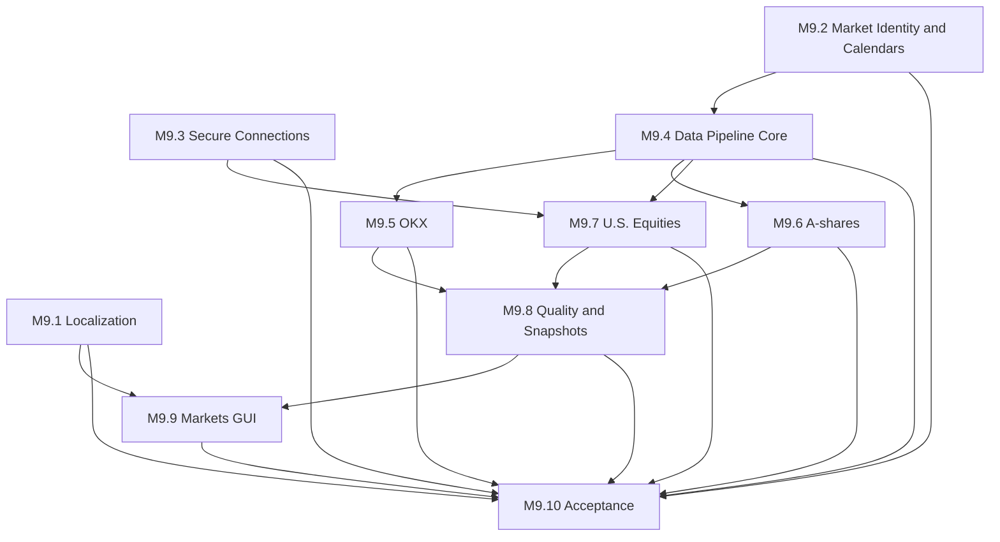
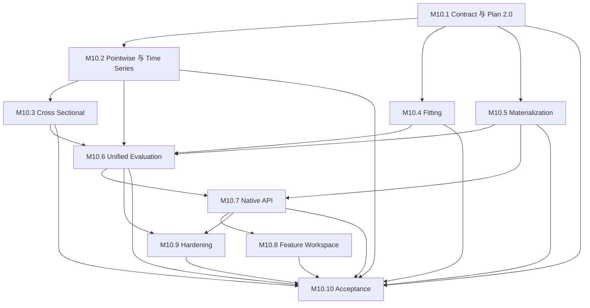
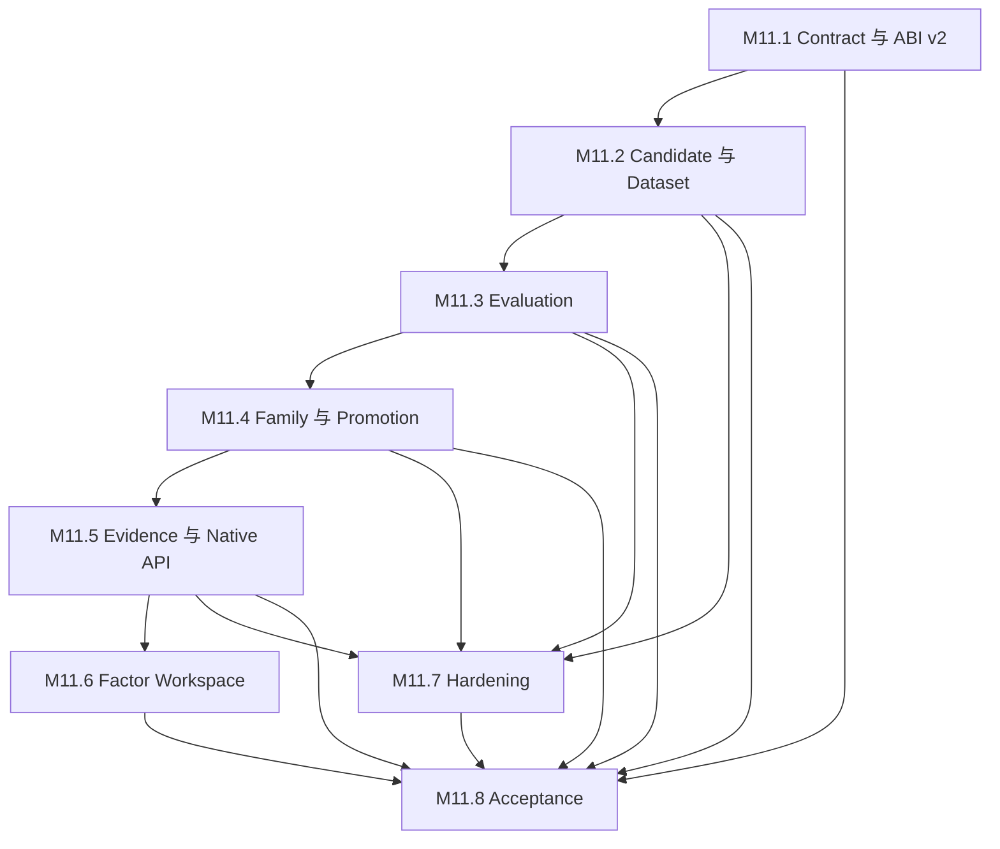
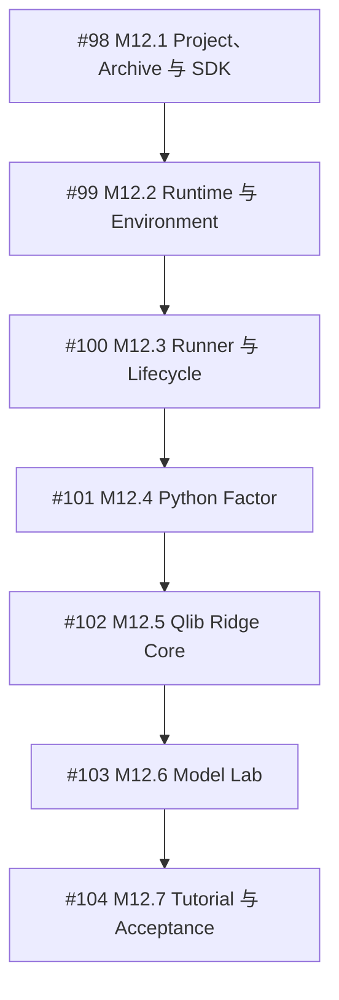

# M10 之后的 ADAQ V1 交付 Roadmap

[English](./v1-roadmap.md)

状态：已接受的 V1 架构与依赖顺序交付基线。M1–M10 是已经实现的研究、多市场与 Feature Engineering 基础；扩展后的 V1 只有在 M11–M18 全部完成后才能声明真正可用。

当前 Delivery Slice：在找到稳定的 A 股和美国股票数据源之前，开发与端到端验收只推进 OKX Spot。A 股和美股在本 Slice 中标记为 Not Tested / Deferred；除非另行重新规划，目标 V1 市场范围不变。

本 Roadmap 实现完整的“研究 → Paper Trading → 反馈”系统，不是缩减版演示闭环。真实资金下单仍然属于独立资格认证后的 V1 后能力。

## V1 最终结果

V1 用户可以获取并检查 Crypto、中国 A 股和美国股票数据；生成不可变、经过质量控制的研究证据；计算 Feature；研究和晋升 Time-Series 或 Cross-Sectional Factor；训练和评估 Qlib-first Model；构建并回测 Single-Instrument 或 Portfolio Strategy；生成、编译、验证和导入合格 Component；把不可变 Bundle 部署到受监督 Paper Trading Bot；在双语 GUI 中监控 Account、Health、Alert 和研究工作；并把已实现的 Paper 证据反馈到人工复核的研究流程，而不修改正在运行的 Deployment。

V1 执行只使用：

- Crypto Spot：OKX Demo Trading。
- 美国股票：Alpaca Paper。
- 中国 A 股：ADAQ 自有 A-share Ordinary Securities Account 模拟器。

任何 V1 路径都不接受 Live Endpoint 或 Real Trading Credential。

## 产品命名与责任归属

| Concern | V1 Owner | 命名决策 |
| --- | --- | --- |
| 获取、Canonicalization、Quality、Revision、Publication | Host Data Pipeline | `adaq-data-pipeline`；不创建狭窄的 `adaq-data-cleaning` 产品 |
| 技术指标与任意 Derived Feature | Host Feature Engine | `adaq-feature-engine`；`adaq-indicator-engine` 保持可复用 Subengine |
| Factor 研究 | Factor Lab + Factor Component | 一个 Factor 产品，包含 Time-Series 与 Cross-Sectional Scope |
| Model 研究 | Model Lab | Qlib-first，ADAQ Native 可选；Inference Deployment 保持 Engine-neutral |
| Strategy 研究 | Strategy Lab + Strategy Component | 一个 Strategy 产品，包含 Single-Instrument 与 Portfolio Scope |
| Package 生成 | Component Generation and Qualification | Factor、Model、Strategy 复用现有 SDK/CLI/Package Trust Boundary |
| Paper Account 与 Execution | Host Paper Trading Core | `adaq-paper-trading-core` + OKX、Alpaca、A-share Adapter |
| Bot Evaluation | 受监督 Child Process | 每个 Active Bot 一个预编译 `adaq-bot-worker` Sidecar；不生成独立 Bot Executable |
| Operations | Host Monitoring Engine + GUI | Tauri/React Operations Dashboard，不做 TUI |

V1 不发布推测性的 Unified Data API 或 Unified Trading API。只有证据证明语义可共用时，内部 Contract 才保持 Asset-neutral；Provider 差异仍由 Connector 与 Adapter 明确保留。

## 依赖链

```mermaid
flowchart LR
    M8["M8：Model Research Foundation"] --> M9["M9：Multi-market Data and Platform Foundation"]
    M9 --> M10["M10：Feature Engineering"]
    M10 --> M11["M11：Factor Research"]
    M11 --> M12["M12：Python Research SDK 与 Qlib-first Model Lab"]
    M12 --> M13["M13：Strategy and Portfolio Backtest"]
    M13 --> M14["M14：Component Generation and Qualification"]
    M14 --> M15["M15：Secure Paper Trading"]
    M15 --> M16["M16：Trading Bot Runtime"]
    M16 --> M17["M17：Monitoring and Operations Dashboard"]
    M17 --> M18["M18：Feedback、Hardening 与 V1 Acceptance"]
    M18 -. "独立的 V1 后资格认证" .-> LIVE["Real Trading"]
```

只有已经稳定其明确依赖时，后续独立 Slice 才可以并行准备。某个 Milestone 可以制作下一个阶段的 Prototype，并不代表它已经完成。

## Milestones

### M9 — Multi-market Data and Platform Foundation

交付 OKX Spot、通过 `akshare-rs` 获取的中国 A 股、通过 Alpaca Market Data Basic 获取的美国股票的最终 V1 数据信任边界。加入 Venue-aware Instrument、Calendar 与 Session 语义；Source → Canonical → Snapshot Pipeline；Append-only Revision；Data Quality Report；Point-in-Time Instrument Universe；安全 Provider Connection Profile；`en-US` 与 `zh-CN` GUI Localization；以及三个市场的基础 Market Workspace。

完成 Gate：三个 Provider 都能生成可检查的 Source/Canonical Evidence 和不可变 Snapshot，并保留 Provider Capability、Calendar、Quality、Gap、Quarantine 与 Revision Provenance；GUI 能以两种 Locale 检查每个 Market；Credential 不进入 SQLite、Log、Component 或 Frontend State。

### M10 — Feature Engineering

交付 `adaq-feature-engine`，由 Host 统一拥有 Point-in-Time Feature Definition、Frozen Feature Plan、精确 Availability、Warmup、MissingInput、Transformation 与不可变 Feature Evidence。复用 `adaq-indicator-engine` 计算技术指标，同时支持 Return、Volatility、Liquidity、Calendar、Cross-sectional Rank 与绑定 Provenance 的 Corporate-action Transformation 等非指标 Feature。

完成 Gate：同一 Snapshot、Plan、Engine Identity、Parameter 与 Seed 在不同 Chunking 下生成相同 Feature Evidence；每个值都必须 Causal、Scope-correct、Finite 或明确 Unavailable，Transformation 不得修改 Canonical Market Data。

### M11 — Factor Research and Promotion

交付一个显式包含 Time-Series 与 Cross-Sectional Scope 的 Factor Lab，绑定 Point-in-Time Universe，提供 Scope-correct Evaluation、Neutralization、Robustness、IC、Rank IC、Turnover、Decay、Stability、Regime 与 Cost-aware Diagnostic。Promotion Decision 区分 Candidate、Rejected、Research Validated 与 Component Eligible，不把高历史分数称为保证。

完成 Gate：晋升 Factor 必须绑定精确 Feature、Snapshot、Universe、Evaluation Protocol、Report 与 Decision Evidence，且可被 Model Research 选择；失败或不完整 Study 保持可检查，但不能进入 Promoted Library。

已接受的双语 [M11 Factor Research 架构](./m11-factor-research.zh-CN.md)与[人工验收指南](./m11-manual-acceptance.zh-CN.md)定义已完成的 Native-only Research Engine Boundary、Factor ABI v2、Immutable Dataset-first Evaluation、Research Family Lineage、User-owned Promotion、`/factors` Workspace，以及 [Parent Issue #88](https://github.com/tonywxx/adaq/issues/88) 下已交付的八个 Delivery Slice。

### M12 — Python Research SDK 与 Qlib-first Model Lab（已接受）

M12 已交付共享 Python Research SDK，包括一个显式 `create_project()` 入口、类型化 Factor/Model/Strategy Lifecycle、固定且源码可见的 Project Layout 与惰性 Import/Export Validation、可移植 Input Slot；同时交付 ADAQ 管理的 Python Runtime 与锁定 Environment、显式 Sync Environment、Project/Revision/Attempt Lifecycle、受信任的 Child-process Research Runner、版本化 Loopback Protocol、Host 验证后的原子 Result Publication、Cancel 与 Restart Recovery、Resource Bound、Host-owned 有限 Parameter Grid、Repeatability Report，以及通过现有 M11 Dataset、Evaluation、Research Family 与 Promotion Evidence 接入的 Python Factor Candidate。随后通过 Qlib Ridge Adapter 在 Host-fed Train、Validation 与仅含 Feature 的 Test Partition 上交付受控 Model Training，每个 Project 一个 Forecast，并生成规范的纯数据 Linear Model Artifact；ADAQ Native 保持未来可选 Research Engine。支持 Single-Instrument 与 Cross-Sectional Model Scope、不可变 Experiment、分离的 Selection/Final Evaluation Window、Point-in-Time Training Universe、Feature/Factor Selection、Seed、Environment、Artifact、Metric、Diagnostic 与 Forecast Signal Dataset。

把 WASI Model Component、受控 ONNX 与 Local Qlib Paper 保持为彼此独立且真实的 Deployment Profile。M12 只冻结规范 Linear Model Artifact 与其显式 Eligibility Contract；M14 实现首个 Artifact-to-WASI Exporter。ONNX 与 Local Qlib 需要未来注册 Adapter 和真实需求；没有合格 Exporter 与 Equivalence 的 Artifact 保持 Research Only，不能获得虚假的 Portable Profile。

完成 Gate：Apache-2.0 的 `py-factor-cross-sectional-momentum` 与 `py-model-qlib-ridge-return` Project 不使用 Network Data 或额外 Wheel，在不可变的 12-Instrument × 180-Session `python-tutorial-a-share@1` Fixture、固定 Train/Purge/Selection/Embargo/Final Window、托管 Environment、Host-owned Grid、显式 User Decision 与既有 Evidence Contract 上通过所有支持平台。Factor Golden Evidence 必须精确；Ridge Experiment 在严格有限 Tolerance 下发布并重新加载不含 pickle 的 Linear Model Artifact，并且只保持显式 WASI Export Path 资格，同时不削弱 M8 Forecast Signal Contract。

集中整理的 M12 实现与验证记录由 [M12 Python Research 与 Model Lab 架构](./m12-python-research-and-model-lab.zh-CN.md)及其[人工验收指南](./m12-python-research-manual-acceptance.zh-CN.md)组成。逐项验收证据记录在 Parent Issue [#97](https://github.com/tonywxx/adaq/issues/97) 与 Child Issue #98–#104 中。

### M13 — Strategy and Portfolio Backtest

基于 Promoted Factor 与 Qualified Model Signal 交付 Single-Instrument 和 Portfolio Strategy 构建。冻结 Strategy Target → Host Risk → Approved Target → Execution Plan 边界，以及 Capital Allocation、Position Limit、Rebalance、Stop Rule、Cost、Liquidity、Settlement、Calendar 与 Provider-specific Market Constraint。用 Portfolio Performance、Risk、Attribution、Turnover、Capacity 和 Like-for-like Optimization Comparison 扩展不可变 Backtest/Validation Evidence。

完成 Gate：Apache-2.0 的 `py-strategy-top-n-forecast` Project 使用固定 Host-owned Grid 与有限 Portable Strategy Operation Catalog 组合 M12 Tutorial Factor 与 Forecast Signal，以确定性规则选择 Top-N，并生成精确 Golden Long-only Portfolio Target，其中非负 Decimal Weight 与 Cash Reserve 之和等于一；缺少 Required Input 时在调用前 Pause。Strategy 不能输出 Order、绕过 Hard Risk、混合 Account/Currency，也不能在缺少精确 Snapshot、Feature、Model、Risk、Execution 与 Evaluation Provenance 时声称结果。

### M14 — Component Generation and Qualification

交付用户控制的流程：把合格的规范 Factor/Strategy Definition 与受支持 Model Artifact 输入固定 Rust SDK Generator，对每个允许的 Portable Parameter 组合执行 Build、Package/Runtime Conformance、与源研究证据的 Numerical/Behavioral Equivalence，分配不可变 Identity/Version，生成不含 Python 的 `.adaq` Component 并导入 Component Library。

首个 Model Exporter 只把 `adaq:linear-model@1` 转换为 WASI Model Component。ONNX 与 Local Qlib Paper 保持显式的未来 Deployment Profile，不伪装为 Portable Component；Marketplace 发布不属于 V1，已记录的未来 Publishing Gate 与本地 Deployment Qualification 分离。

完成 Gate：只有 Build、Numeric-boundary Validation、Conformance、Provenance、Equivalence、Resource 与 Trust Gate 全部通过，Generated Package 才能作为 Qualified 导入；失败保留证据，且不能覆盖已有 Package Identity/Version。

### M15 — Secure Paper Trading Accounts and Execution

交付 `adaq-paper-trading-core`、`adaq-okx-paper`、`adaq-alpaca-paper`、`adaq-a-share-paper`、Provider Connection Test、Account Snapshot/Reconciliation、Capital Reservation、Host Risk/OMS、Provider-normalized Order/Fill Journal，以及仅支持 Ordinary Securities Account 的 A-share Event-driven Fill Engine。

创建三个独立 Funding Target：1,000,000 CNY、1,000,000 USD、1,000,000 USDT。外部 Account Snapshot 不一致时仍保持权威；不得发明 Cross-account 或 Cross-currency Capital。

完成 Gate：每个 Account 都能 Reconcile，通过 Host Risk/OMS 接收 Venue-valid Paper Order，保存 Partial Fill 和 Provider Evidence，从不确定结果恢复，并且 Fail-closed 而不创建 Real Order。

### M16 — Trading Bot Runtime

交付不可变 Bot Deployment Bundle、Host Bot Supervisor、每个 Active Bot 一个已签名预编译 Rust `adaq-bot-worker` Sidecar、单独监督的 Local Qlib Runner、Causal Closed-Bar 与 Scheduled Cross-sectional Decision Clock、Decision Deadline、Heartbeat、Resource Limit 和显式 Fail-closed Lifecycle。

完成 Gate：只有 Running 可以授权增加新风险；Worker 与 Python 不能接收 Credential 或 Order API；Pause、Resume、Stop and Keep Position、单独确认的 Stop and Flatten、Crash Recovery、Reconciliation 与 Retry 生成完整 Runtime Attempt Evidence，且不会重放过期 Target。

### M17 — Monitoring, Alerts, and Operations Dashboard

交付多维 Health、Append-only Operational Event、具备 Active/Acknowledged/Resolved Lifecycle 的 Typed Alert、Debounce/Hysteresis、Safety Action、Notification Center、Critical Banner、OS Notification、Bot/Account/Research Drill-down 和 GUI Home Operations Dashboard。完成 Global Status，但不把 CNY、USD、USDT 相加，也不让 Frontend Cache 获得 Trading Authority。

完成 Gate：Data、Worker、Model、Account、Risk/OMS、Adapter、Local System 和 Feedback Failure 独立可见，并触发其 Frozen Fail-closed Action；Dashboard 立即 Paint、Card 独立加载，并在两个 V1 Locale 下可用。

### M18 — Paper Feedback、Operational Hardening 与 V1 Acceptance

交付不可变 Paper Feedback Snapshot 与 Factor/Model/Strategy/Execution Feedback Report、Sample Sufficiency 与 Realized Horizon Gate、Research Review Required Alert、显式 User Review Decision，以及创建 New Attempt/New Bundle 的 Promotion Path。加入 Fault Injection、Restart/Reconciliation Drill、Retention/Diagnostic Control、完整双语用户文档、Accessibility Review、Performance Budget、Release Packaging 与 Supported-platform Acceptance。

完成 Gate：三个市场完整 Workflow 在受支持平台通过自动与人工 Acceptance；Fault/Recovery Evidence 被保留；任何 Drift Response 都不能自动 Retrain、切换 Challenger 或 Hot-patch Running Bundle；全部 V1 Security 与 No-Live Invariant 都得到验证。

## 对原始 Workflow 的追踪

| 原始步骤 | V1 交付 |
| --- | --- |
| 1. 获取 Raw Data | M9 Connector、Source Market Dataset、Provider Capability Snapshot |
| 2. 清理和预处理 Data | M9 Lossless Canonicalization、Quarantine、Gap、Quality Report；M10 Research Transformation |
| 3. 计算 Indicator 与 Feature | M10 `adaq-feature-engine`，`adaq-indicator-engine` 为 Subengine |
| 4. 研究、验证并保存 Factor | M11 Factor Lab；M14 Component Generation 与 Import |
| 5. 训练和评估 Model | M12 Python Research SDK 与 Qlib-first Model Lab；M14 Portable 或 Local Qlib Qualification |
| 6. 构建并回测 Strategy | M13 Strategy/Portfolio Backtest；M14 Component Generation 与 Import |
| 7. 部署 Trading Bot | M16 Supervisor + 每 Bot Worker，运行于 M15 Paper Account |
| 8. Monitoring 与 Alert | M17 Health、Event、Alert、Safety Action、Notification |
| 9. Global Dashboard 与 Market View | M9 三市场 Workspace；M17 Operations Dashboard |
| 10. Real Trading | 明确属于 V1 后；M18 只生成 Paper 与 Operational Qualification Evidence，不授予 Live Authority |
| Feedback Closure | M18 不可变 Paper Feedback + 人工复核的新 Research Attempt |

## M9 可执行交付图

M9 已发布为 [Parent Issue #66](https://github.com/tonywxx/adaq/issues/66)，并包含十个具备独立证据的 Child Slice：

1. **[M9.1 — GUI Localization Foundation](https://github.com/tonywxx/adaq/issues/67)：** First Paint 前初始化 `i18next`/`react-i18next`；实现 System、English (US)、简体中文设置、Persistence、Parity Test、`Intl` Formatting 与 English Fallback。
2. **[M9.2 — Market Identity、Venue Time 与 Calendar Contract](https://github.com/tonywxx/adaq/issues/68)：** 定义 Asset-neutral Instrument/Venue Identity、`Asia/Shanghai`、`America/New_York`、UTC Storage、Trading Date、Session、Phase、Calendar Snapshot、Bar Alignment，以及 Scheduled Closure 与 Gap 的区别。
3. **[M9.3 — Provider Connection Profile 与 OS Secret Storage](https://github.com/tonywxx/adaq/issues/69)：** 实现 User/Device Scope、Secret Reference、固定 Paper/Demo Endpoint、Redaction、Rotation/Deletion，以及只读 Alpaca Paper 与 OKX Demo Connection Test。
4. **[M9.4 — `adaq-data-pipeline` Core](https://github.com/tonywxx/adaq/issues/70)：** 实现不可变 Source/Canonical Dataset、Lossless Normalization、Quarantine、Gap、Quality Report、Append-only Revision、Content Address、Publication 与现有 Snapshot Integration。
5. **[M9.5 — OKX Spot Data Path](https://github.com/tonywxx/adaq/issues/71)：** 完整记录的 Spot Instrument Universe、最大可获取 1-minute Closed-Bar History、Resumable Update、Daily/Status Instrument Master Evidence、Deterministic Higher Interval 和 Selected Realtime Ticker/Trade/Level 2 Input。
6. **[M9.6 — 中国 A 股 Data Path](https://github.com/tonywxx/adaq/issues/72)：** `akshare-rs` Connector + Actual Upstream Provenance、Ordinary Equity Instrument Master、Unadjusted Bar、独立 Corporate Action Evidence、中国 Calendar/Session Rule 与 Evidence-graded Provider Coverage。
7. **[M9.7 — 美国股票 Data Path](https://github.com/tonywxx/adaq/issues/73)：** 认证 Alpaca Market Data Basic Connector，显式展示 IEX-only Realtime、History/Delay/Rate/Stream Limit、美国 Calendar/Session Rule，以及绝不静默修复 Canonical Data 的可选 `yfinance-rs` Evidence。
8. **[M9.8 — Multi-market Quality 与 Snapshot Publication](https://github.com/tonywxx/adaq/issues/74)：** Point-in-Time Universe、Observed/Reconstructed/Unknown Evidence、Deterministic Higher-interval Derivation、Revision、Deletion Lock、Quality Inspection 与三个市场 Research-compatible Immutable Snapshot。
9. **[M9.9 — Unified Markets GUI](https://github.com/tonywxx/adaq/issues/75)：** 把当前 Crypto Dashboard 移至 `/markets/crypto`；加入 `/markets`、`/markets/a-shares`、`/markets/us-equities`；保留一个 Asset-neutral、Per-user Watchlist；显示 Session、Ticker、Bid/Ask、Volume、Kline、Provider、Freshness、Quality、Rule Summary 与 Workflow Link。
10. **[M9.10 — Bilingual、Cross-platform Acceptance](https://github.com/tonywxx/adaq/issues/76)：** 发布 English/简体中文 Setup 与 Manual Acceptance；运行自动 Gate；保留 Provider Fixture 与可选 Real Credential Evidence；验证 Secret Redaction；证明 M9 的任何 Paper Connection 都不会提交 Order。

Dependency Frontier：

M10 的终点是 finalized immutable Feature Datasets 与等价的 Feature Engine；Factor research 从 M11 开始。

初始可执行 Frontier 是 #67、#68、#69；它们没有 Open Blocker，可以独立进行。其余 Child 已按上图写入 GitHub 原生 `blocked_by` 依赖。

## M10 可执行交付图

M10 已发布为 [Parent Issue #77](https://github.com/tonywxx/adaq/issues/77)，并由双语 [M10 Feature Engineering 架构](./m10-feature-engineering.zh-CN.md)定义：

1. [#78 — Feature Engine Contract 与 Feature Plan 2.0](https://github.com/tonywxx/adaq/issues/78)
2. [#79 — Pointwise/Time-Series Feature Operator](https://github.com/tonywxx/adaq/issues/79)
3. [#80 — Cross-Sectional Feature Scope 与 Universe Operator](https://github.com/tonywxx/adaq/issues/80)
4. [#81 — Fitted Transformation Protocol 与 Artifact](https://github.com/tonywxx/adaq/issues/81)
5. [#82 — Immutable Feature Dataset Materialization 与 Retained Attempt](https://github.com/tonywxx/adaq/issues/82)
6. [#83 — Batch/Observation Equivalence 与 Component Consumer](https://github.com/tonywxx/adaq/issues/83)
7. [#84 — User-scoped Feature API 与 Background Runner](https://github.com/tonywxx/adaq/issues/84)
8. [#85 — Localized Feature Workspace](https://github.com/tonywxx/adaq/issues/85)
9. [#86 — Three-market Fixture、Benchmark 与 Hardening](https://github.com/tonywxx/adaq/issues/86)
10. [#87 — Bilingual Cross-platform Acceptance](https://github.com/tonywxx/adaq/issues/87)

#78 是唯一初始可执行 Frontier。其余 Child 已按本图写入 GitHub 原生 `blocked_by` 关系。M10 终点是 Completed Feature Dataset 与等价 Feature Engine；Factor Evaluation 从 M11 开始。

## M11 可执行交付图

M11 已发布为 [Parent Issue #88](https://github.com/tonywxx/adaq/issues/88)，并由双语 [M11 Factor Research 架构](./m11-factor-research.zh-CN.md)定义：

1. [#92 — Core Contract、Factor ABI v2 与 Factor Metric Catalog](https://github.com/tonywxx/adaq/issues/92)。
2. [#90 — Declarative/Custom Candidate Execution 与 Factor Dataset Materialization](https://github.com/tonywxx/adaq/issues/90)。
3. [#89 — Target、Lens、Neutralization、Economic Diagnostic 与 Robustness Evaluation](https://github.com/tonywxx/adaq/issues/89)。
4. [#91 — Research Family、Grid Search、Multiple Testing、Promotion Policy 与 Decision](https://github.com/tonywxx/adaq/issues/91)。
5. [#95 — SQLite/Parquet Evidence、Shared Research FIFO 与 User-scoped Native API](https://github.com/tonywxx/adaq/issues/95)。
6. [#96 — Localized `/factors` Workspace](https://github.com/tonywxx/adaq/issues/96)。
7. [#94 — Three-market Fixture、Benchmark、Resource Limit 与 Hardening](https://github.com/tonywxx/adaq/issues/94)。
8. [#93 — Bilingual Cross-platform Acceptance、Manual Guide 与 Roadmap Closure](https://github.com/tonywxx/adaq/issues/93)。

#92 曾是唯一初始 Executable Frontier。八个 Slice Comment、双语 Acceptance Matrix、Final Local Gate 与 Supported-platform Evidence 全部记录后，M11 已接受。

## M12 交付图

M12 已发布为 [Parent Specification #97](https://github.com/tonywxx/adaq/issues/97)，包含七个可独立关闭、但具有依赖顺序的 Child Issue；目前七个 Child Issue 均已关闭并记录逐项验收证据：

1. **[#98 — M12.1 Project、Archive、SDK 与 Static Validation](https://github.com/tonywxx/adaq/issues/98)。**
2. **[#99 — M12.2 Managed Runtime、Wheelhouse、Lock、Sync 与 Environment Lifecycle](https://github.com/tonywxx/adaq/issues/99)。**
3. **[#100 — M12.3 Runner、Attempt、Trust、Resource、Cancel、Recovery 与 Shared Queue Integration](https://github.com/tonywxx/adaq/issues/100)。**
4. **[#101 — M12.4 Python Factor Candidate、Factor Schema/Reset、Factor Lab 与 `py-factor-cross-sectional-momentum`](https://github.com/tonywxx/adaq/issues/101)。**
5. **[#102 — M12.5 Qlib Dataset Bridge、Ridge Adapter、Host Transformation 与 Linear Model Artifact](https://github.com/tonywxx/adaq/issues/102)。**
6. **[#103 — M12.6 Model Lab、Grid、Selection、Repeatability、Final Evaluation 与 `py-model-qlib-ridge-return`](https://github.com/tonywxx/adaq/issues/103)。**
7. **[#104 — M12.7 Guided Factor/Model Tutorial、Synthetic Fixture、Failure Matrix、双语 Docs 与三平台 Acceptance](https://github.com/tonywxx/adaq/issues/104)。**

#98 曾是初始 Executable Frontier。M12 在七个 Child Issue 及其 Supported-platform Evidence 全部完成后已接受。M13 负责 Python Strategy Execution 与 `py-strategy-top-n-forecast`；M14 负责 Generation、Build、Conformance、Equivalence、`.adaq` Packaging 与 Import。

## Roadmap 全局完成规则

每个 Milestone 与 Child Issue 都必须：

- 把每条 Acceptance Criterion 映射到独立 Implementation 与 Verification Evidence。
- 保持 Immutable Identity、User Scope、Exact Decimal、Availability、Provider Capability 与 Provenance 可检查。
- 新 GUI Route 立即 Paint，并把 Pending State 放在拥有该工作的 Control 上。
- 保留 Failed、Cancelled、Late、Degraded 与 Recovery Evidence，而不是只展示成功。
- 为 User-facing Behavior 加入 English (US) 与简体中文用户文档和 Accessible GUI Copy。
- 先运行 Focused Test，再运行适用的 Rust Workspace、Frontend Jest、Production Build、Formatting、Secret Scan 与 Supported-platform CI Gate。
- 保证每个内置 Python Example 可执行且双语：Pull Request 在 Supported CI Matrix 上运行完整 Offline Tutorial，并在所有平台运行快速 Contract；main、Release、Manual Acceptance 与接受 M12–M14 的 Slice 记录 Supported-platform Golden 和 Failure-path Matrix。
- 保留无关 User Change；Child 未获得显式授权时绝不关闭 Parent Issue。

最终 V1 Manual Acceptance 必须覆盖三个 Reference Journey：OKX Crypto Paper、A-share Local Paper、Alpaca U.S. Equity Paper；并覆盖 Missing Data、Provider Disconnect、Clock Skew、Worker Crash、Uncertain Order State、Credential Rotation 与 Restart Reconciliation 的 Failure Journey。

V1 发布就绪通过不可变的 `Readiness Assertion` 集合记录，而不是应用内的全局 Flag。每条 Assertion 只覆盖明确声明的 Capability、Journey、Market/Data Context、Supported Platform 与 Interface Locale；所有必需 Criterion 通过后，才能称为 `Ready for declared scope`。验收记录必须绑定 Reviewed Commit、自动化与人工证据、精确平台/语言观察、限制项以及指定的 Acceptance Reviewer 或 Release Owner。平台或语言缺口、隐藏人工步骤、缺失恢复证据、Host/fail-closed 边界失败都会阻断对应 Assertion。发布集合必须包含上面的三条 Reference Journey 与完整 Failure Matrix；Assertion 不授予运行时权限，也不能静默泛化到其他 Scope。

## 明确的 V1 后工作

- Real Trading Endpoint、Credential 与 Order Authority。
- Public Unified Data API 或 Unified Trading API。
- A-share Credit Account、融资、融券、卖空与 Margin。
- Cross-account/Cross-currency Global Portfolio 与换算后的 Total Equity。
- Historical Full-depth Order-book Replay、HFT、Tick-driven Strategy、Derivative 与 Advanced Market Terminal。
- Marketplace Publishing Infrastructure、Payment、License Enforcement 与 Managed Qlib Hosting。
- Cloud/Unattended Bot Control、Remote Notification Channel 与 Remote Credential Sync。

这些排除项不会删除已接受的 Paper-trading V1 Workflow 的任何部分。
